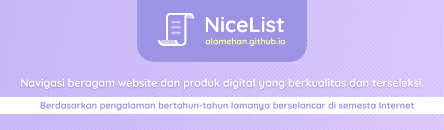

## NiceList
- **101 Daftar ragam topik menarik** : jernih, berkulitas, berbobot, terseleksi dan komprehensif 
- Merupakan salah satu segmen dari konten di [Alamehan Project](https://medium.com/@alamehan/selamat-datang-di-alamehan-35a43da9d87e) [(alamehan.github.io)](https://alamehan.github.io/)

## Motivasi 

Dari lautan informasi yang tersebar secara acak di Internet, terdapat harta karun tak ternilai yang tersembunyi. Harta karun ini tidak mudah ditemukan, diperlukan sebuah _keyword_ yang tepat pada mesin pencari untuk mendapatkannya. Harta karun ini memuat informasi yang jernih, berkualitas, berbobot, terseleksi dan komprehensif. Dengan harta karun ini, hidup anda akan jauh lebih mudah. Anda tidak perlu buang-buang waktu mencari dan menjelajah suatu topik tertentu di Internet, berkunjung ke situs sana-sini yang tidak menjamin kualitas kontennya ataupun hanya berisi secuil informasi saja.

Dengan **NiceList** yang terinspirasi dari sebuah proyek bernama [Awesome](https://github.com/sindresorhus/awesome) ini, saya menghabiskan banyak waktu untuk melakukan penjelahan secara mendalam di lautan Internet, mencari harta karun yang tersembunyi itu, kemudian mengumpulkan lalu mem-_filter_ dan mengkategorikannya sesuai topik. Tidak lain untuk memudahkan kita mendapatkan informasi maupun _insight_ yang jernih, tidak menyesatkan (setengah-setengah) dan tidak memakan banyak waktu.

**Catatan** : Topik yang tersedia di **NiceList** ini memang tidak banyak, dan cenderung lebih ke bidang IT (sesuai dengan _background_ pendidikan saya), namun saya akan terus menambahkannya secara berkala.

 

	<a href="#find-a-job">Find a Job</a>&nbsp;&nbsp;&nbsp;
	<a href="#self-improvement">Self Improvement</a>&nbsp;&nbsp;&nbsp;
	<a href="#designer-starter-pack">Designer Starter Pack</a>&nbsp;&nbsp;&nbsp;
	<a href="#developer-starter-pack">Developer Starter Pack</a>&nbsp;&nbsp;&nbsp;
	<a href="#top-chrome-extensions">Top Chrome Extensions</a>&nbsp;&nbsp;&nbsp;
	<a href="#top-figma-plugins">Top Figma Plugins</a>&nbsp;&nbsp;&nbsp;
	<a href="#incredibly-useful-websites">Incredibly Useful Websites</a>&nbsp;&nbsp;&nbsp;
	<a href="#top-education-instagram-accounts">Top Education Instagram Accounts</a>&nbsp;&nbsp;&nbsp;

 

💼 
Find a Job
-----------

* General
  * [LinkedIn](https://www.linkedin.com/)
  * [Qerja](https://www.qerja.com/)
  * [Glints](https://glints.com/id)
  * [Urbanhire](https://www.urbanhire.com/)
  * [Careerjet](https://www.careerjet.co.id/)
  * [Indeed](https://id.indeed.com/)
  * [JobStreet](https://www.jobstreet.co.id/)
  * [Jora](https://www.jora.com/)
  * [JobFinder](http://www.jobfinder.co.id/)
  * [Jobs.id](https://www.jobs.id/)
  
* Developer
  * [Tech in Asia](https://www.techinasia.com/jobs/search)
  * [Dicoding](https://www.dicoding.com/jobs/list)
  * [Simonas Kominfo](https://simonas.kominfo.go.id/)
  
* Startup Career
  * [Tokopedia](https://www.tokopedia.com/careers/jobs/)
  * [Bukalapak](https://careers.bukalapak.com/browse/Engineering)
  * [Shopee](https://careers.shopee.co.id/jobs/)
  * [Blibli](https://www.blibli.com/page/karir/)
  * [Gojek](https://career.go-jek.com/job/)
  * [Traveloka](https://www.traveloka.com/en/careers)
  * [Pegipegi](https://www.pegipegi.com/team/career.html)
  * [Dana](https://www.dana.id/karir)
  * [KitaBisa](https://kitabisa.urbanhire.com/)
  * [Ruangguru](https://career.ruangguru.com)
  
* Freelancer & Project
  * [Freelancer](https://www.freelancer.co.id/search/projects/)
  * [Sribu](https://www.sribu.com/id/contests)
  * [Sribulancer](https://www.sribulancer.com/id/bj/loker/v3)
  * [Projects](https://projects.co.id/public/browse_projects/listing)
  * [Fastwork](https://fastwork.id/start-selling)
  * [99designs](https://99designs.com/contests)
  * [DesignCrowd](https://jobs.designcrowd.com/jobs/)

 

📚
Self Improvement 
-----------------

* Books and Ideas
  * [Faster to Master](https://fastertomaster.com/) - Read more, learn faster and wake up productivity.
  * [Optimize Me](https://www.optimize.me/) - The best Big Ideas from the best optimal living books. More wisdom in less time.
  * [Design Epic Life](https://designepiclife.com/) - Design your life for high performance and success.
  * [Gates Notes](https://www.gatesnotes.com/Books) - Recommended and books review by Bill Gates.
  * [Marc Reclau](https://www.marcreklau.com/) - Author of the #1 Bestseller "30 Days -Change your habits, change your life".
  * [Hitman System](https://hitmansystem.com/produk) - Satu-satunya Professional Relationship Consultancy di Indonesia
  * [Dewa Eka Prayoga](https://dewaekaprayoga.com/) - Dewa Selling, hobi jualan, plus ngajarin orang jago jualan.
  * [Arry Rahmawan](https://arryrahmawan.net/) - Mengikat dan Berbagi Ilmu untuk Generasi Indonesia yang Lebih Baik.
  
* Podcast
  * [GaryVee Podcast](https://www.garyvaynerchuk.com/podcast/) - Keynote speeches on marketing and business.
  * [HBR IdeaCast](https://open.spotify.com/show/4gtSBBxIAE142ApX6LqsvN) - A weekly podcast featuring the leading thinkers in business and management.
  * [Podcast Subjective](https://soundcloud.com/iqbalhariadi) - Berbagi kisah, insight, dan tips praktis pengembangan diri.
  * [Satu Persen Audio Insight](https://open.spotify.com/show/1iIFlumWtP4xI1QEzCBcSY) - Berkembang bersama kami, satu persen setiap harinya.
  * [Thirty Days of Lunch](https://open.spotify.com/show/0vFfPAk7zgDLnv3utpZ8ww) - Teman makan siang sekaligus nutrisi untuk pikiran. Ga berat, tapi juga ga receh.
  * [Makna Talks](https://open.spotify.com/show/1PGN4ilb4aoWKkB7FNSLsx) - A weekly podcast with well known subjects every week talking about what's behind the facts.
  * [Hiduplah Indonesia Maya](https://open.spotify.com/show/6yUPhJdvDAMRVwApXBpQWd) - Podcast dari Pandji Pragiwaksono, membahas segala hal yang terjadi di Indonesia.
  * [Finfolk](https://open.spotify.com/show/3coiCSZDmmBSREVpo0PpIB) - New ideas about investment in a fun way.
  
* Youtube Channel
  * [GaryVee](https://www.youtube.com/user/GaryVaynerchuk) - Keynote speeches on marketing and business.
  * [Satu Persen](https://www.youtube.com/channel/UC_eifcIIjgN8Q_8m34nWo3Q) - Mengajarkan hal-hal penting yang sampai saat ini belum diajarkan di sekolah konvensional.
  * [SuccessBefore30](https://www.youtube.com/user/successbefore30/) - Wadah untuk Belajar Berbisnis dan Mengerti tentang aspek-aspek dari Kesuksesan.
  * [Pagar Kehidupan](https://www.youtube.com/channel/UCRPWx7xrHni4v31AkXE16Fg) - Butuh Inspirasi dan bantuan dalam hidup? Ini adalah channel yang bisa Kamu tuju.
  * [Chandra Hasyim](https://www.youtube.com/channel/UCFCUdbQNQjbK-7UhKy--chg) - Inspiring and motivational video translations in Indonesia.
  * [Merry Riana](https://www.youtube.com/user/merryrianashow) - Menciptakan dampak positif di dalam kehidupan jutaan orang di Indonesia.
  * [Dewa Eka Prayoga](https://www.youtube.com/channel/UCx-9wWeG3YcqxXKXxOn3wMA) - Sharing seputar bisnis online, digital marketing, copywriting, dll.
  * [Kok Bisa?](https://www.youtube.com/channel/UCu0yQD7NFMyLu_-TmKa4Hqg) - Pengalaman belajar sains yang inovatif melalui video-video animasi edukatif.
  
 

🎨
Designer Starter Pack
---------------------

_(Upcoming!)_

 

💻
Developer Starter Pack
----------------------

* Top Udemy Course
  * [The Web Developer Bootcamp](https://www.udemy.com/course/the-web-developer-bootcamp/) - JavaScript Base
  * [The Complete 2020 Web Development Bootcamp](https://www.udemy.com/course/the-complete-web-development-bootcamp/) - JavaScript Base
  * [The Complete Web Developer Course 2.0](https://www.udemy.com/course/the-complete-web-developer-course-2/) - PHP Base
  * [Master Laravel 6 with Vue.js Fullstack Development](https://www.udemy.com/course/master-laravel-6-with-vuejs-fullstack-development/) - PHP Base
  * [Brad Traversy Course](https://www.udemy.com/user/brad-traversy/) - For Better Insight

* Full-Stack Web Dev
  * [Dunia Ilkom](https://www.duniailkom.com/) - Situs belajar programming Indonesia, membahas lengkap materi bahasa pemrograman website.
  * [Web Programming Unpas](https://www.youtube.com/channel/UCkXmLjEr95LVtGuIm3l2dPg) - Membahas mengenai teknologi internet dan pengembangan web.  
  * [Build With Angga](https://buildwithangga.com/) - Pelajari keahlian baru yang dibutuhkan oleh perusahaan IT terbesar di seluruh dunia.
  * [Be Fullstack Developer](https://buku-laravel-vue.com/) - Panduan Hebat untuk Menjadi Fullstack Developer! Laravel & Vue.js.
  * [W3Schools](https://www.w3schools.com/) - Educational website for learning web technologies online.
  * [A Smarter Way](https://www.amazon.com/Mark-Myers/e/B00HNW14T4?ref_=dbs_p_ebk_r00_abau_000000) - Coding, I learned, isn't that hard. Easy way to learn web programming.
  * [Tutorialspoint](https://www.tutorialspoint.com/index.htm) - Learn to code with free online courses and programming projects #1
  * [FreeCodeCamp](https://www.freecodecamp.org/) - Learn to code with free online courses and programming projects #2
  
* Front-End Web Dev
  * [HTML](https://github.com/diegocard/awesome-html5) - HTML Resource
  * [CSS](https://github.com/micromata/awesome-css-learning) - CSS Resource #1 (Learn)
  * [CSS](https://github.com/awesome-css-group/awesome-css) - CSS Resource #2 (Collection)
  * [BootStrap](https://github.com/pierceoneill/awesome-bootstrap) - CSS Framework
  * [JavaScript](https://github.com/micromata/awesome-javascript-learning) - JavaScript Resource #1 (Learn)
  * [JavaScript](https://github.com/sorrycc/awesome-javascript) - JavaScript Resource #2 (Collection)
  * [JavaScript](https://github.com/addyosmani/es6-tools) - JavaScript Resource #3 (Tools)
  * [JSON](https://github.com/burningtree/awesome-json) - JSON Resource
  * [JQuery](https://github.com/petk/awesome-jquery) - JavaScript Library
  * [Vue.js](https://github.com/vuejs/awesome-vue) - JavaScript Framework #1
  * [React](https://github.com/enaqx/awesome-react) - JavaScript Framework #2
  * [Angular](https://github.com/PatrickJS/awesome-angular) - JavaScript Framework #3
  
* Back-End Web Dev
  * [PHP](https://github.com/odan/learn-php) - PHP Resource #1 (Learn)
  * [PHP](https://github.com/ziadoz/awesome-php) - PHP Resource #2 (Collection)
  * [REST](https://github.com/marmelab/awesome-rest) - REST Resource
  * [MySQL](https://github.com/shlomi-noach/awesome-mysql) - MySQL Resource
  * [Laravel](https://github.com/shlomi-noach/awesome-mysql) - PHP Framework
  * [NodeJs](https://github.com/sindresorhus/awesome-nodejs) - **Back-End JavaScript Base**

* Miscellaneous
  * [Pro Git](https://github.com/progit/progit2-id) - Panduan menggunakan Git berbahasa Indonesia.
  * [Awesome Github](https://github.com/phillipadsmith/awesome-github) - A curated list of GitHub's awesomeness.
  * [Awesome Guideline](https://github.com/Kristories/awesome-guidelines) - A curated list of high quality coding style conventions and standards.
  * [Free for Developer](https://github.com/ripienaar/free-for-dev) - A curated list of Developer resources.
  * [Developer Roadmaps](https://github.com/liuchong/awesome-roadmaps) - A curated list of roadmaps, mostly about software development.
  * [Full-Stack Resources](https://github.com/bmorelli25/Become-A-Full-Stack-Web-Developer) - Free resources for learning Full Stack Web Development.
  * [Front-End Resources](https://github.com/dypsilon/frontend-dev-bookmarks) - Free resources for learning Front End Web Development.
  * [Back-End Resources](https://github.com/backend-br/awesome-backend) - Free resources for learning Back End Web Development.

 

⚙️ 
Top Chrome Extensions
---------------------

* Increase Productivity
  * [Extensify](https://chrome.google.com/webstore/detail/extensity/jjmflmamggggndanpgfnpelongoepncg) - Quickly enable/disable Chrome extensions.
  * [Infinity New Tab](https://chrome.google.com/webstore/detail/infinity-new-tab-producti/dbfmnekepjoapopniengjbcpnbljalfg) - Beautiful & usefull homepage.
  * [Muzli 2](https://chrome.google.com/webstore/detail/muzli-2-stay-inspired/glcipcfhmopcgidicgdociohdoicpdfc) - Beautiful inspiration homepage for designer.
  * [Bookmark Sidebar](https://chrome.google.com/webstore/detail/bookmark-sidebar/jdbnofccmhefkmjbkkdkfiicjkgofkdh) - Adds a toggleable sidebar with all your bookmarks at the edge of your browser window.
  * [Tabli](https://chrome.google.com/webstore/detail/tabli/igeehkedfibbnhbfponhjjplpkeomghi) - A simple and powerful tab manager that provides fast switching between windows.
  * [Sticky Notes](https://chrome.google.com/webstore/detail/sticky-notes-just-popped/plpdjbappofmfbgdmhoaabefbobddchk) - Most beautiful, easiest, fastest note taking experience.
  * [Application Launcher for Drive](https://chrome.google.com/webstore/detail/application-launcher-for/lmjegmlicamnimmfhcmpkclmigmmcbeh) - Open Drive files directly from your browser in compatible applications.
  * [Black Menu for Google](https://chrome.google.com/webstore/detail/black-menu-for-google/eignhdfgaldabilaaegmdfbajngjmoke) - The easiest access to the Google universe.
  * [Checker Plus for Gmail](https://chrome.google.com/webstore/detail/checker-plus-for-gmail/oeopbcgkkoapgobdbedcemjljbihmemj) - Get notifications, read, listen, delete emails without opening Gmail.
  * [InstaClean](https://www.instaclean.app/) - **Bukan extension**, Clean Up your Mailbox with Easy Steps.
  * [Awesome Screenshot](https://www.awesomescreenshot.com/) - **Third-party**, share screenshots with your friends or teammates, fast and easily.
  * [Element Screenshot](https://chrome.google.com/webstore/detail/element-screenshot/mhbapdljigafafoimcnnhagdclejnkcf) - Take screenshot of any HTML element on a webpage.
  * [Carbon](https://carbon.now.sh/) - **Bukan extension**, easiest way to create and share beautiful images of your source code.
  * [Copyfish](https://chrome.google.com/webstore/detail/copyfish-%F0%9F%90%9F-free-ocr-soft/eenjdnjldapjajjofmldgmkjaienebbj) - Copy, paste and translate text from any image, video or PDF.
  * [Image Reader (OCR)](https://chrome.google.com/webstore/detail/image-reader-ocr/cakcfocedphbadddjpalejbkhflfbhmf) - Easily get words out of an image with OCR engine.
  
* Text & Read Tools
  * [Reading List](https://chrome.google.com/webstore/detail/reading-list/lloccabjgblebdmncjndmiibianflabo) - This extension saves a list of links to pages to read later.
  * [Mercury Reader](https://chrome.google.com/webstore/detail/mercury-reader/oknpjjbmpnndlpmnhmekjpocelpnlfdi) - Clear away the clutter from all of your articles. Instantly. 
  * [Rocket Readablility](https://chrome.google.com/webstore/detail/rocket-readability/fhckbdfnalikpmcmcpcpkkdlhabngbod) - Mercury Reader alternative.
  * [Print Friendly & PDF](https://chrome.google.com/webstore/detail/print-friendly-pdf/ohlencieiipommannpdfcmfdpjjmeolj) - Print Friendly and PDF any Webpage.
  * [Kami Extension](https://chrome.google.com/webstore/detail/kami-extension-pdf-and-do/ecnphlgnajanjnkcmbpancdjoidceilk) - Best PDF and Document Annotation and Markup Tool.
  * [Google Docs Offline](https://chrome.google.com/webstore/detail/google-docs-offline/ghbmnnjooekpmoecnnnilnnbdlolhkhi) - Edit, create and view all your documents without Internet access.
  * [Google Translate](https://chrome.google.com/webstore/detail/google-translate/aapbdbdomjkkjkaonfhkkikfgjllcleb) - View translations easily as you browse the web. By the Google Translate team.
  * [Mate Translate](https://chrome.google.com/webstore/detail/mate-translate-%E2%80%93-translat/ihmgiclibbndffejedjimfjmfoabpcke) - Your all-in-one translator for web pages, highlighted text & Netflix subtitles.
  * [Copy As Plain Text](https://chrome.google.com/webstore/detail/copy-as-plain-text/eneajgkmdhmjmloiabgkpkiooaejmlpk) - Easily copy the selected text without formatting to the clipboard via right-click menu.
  * [Highlight This](https://chrome.google.com/webstore/detail/highlight-this-finds-and/aflnhjcbpnknodmnmjjlphgcichcfbak) - Automatically finds and highlights words and phrases on the web page according to your list.
  * [Text Tools](https://chrome.google.com/webstore/detail/text-tools/mpcpnbklkemjinipimjcbgjijefholkd) - Handy text tools a click away (including uppercase, lowercase, count words, count lines, etc).
  * [Bitly](https://chrome.google.com/webstore/detail/bitly-unleash-the-power-o/iabeihobmhlgpkcgjiloemdbofjbdcic) - Shorten, measure, and optimize your links.
  * [Medium Unlimited](https://manojvivek.github.io/medium-unlimited/) - **Third-party**, addon to access the medium.com premium articles.
  * [Read Aloud](https://chrome.google.com/webstore/detail/read-aloud-a-text-to-spee/hdhinadidafjejdhmfkjgnolgimiaplp) - Read out loud the current web-page article with one click.
  * [Spreed](https://chrome.google.com/webstore/detail/spreed-speed-read-the-web/ipikiaejjblmdopojhpejjmbedhlibno) - Train yourself to double or triple your reading speed, without sacrificing comprehension.
  
* Better Browsing
  * [uBlock Origin](https://chrome.google.com/webstore/detail/ublock-origin/cjpalhdlnbpafiamejdnhcphjbkeiagm) - Finally, an efficient blocker. Easy on CPU and memory.
  * [Open link in same tab](https://chrome.google.com/webstore/detail/open-link-in-same-tab-pop/jmphljmgnagblkombahigniilhnbadca) - Forces Chrome to open new tabs instead of pop-up windows/links in the same tab.
  * [Click to Remove Element](https://chrome.google.com/webstore/detail/click-to-remove-element/jcgpghgjhhahcefnfpbncdmhhddedhnk) - Remove annoying elements with a single click.
  * [Hoxx VPN Proxy](https://chrome.google.com/webstore/detail/hoxx-vpn-proxy/nbcojefnccbanplpoffopkoepjmhgdgh) - Service to unblock blocked websites and encrypt your connection.
  * [Simple Allow Copy](https://chrome.google.com/webstore/detail/simple-allow-copy/aefehdhdciieocakfobpaaolhipkcpgc) - Enable copy and right-click on sites that blocked them.
  
* Downloader
  * [Image Downloader](https://chrome.google.com/webstore/detail/image-downloader/cnpniohnfphhjihaiiggeabnkjhpaldj) - Browse and download images on a web page.
  * [One-Click Video Downloader](https://chrome.google.com/webstore/detail/one-click-video-downloade/bhepgcoaibmmehlmckhlmbdgcemhidcg) - We are the simplest and fastest way to download videos from any website.
  * [Video DownloaderHelper](https://chrome.google.com/webstore/detail/video-downloadhelper/lmjnegcaeklhafolokijcfjliaokphfk) - The most complete Web video downloader. The popular Video Downloader.
  * [SVG Export](https://chrome.google.com/webstore/detail/svg-export/naeaaedieihlkmdajjefioajbbdbdjgp) - Download SVGs from websites as SVGs, PNGs or JPEGs.
  * [SVG-Grabber](https://chrome.google.com/webstore/detail/svg-grabber-get-all-the-s/ndakggdliegnegeclmfgodmgemdokdmg) - A tool to quickly preview and get all the svg assets from a website.
  
* Frontend Developer
  * [Codepen](https://codepen.io/) - **Bukan extension**, an online code editor and community for frontend dev.
  * [JSFiddle](https://codepen.io/) - **Bukan extension**, test your JavaScript, CSS, HTML or CoffeeScript online.
  * [Web Developer](https://chrome.google.com/webstore/detail/web-developer/bfbameneiokkgbdmiekhjnmfkcnldhhm) - Adds a toolbar button with various web developer tools.
  * [Live editor for CSS](https://chrome.google.com/webstore/detail/live-editor-for-css-less/ifhikkcafabcgolfjegfcgloomalapol) - Live preview of CSS/Less/Sass code changes.
  * [Bootstrap Viewport](https://chrome.google.com/webstore/detail/bootstrap-viewport/kflgmkikmbklpikoicfhonemdcemkdia) - Determines browser window width and which bootstrap viewport is in use.
  * [Bootstrap 3 Helper](https://chrome.google.com/webstore/detail/bootstrap-3-helper-resize/bnkadmnhdpkpbfmaehgjeijgopkjinbl) - Show the current Bootstrap 3 breakpoint.
  * [Viewport Resizer](https://chrome.google.com/webstore/detail/viewport-resizer-%E2%80%93-respon/kapnjjcfcncngkadhpmijlkblpibdcgm) -Responsive design testing tool to test any website’s responsiveness.
  * [Responsive Test Tool](http://responsivetesttool.com/) - **Bukan extension**, the best responsive test tools for check your website resolutions.
  * [Pesticide for Chrome](https://chrome.google.com/webstore/detail/pesticide-for-chrome/bblbgcheenepgnnajgfpiicnbbdmmooh) - Outlining each element to better see placement on the page.
  * [Z-Context](https://chrome.google.com/webstore/detail/z-context/jigamimbjojkdgnlldajknogfgncplbh) - Displays stacking contexts and z-index values in the elements panel.
  * [Page Ruler](https://chrome.google.com/webstore/detail/page-ruler/emliamioobfffbgcfdchabfibonehkme) - Draw a ruler to get pixel dimensions, positioning, and measure elements.
  * [Dimensions](https://chrome.google.com/webstore/detail/dimensions/baocaagndhipibgklemoalmkljaimfdj) - A tool for designers to measure screen dimensions.
  * [PerfectPixel](https://chrome.google.com/webstore/detail/perfectpixel-by-welldonec/dkaagdgjmgdmbnecmcefdhjekcoceebi) - This extension helps develop your websites with pixel perfect accuracy.
  * [Visual Inspector](https://chrome.google.com/webstore/detail/visual-inspector/efaejpgmekdkcngpbghnpcmbpbngoclc) - Collaboration tool for website feedback and fixing design bugs.
  * [Stylebot](https://chrome.google.com/webstore/detail/stylebot/oiaejidbmkiecgbjeifoejpgmdaleoha) - Change the appearance of websites instantly.
  * [CSSViewer](https://chrome.google.com/webstore/detail/cssviewer/ggfgijbpiheegefliciemofobhmofgce) - A simple CSS property viewer.
  * [CSS Used](https://chrome.google.com/webstore/detail/css-used/cdopjfddjlonogibjahpnmjpoangjfff) - Get all css rules used by the selected DOM and its children.
  * [WhatFont](https://chrome.google.com/webstore/detail/whatfont/jabopobgcpjmedljpbcaablpmlmfcogm) - The easiest way to identify fonts on web pages.
  * [ColorZilla](https://chrome.google.com/webstore/detail/colorzilla/bhlhnicpbhignbdhedgjhgdocnmhomnp) - Advanced Eyedropper, Color Picker, Gradient Generator and other colorful goodies.
  * [Vue.js Devtools](https://chrome.google.com/webstore/detail/vuejs-devtools/nhdogjmejiglipccpnnnanhbledajbpd) - Chrome and Firefox DevTools extension for debugging Vue.js applications.
  
* Miscellaneous
  * [Loom](https://chrome.google.com/webstore/detail/loom-video-recorder-scree/liecbddmkiiihnedobmlmillhodjkdmb) - Capture, narrate and instantly share videos to communicate faster, clearer and friendlier.
  * [Volume Booster](https://chrome.google.com/webstore/detail/volume-booster/ejkiikneibegknkgimmihdpcbcedgmpo) - Increase your max volume by up to 4 times the loudness.
  * [Clever Mute](https://chrome.google.com/webstore/detail/clever-mute/eadinjjkfelcokdlmoechclnmmmjnpdh) - This extension mutes all sites by default.
  
 

🧰
Top Figma Plugins
------------------

* Project Template
  * [Project Scaffold](https://www.figma.com/community/plugin/747372158567878238/Project-Scaffold) - This plugin Generates a Scaffold for your Product design project in just 1 click.
  * [Wireframe](https://www.figma.com/community/plugin/742764242781786818/Wireframe) - Creating beautiful user flow prototypes and basic structures.
  * [Interplay](https://www.figma.com/community/plugin/736368164448889527/Interplay) - Imports your design system code repository and lets you design with code components
  * [Cover Generaotr](https://www.figma.com/community/plugin/745146759001708690/Cover-Generator) - Takes a name, description and status as input and generates a cover Image for your figma file.

* About Color
  * [Contrast](https://www.figma.com/community/plugin/748533339900865323/Contrast) - Makes it easy to check the contrast ratios of colors as you work.
  * [Contrast](https://www.figma.com/community/plugin/748533339900865323/Contrast) - Makes it easy to check the contrast ratios of colors as you work.
  * [Color Palettes](https://www.figma.com/community/plugin/740832935938649295/Color-Palettes) - Find the best color palette from the huge list of best color palettes.
  * [Contrast](https://www.figma.com/community/plugin/748533339900865323/Contrast) - Makes it easy to check the contrast ratios of colors as you work.
  * [uiGradients](https://www.figma.com/community/plugin/744909029427810418/uiGradients) - Adds gradients to groups, text and frames in single click.
  * [Color Designer](https://www.figma.com/community/plugin/739475857305927370/Color-Designer) - Generates shades, tints, and color harmonies based on select layers or local styles.
  * [Chromatic Figma](https://www.figma.com/community/plugin/759433498184507623/Chromatic-Figma) - Lets you use other color spaces than RGB, such as Lab and Lch, to create good-looking color.
  * [Color Filters](https://www.figma.com/community/plugin/735658738614175372/Color-filters...) - Simple plugin that allows you to quick convert all the colors in you selected layers or frames.
  * [Image Palette](https://www.figma.com/community/plugin/731841207668879837/Image-Palette) - Extracts a colour palette of 5 different colours from the selected images.
  * [Dominant Color Toolkit](https://www.figma.com/community/plugin/744725347356614754/Dominant-Color-Toolkit-%F0%9F%8E%A8) - Generate a palette from an image to magically populate your designs.
  
* About Text
  * [Font Scale](https://www.figma.com/community/plugin/741231992144144738/Font-Scale) - Font Scale is a quick tool to generate a harmonious and consistent typography hierarchy.
  * [Font Master](https://www.figma.com/community/plugin/781086314747849337/Font-Master) - Makes it easy to organize your fonts and ensure consistency in your texts.
  * [Find and Replace](https://www.figma.com/community/plugin/735072959812183643/Find-and-Replace) - Search for texts on your page and replace them just like a text editor.
  * [Substrate for Text](https://www.figma.com/community/plugin/739517744595900126/Substrate-for-text) - Highlight text by adding the cool substrate with this simple plugin.
  * [Arc](https://www.figma.com/community/plugin/762070688792833472/arc) - Curve your text upward, downward or into a circle. Adjust the slider and preview the result.

* Shape Manipulation
  * [SkewDat](https://www.figma.com/community/plugin/741472919529947576/SkewDat) - You can skew anything & everything in sight within the comfort of everyone's
  * [Shadow Picker](https://www.figma.com/community/plugin/744987207861965946/Shadow-picker) - Stunt & flex with these drop shadows instead, or tweak them to your liking. 
  * [Aspects](https://www.figma.com/community/plugin/739222456238688882/Aspects) - A little plugin that helps resize selected elements to fit a certain aspect ratio.
  * [Proportional Scale](https://www.figma.com/community/plugin/756895186298946525/Proportional-Scale) - Easily resize your shapes with all other attributes resizing proportionally.
  
* Shape Maker
  * [Chart](https://www.figma.com/community/plugin/734590934750866002/Chart) - Uses real or random data to create the most popular charts.
  * [Make Blob](https://www.figma.com/community/plugin/740172168964577201/Make-blob) - Make random blob and add it on your page. Set your complexity and contrast.
  * [Metaball](https://www.figma.com/community/plugin/743754408199479204/Metaball) - Metaball plugin generates 2D-Metaball shapes from circle objects.
  * [Arrow Auto](https://www.figma.com/community/plugin/751007211632768205/Arrow-Auto) - With Arrow Auto, you never need to manually draw arrows between interfaces for UI flow diagrams.
  * [Humaaans for Figma](https://www.figma.com/community/plugin/739503328703046360/Humaaans-for-Figma) - Brings the amazing illustations library called Humaaans by Pablo Stanley to Figma.
  * [Hero Patterns for Figma](https://www.figma.com/community/plugin/743134103711120154/Hero-Patterns-for-Figma) - Brings the amazing collection of patterns called Hero patterns by Steve Schoger.

* Shape Exploration
  * [Roto](https://www.figma.com/community/plugin/733184376355671573/Roto) - Roto extrudes and rotates shapes in 3D. 
  * [To Path](https://www.figma.com/community/plugin/751576264585242935/To-Path) - Put any objects or text on a path. Make a curve, select an object, and watch the magic happen.
  * [Sprinkle](https://www.figma.com/community/plugin/734501601239074381/Sprinkle) - Make it rain with confetti. Select your pieces of confetti and watch the magic happen.
  * [Confetti](https://www.figma.com/community/plugin/732876968584257019/Confetti) - Confetti for Figma lets anyone create gorgeous confetti patterns.
  * [Isometric](https://www.figma.com/community/plugin/741184519069077841/Isometric) - Isometric allows you to create isometric layers without manually having to set them up.
  * [Easometric](https://www.figma.com/community/plugin/750743440401413268/Easometric) - With Easometric it is really easy to create isometric layers & groups.

* Layer Manipulation
  * [Layer Names Transfom](https://www.figma.com/community/plugin/734746297902924375/Layer-Names-Transfom) - This plugin will help you to quickly transform the names of your layers.
  * [Reset Text Layer Name](https://www.figma.com/community/plugin/768671547563304036/Reset-Text-Layer-Name) - Ever end up wanting to reset your layer names? This plugin will help you.
  
* Dummy Generator
  * [Photos](https://www.figma.com/community/plugin/745428728979155171/Photos) - Search and insert photos into your Figma files.
  * [Unsplash](https://www.figma.com/community/plugin/738454987945972471/Unsplash) - Insert beautiful images from Unsplash straight into your designs.
  * [Vectary 3D](https://www.figma.com/community/plugin/769588393361258724/Vectary-3D) - Vectary 3D plugin for Figma is adding the missing third dimension to your 2D designs.
  * [Content Reel](https://www.figma.com/community/plugin/731627216655469013/Content-Reel) - Content Reel helps you easily pull text strings, avatars and icons into your designs.
  * [Iconify](https://www.figma.com/community/plugin/735098390272716381/Iconify) - Import Material Design Icons, FontAwesome, Jam Icons, EmojiOne, Twitter Emoji and many other icons.
  * [Feather Icons](https://www.figma.com/community/plugin/744047966581015514/Feather-Icons) - Collection of simply beautiful open source icons. Quick access to Feather icons in Figma. 
  * [Font Awesome Icons](https://www.figma.com/community/plugin/774202616885508874/Font-Awesome-Icons) - This is the unofficial plugin for the Font Awesome Icon Collection.
  * [Material Design Icons](https://www.figma.com/community/plugin/740272380439725040/Material-Design-Icons) - This plugins provides you instant easy access to the entire Material Design Icons library.
  * [Logo Creator](https://www.figma.com/community/plugin/768094929040207895/Logo-Creator) - Craft a beautiful logo from prebuild collections of 300+ logos.
  * [Avatars Generaotr](https://www.figma.com/community/plugin/746656816456492537/Avatars-generator) - Avatars Generator creates unique, AI-generated photos of a fictional persons.
  * [Map Maker](https://www.figma.com/community/plugin/731312569747199418/Map-Maker) - Map Maker allows you to make a customized map blazing fast.
  * [QR Code Generator](https://www.figma.com/community/plugin/735650288109030027/QR-Code-Generator) - QR Code Generator helps you to quickly create a Vector QR code.
  * [Sigils](https://www.figma.com/community/plugin/755929849994721127/sigils) - Sigils are avatars generated for Urbit IDs, which can be thought of as IP addresses.

* Miscellaneous
  * [Todo](https://www.figma.com/community/plugin/747822968977461925/Todo) - Simple todo list plugin to check off your tasks inside Figma!
  * [Notepad](https://www.figma.com/community/plugin/739527655081183968/Notepad) - Use Notepad to add a place for notes to your Figma documents.
  * [Figma Chat](https://www.figma.com/community/plugin/742073255743594050/Figma-Chat) - This plugin helps you to interact inside your files with other peoples.
  * [Figmotion](https://www.figma.com/community/plugin/733025261168520714/Figmotion) - Figmotion is an animation tool built right in Figma.
  * [Design Inspo](https://www.figma.com/community/plugin/738775292786594626/Design-Inspo) - The best way to quickly look for design inspiration while you work.
  * [Remove BG](https://www.figma.com/community/plugin/738992712906748191/Remove-BG) - Remove the background of images automatically with just a single click.
  
 

🌐
Incredibly Useful Websites
--------------------------

* Expand Your Knowledge
  * [Medium](https://medium.com/) - Our sole purpose is to help you find compelling ideas, knowledge, and perspectives.
  * [MakeUseOf](https://www.makeuseof.com/) - Learn how to make use of tech and gadgets around you and discover cool stuff on the Internet.
  * [Pretty Awesome Lists](https://www.prettyawesomelists.com/) - Pretty Awesome Lists crawls all these lists, collects interesting information about each link.

* Digital Product
  * [Product Hunt](http://www.producthunt.com/) - Discover the latest mobile apps, websites, and technology products.
  * [YourStack](https://yourstack.com/) - YourStack is for sharing your favorite products with the world.
  * [SimiliarWeb](https://www.similarweb.com/) - SimilarWeb is a website which provides web analytics services for businesses.
  * [Slant](https://www.slant.co/) - Product recommendation community to find the best product, app or game for you.
 
* Discover Books
  * [Libgen](https://libgen.is/) - Search engine for articles and books on various topics which allows free access.
  * [Alleng](https://alleng.org/) - Download textbooks, dictionaries, manuals, audio, video etc. 
  * [PDF Drive](https://www.pdfdrive.com/) - Search engine for PDF files. eBooks for you to download for free.
  * [Sci-Hub](https://sci-hub.tw/) - The first website in the world to provide mass & public access to research papers.

* Resource & Coupon
  * [Use FYI](https://usefyi.com/templates/) - Free resources and templates you need to get work done in one place.
  * [CouponCause](https://couponcause.com/) - Find promo codes and online discounts by store and category.
  * [Couponos](https://couponos.ooo/) - Get the latest Udemy Coupon and BitDegree Online Courses. 
  * [Freebies Global](https://freebiesglobal.com/) - Latest freebies, courses, coupons & deals.
  * [FreeCourseLab](https://freecourselab.com/) - A great place to learn. Download Udemy Courses for Free.
  * [GfxStudy](https://gfxstudy.com/) - Free AE Template, Videohive, Vector, Stock Image , PSD, Photoshop (1).
  * [Graphicex](https://graphicex.com/) - Free AE Template, Videohive, Vector, Stock Image , PSD, Photoshop (2).
  * [Yify](https://yts.lt/) - YTS was a peer-to-peer release group known for distributing large numbers of movies.

* Useful Web Apps
  * [LingoJam](https://lingojam.com/) - LingoJam lets you create an online translator (biasanya untuk style text generator).
  * [Text Fixer](https://www.textfixer.com/) - Collection of free online tools for web coding and text conversion
  * [Online Text Tools](https://onlinetexttools.com/) - Online text tools is a collection of useful text processing utilities.
  * [Remove Line Breaks](http://removelinebreaks.net/) - Remove line breaks from blocks of text (solusi untuk copy text dari PDF).
  * [Subtitle Translator](https://www.syedgakbar.com/projects/dst) - Free subtitle translator can quickly translate subtitles from one language to other language.
  * [ttsMP3](https://ttsmp3.com/) - Easily convert your written text into natural sounding voice in up to 50 different languages.
  * [Pastebin](https://pastebin.com/) - Pastebin is a website where you can store text online for a set period of time.
  * [Bitly](https://bitly.com/) - Shorten, create and share trusted, powerful links for your business.
  * [Small PDF](https://smallpdf.com/) - All-in-one (convert, compress, merge, split and edit) easy-to-use online PDF tools.
  * [Vector Magic](https://vectormagic.com/) - Easily Convert JPG, PNG, GIF Files to PDF, SVG, EPS Vectors.
  
 

💎
Top Education Instagram Accounts
--------------------------------

**Catatan** : Pertama-tama Login terlebih dahulu ke akun Instagram anda. Kemudian copy seluruh akun instagram yang ingin anda _follow_ (dibawah). Lalu gunakan tools/generator [ini](https://chrome.google.com/webstore/detail/helper-tools-for-instagra/clibiflfecckdjnjcgcgjdknmbgceail) untuk mem-_follow_ banyak akun sekaligus dalam satu waktu. Selamat! Anda sudah berhasil mem-_follow_ akun-akun Instagram terseleksi dan pilihan.

* Self-Improvement
1. **(Upcoming!)**
1. **(Upcoming!)**

* UI/UX Design
1. @ui__ux
1. @bungmomo
1. @juju.branding
1. @uixninja
1. @interaction_design_foundation
1. @uxbites
1. @ux_meta
1. @designspective
1. @ui.markin
1. @ui.mob
1. @ransegall
1. @msdesigns_
1. @abhinavagr180
1. @mdeezyn
1. @brand0ngr0ce
1. @maitreyee_kal
1. @alex.presa
1. @theryanhayward
1. @usepitchproof
1. @winart.design
1. @thejeremymura
1. @gdaydesignlife
1. @gdayfrank
1. @tomrossmedia
1. @hannawoa_design
1. @divadsanders
1. @uxsteven
1. @domenicosolazzo
1. @ux.cagla
1. @lisa.martinovska
1. @dianagetssocial
1. @justcreative
1. @ux_snax
1. @cantusstar.ux
1. @kamiltatol
1. @uxlore
1. @jeliazkovdsgn
1. @pieces_of_ux
1. @ui.helen
1. @trupsfolio
1. @ux.by.ana
1. @_designbytes_
1. @bydanromero
1. @the.dsgnr
1. @misaac85
1. @kalypsodesigns
1. @uxgoodies
1. @ux.patricia
1. @dainwalker
1. @morejanda
1. @lubosvolkov
1. @anfisign
1. @tomkoszyk

* Illustration
1. @dribbble
1. @behance
1. @gfx_daily
1. @gfx.mob
1. @vector.mob
1. @motion.mob
1. @motion.aep
1. @meghana.design
1. @weloveillustration
1. @weloveanimations
1. @illustratorbee
1. @illustration_daily
1. @theillustratordaily
1. @dopelyillustration
1. @myvisualcake
1. @studiomuti
1. @pixelcart
1. @pasta_nick
1. @nick.brito
1. @emblemo
1. @asiaorlando_
1. @samji_illustrator
1. @danygartman
1. @adriannewalujo.o
1. @kalathingal_shaji
1. @gaspart_illustration
1. @dmitrijdraws
1. @mutanthands
1. @marcyday_
1. @myfancyfox
1. @vibrantpunch
1. @worldscape_wonders
1. @art.fortress
1. @danny.fortress
1. @space_and_fantasy
1. @scifi.cyber.art
1. @arborealsoul
1. @thyriankingdom
1. @conceptkingdom
1. @epic.realm
1. @hummingfluff
1. @beeple_crap
1. @iamagco
1. @loisvb
1. @snatti89
1. @polygonrunway
1. @gebelia
1. @tiantianxu
1. @mrsjwignall
1. @isometricdesign
1. @ayejay_make_art
1. @andy_the_illustrator
1. @jakemorrisonart
1. @crystalnyam
1. @simz.art
1. @namendart
1. @diberkato
1. @is.yuniarto
1. @awsmcolor
1. @awsmgradient
1. @colours.cafe
1. @colorxprez
1. @mr.pugo
1. @omegachainoboy
1. @woostarspixels
1. @angrysnail
1. @8pxl_
1. @venturebit
1. @watt.designs
1. @2bitart
1. @motionmate
1. @ad0wn
1. @floortjesart
1. @cutestintrovert
1. @logoshift
1. @dimaphew
1. @yogaperdana7
1. @modal_tampang
1. @rozwell_ramirez
1. @legiontrashart
1. @projectdivider
1. @vector_idn
1. @vector_vexel
1. @nahnu.nuno
1. @kreatifdigital
1. @alamcreative
1. @mousely7
