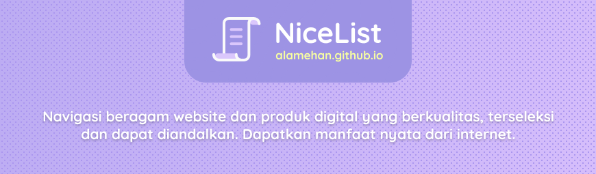

## NiceList
- Navigasi beragam website dan produk digital yang berkualitas, terseleksi dan dapat diandalkan 
- Merupakan salah satu personal project dari [alamehan.github.io](https://alamehan.github.io/) yang berfokus pada _curated list_

## Motivasi 

Dari tak terhitungnya jumlah konten di internet, terdapat konten "harta karun" yang tersembunyi. Harta karun ini tidak mudah ditemukan, diperlukan sebuah _keyword_ yang tepat pada mesin pencari untuk mendapatkannya. Harta karun yang dimaksud ini berupa website maupun produk digital yang berkualitas, terseleksi dan dapat diandalkan. Dengan harta karun ini, hidup anda akan jauh lebih mudah, anda akan mendapatkan banyak sekali manfaat nyata dari internet, mulai dari informasi yang berbobot dan gak setengah-setengah hingga produk digital gratisan yang dapat membantu anda dalam mengerjakan pekerjaan sehari-hari. Kabar baiknya, anda gak perlu menghabiskan waktu untuk mencarinya kesana-kemari, karena saya akan memberikan semua harta karun yang berhasil saya kumpulkan dalam **NiceList** ini.

Dengan **NiceList** yang terinspirasi dari sebuah proyek _curated list_ yang begitu populer bernama [Awesome](https://github.com/sindresorhus/awesome), saya menghabiskan banyak sekali waktu untuk melakukan "penjelahan" secara mendalam di semesta Internet dari waktu ke waktu. Mencari harta karun yang tersembunyi itu, kemudian mengumpulkannya, lalu mem-_filter_ dan mengkategorikan nya sesuai topik. Gak lain dan gak bukan, tujuan utamanya untuk memudahkan anda maupun saya pribadi dalam mendapatkan konten bermutu dengan mudah. Intinya, **NiceList** dapat digunanan sebagai _navigasi_ yang membantu dan menuntun anda ke beragam website maupun produk digital yang berkualitas, terseleksi dan dapat diandalkan. Bisa anda manfaatkan sebagai sumber informasi, sumber belajar maupun rekomendasi tools berguna.

Topik yang tersedia di NiceList ini memang tidak banyak dan cenderung lebih ke topik design, pemrograman dan pengembangan diri. Namun demikian, NiceList ini merupakan proyek yang berkepanjangan, sehingga dari waktu ke waktu saya akan meng-_update_ dan menambahkannya secara berkala, tentunya saat saya menemukan harta karun baru yang layak dimasukkan kedalam daftar. Hingga saat ini **NiceList memiliki 12 kategori & ... daftar** (per 10/07/2020).

## Daftar Isi (Section) :

	<a href="#sec01">1. Find a Job (32)</a>&nbsp; 
	<a href="#sec02">2. Useful Websites (85)</a>&nbsp; 
	<a href="#sec03">3. Internet Library (27)</a>&nbsp; 
	<a href="#sec04">4. Wikipedia Uncover (...)</a>&nbsp; 
	<a href="#sec05">5. Self Improvement (78)</a>&nbsp; 
	<a href="#sec06">6. Top Chrome Extensions (71)</a>&nbsp; 
	<a href="#sec07">7. Designer 101 (...)</a>&nbsp; 
	<a href="#sec08">8. Developer 101 (77)</a>&nbsp; 
	<a href="#sec09">9. Top Figma Plugins (130)</a>&nbsp; 
	<a href="#sec10">10. Top Visual Studio Code Extensions (33)</a>&nbsp; 
	<a href="#sec11">11. Educational Instagram Accounts (460)</a>&nbsp; 
	<a href="#sec12">12. Windows Software Bundles (155)</a>&nbsp; 

💼 
Find a Job : Mudah Mencari Kerja
---

<a href="#daftarisi">🡹 Kembali ke daftar isi</a>

* General : [LinkedIn](https://www.linkedin.com/), [Qerja](https://www.qerja.com/), [Glints](https://glints.com/id), [Glassdoor](https://www.glassdoor.com/index.htm), [Urbanhire](https://www.urbanhire.com/), [Careerjet](https://www.careerjet.co.id/), [Indeed](https://id.indeed.com/), [TheMuse](https://www.themuse.com/), [JobStreet](https://www.jobstreet.co.id/), [Jora](https://www.jora.com/), [JobFinder](http://www.jobfinder.co.id/)
  
* Developer : [Tech in Asia](https://www.techinasia.com/jobs/search), [Dicoding](https://www.dicoding.com/jobs/list), [Ekrut](https://careers.ekrut.com/), [SIMONAS (Sistem Informasi Monitoring Alumni Sertifikasi ) Kominfo](https://simonas.kominfo.go.id/)
  
* Startup Career : [Tokopedia](https://www.tokopedia.com/careers/jobs/), [Bukalapak](https://careers.bukalapak.com/browse/Engineering), [Shopee](https://careers.shopee.co.id/jobs/), [Blibli](https://www.blibli.com/page/karir/), [Gojek](https://career.go-jek.com/job/), [Traveloka](https://www.traveloka.com/en/careers), [Pegipegi](https://www.pegipegi.com/team/career.html), [Dana](https://www.dana.id/karir), [KitaBisa](https://kitabisa.urbanhire.com/), [Ruangguru](https://career.ruangguru.com)
  
* Freelancer & Project : [Freelancer](https://www.freelancer.co.id/search/projects/), [Sribu](https://www.sribu.com/id/contests), [Sribulancer](https://www.sribulancer.com/id/bj/loker/v3), [Projects](https://projects.co.id/public/browse_projects/listing), [Fastwork](https://fastwork.id/start-selling), [99designs](https://99designs.com/contests), [DesignCrowd](https://jobs.designcrowd.com/jobs/)

🌐 
Useful Websites : Jelajah Manfaat Internet
---

<a href="#daftarisi">🡹 Kembali ke daftar isi</a>

* Top Curation Site
  * [Awesome Github](https://github.com/phillipadsmith/awesome-github) - A curated list of GitHub's awesomeness. Huge curated list project.
  * [Awesome Piracy](https://github.com/Igglybuff/awesome-piracy) - Everything you need to get started on your pirate voyage can be found here.
  * [Pretty Awesome Lists](https://www.prettyawesomelists.com/) - Pretty Awesome Lists crawls all these lists, collects interesting information.
  * [Content Curation Tools](https://optinmonster.com/best-content-curation-tools/) - Collecting interesting information as individual pieces of content or as a digest.

* Discover Digital Products
  * [Product Hunt](http://www.producthunt.com/) - Discover the latest mobile apps, websites, and technology products.
  * [Stackshare](https://stackshare.io/) - Find the right developer tools and the companies that use them.
  * [YourStack](https://yourstack.com/) - YourStack is for sharing your favorite products with the world.
  * [SimiliarWeb](https://www.similarweb.com/) - SimilarWeb is a website which provides web analytics services for businesses.
  * [Slant](https://www.slant.co/) - Product recommendation community to find the best product, app or game for you.
  * [Capterra](https://www.capterra.com/) - Search, compare, and choose the right software with confidence.
  * [G2](https://www.g2.com/) - Choose the right software and services based on 1,061,900+ authentic.

* Knowledge Resources
  * [Wikipedia](https://www.wikipedia.org/) - Encyclopedia. The largest and most popular general reference work on the World Wide Web.
  * [Wikihow](https://www.wikihow.com/) - The world's most helpful how-to instructions to enable everyone to learn how to do anything.
  * [Fandom](https://www.fandom.com/) - The entertainment site where fans come first. Source for all things TV, movies, and games, etc.
  * [Medium](https://medium.com/) - Our sole purpose is to help you find compelling ideas, knowledge, and perspectives.
  * [MakeUseOf](https://www.makeuseof.com/) - Learn how to make use of tech around you and discover cool stuff on the Internet.
  * [Reddit](https://www.reddit.com/) - Home to thousands of communities, endless conversation, and authentic human connection.
  * [Vice](https://www.vice.com/) - The definitive guide to enlightening information from every corner of the planet.
  * [Snopes](https://www.snopes.com/) - The definitive fact-checking site and reference source for misinformation.
    
* Useful Web Apps
  * [Pdf.io](https://pdf.io/) - Free set of online tools for handling PDF files. Convert and edit your PDF files.
  * [Convert.io](https://convertio.co/) - Convert your files to any format. 300+ formats supported. Fast and easy.
  * [Veed.io](https://www.veed.io/) - A simple but powerful online video editor. Music, trim, crop, aff effects, images, filter, etc.
  * [Designer.io](http://designer.io/) - Create graphics, logos and icons, edit images illustrations & presentations, all for free.
  * [Draw.io](https://www.draw.io/) - A free diagram software for making flowcharts, process diagrams, org charts, UML, ER, etc.
  * [Mindmeister](https://www.mindmeister.com/) - An online mind mapping tool that lets you capture, develop and share ideas visually.
  * [Io-games.io](http://io-games.io/) - The best io games site in the world. A list of all new io games and most played games.
  
* Useful Web Tools
  * [Get Emoji](https://getemoji.com/) - Copy and paste emoji no apps required 😀 😃 😄 😁 😆 🍎 🍐 🍊 🍋 🍌.
  * [Emojipedia](https://emojipedia.org/) - A fast emoji search experience with options to browse every emoji by name or category.
  * [Cool Symbol](https://coolsymbol.com/) - A symbol & picture text collection that provides access to many special fancy text symbols.
  * [LingoJam](https://lingojam.com/) - LingoJam lets you create an online translator (biasanya untuk style text generator).
  * [Text Fixer](https://www.textfixer.com/) - A Helpful collection of free online tools for web coding and text conversion.
  * [Online Text Tools](https://onlinetexttools.com/) - Online text tools is a collection of useful text utilities (Add line number, etc).
  * [Tools4Noobs](https://www.tools4noobs.com/online_tools/) - Tools you didn't even know you needed. A collection of useful scripts (Count lines, etc).
  * [Sort My List](https://sortmylist.com/) - Online word tool to alphabetize & text sort. Sort numerically or by length and more.
  * [Remove Line Breaks](http://removelinebreaks.net/) - Remove line breaks from blocks of text (solusi untuk copy text dari PDF).
  * [ttsMP3](https://ttsmp3.com/) - Easily convert your written text into natural sounding voice in up to 50 different languages.
  * [WeTransfer](https://wetransfer.com/) - Simple file-sharing, No registration, It's free. the simplest way to send your files.
  * [Pasteboard](https://pasteboard.co/) - Super simple and lightning fast image sharing. Upload clipboard images with Copy & Paste.
  * [Pastebin](https://pastebin.com/) - Pastebin is a website where you can store text online for a set period of time.
  * [Bitly](https://bitly.com/) - Shorten, create and share trusted, powerful links for your business. Create click-worthy links.
  * [Linktree](https://linktr.ee/) - free bio link tool used by the world's best brands, creators and influencers.
  * [Small PDF](https://smallpdf.com/) - All-in-one (convert, compress, merge, split and edit) easy-to-use online PDF tools.
  * [Google Earth](https://www.google.com/intl/id/earth/) - 3D representation of Earth based primarily on satellite imagery - Allows you to "fly".
  * [IsItDownRightNow?](https://www.isitdownrightnow.com/) - Monitors the status of websites and checks whether they are down or not. 
  * [HaveIBeenPwned](https://haveibeenpwned.com/) - Check if you have an account that has been compromised in a data breach.
  
* Online Courses
  * [Kelas](https://kelas.com/) - Belajar dari para mentor terbaik dibidangnya. Nikmati pengalaman belajar yang berbeda.
  * [Skill Academy](https://skillacademy.com/) - Tingkatkan technical & soft skill di berbagai bidang (by Ruangguru).
  * [IndonesiaX](https://www.indonesiax.co.id/) - Kursus dari universitas peringkat tertinggi di Indonesia dan perusahaan terbaik.
  * [Coursera](https://www.coursera.org/) - Build skills with online courses from world-class universities and companies. ⭐
  * [Alison](https://alison.com/) - Free online education platform that mostly focuses on workplace-based skills.
  * [Udemy](https://www.udemy.com/) - Study any topic, anytime. Choose from thousands of expert-led courses now.
  * [Udacity](https://www.udacity.com/) - Advance your career with online courses in programming, data science, and more.
  * [Lynda](https://www.lynda.com/) - Learn software, creative, and business skills to achieve your personal and professional goals.
  * [Skill Share](https://www.skillshare.com/) - Learning platform with online classes taught by the world's best practitioners.
  * [Plural Sight](https://www.pluralsight.com/) - Gives you confidence you have the skills you need to execute your technology strategy.
  * [Treehouse](https://teamtreehouse.com/) - Learn to code, gain a new skill, get a new job. Whatever your goal — we'll get you there.
  * [Codecademy](https://www.codecademy.com/) - Learn the technical skills you need for the job you want. An online interactive platform.
  * [Zero to Mastery](https://zerotomastery.io/) - Help you advance your career, get hired and succeed at some of the top companies. ⭐
  
* Coupon Hunter
  * [Tutflix Coupon](https://tutflix.io/forums/udemy-coupon/) - A place where you can learn any course online. ⭐
  * [OzBargain](https://www.ozbargain.com.au/tag/udemy-course) - Hunting community, coupon codes and freebies.
  * [Freebies Global](https://freebiesglobal.com/) - Latest freebies, courses, coupons & deals.
  * [Disc Udemy](https://www.discudemy.com/language/english) - The only website where expired courses are deleted.
  * [Coupo Scorpion](https://couponscorpion.com/) - The ultimate resources for 100% free Udemy coupons.
  * [LearnViral](https://udemycoupon.learnviral.com/) - Free Udemy coupons, get your coupons before they expire.
  * [CouponCause](https://couponcause.com/) - Find promo codes and online discounts by store and category.
  * [Couponos](https://couponos.ooo/) - Get the latest Udemy coupon and BitDegree online courses.

* Downloadable : Multimedia
  * [SoftArchive](https://sastatus.com/) - Unlimited Resource for Free Downloading Latest PDF eBooks and Video Tutorials. ⭐
  * [FileCR](https://filecr.com/en/) - Free download software, apps, games, e-learning, e-books, scripts and much more.
  * [Internet Archive](https://archive.org/) - Digital library offering free universal access to books, movies & music.
  * [Torrentz2](https://torrentz2.is/) - Fast and powerful meta-search engine combining results of search engines.
  * [TorrentFunk](https://www.torrentfunk.com/) - The fastest download search engine. Find the latest games, etc.
  * [Kickass](https://kickass.help/) - You can search for TV shows and TV series, movies, music and games.
  * [Torlock](https://www.torlock.com/) - A fast BitTorrent search engine that only lists verified torrents.
  * [1337x](https://www.1337x.tw/) - Brings you the latest games, movies, tv series, music and software for free.
  * [Yify](https://yts.mx/) - YTS was a peer-to-peer release group known for distributing large numbers of movies. ⭐
  * [Soap2Day](https://soap2day.ru/) - Watch latest movies and TV series online no ads, we daily update.
  * [KeBioskop21](http://103.194.171.185/) - Streaming film maupun tv series online gratis, subtitle Indonesia. ➊
  * [Rebahin Streaming](http://198.54.124.245/) - Streaming film maupun tv series online gratis, subtitle Indonesia. ➋
  * [Subscene](https://subscene.com/) - Free download and browse more movies, TV Series, tv shows subtitles.
  * [pyTranscriber](https://github.com/raryelcostasouza/pyTranscriber) - Generate automatic subtitles for audio/video files (Desktop). ⭐
  * [Subtitles Translator](https://subtitlestranslator.com/) - Translate multiple subtitle at the same time into 80 different languages. ⭐
  * [TubeOffline](https://www.tubeoffline.com/) - Free online downloader for any Twitter video. Best tool that actually works.
  * [FitGirl Repacks](https://fitgirl-repacks.site/) - Collection of repack games, minimize the size of installation.
  * [OVA Games](https://www.ovagames.com/) - Free download pc game, codex, plaza, cpy, gog, elamigos, repack, etc.
  * [PremixStore](https://premixstore.com/) - Penyedia jasa akun digital premium di indonesia dengan harga yang murah.
  * [OnLeech](https://onleech.me/) - Free premium link generator service for uploaded, rapidgator, turbobit, nitroflare, etc.

* Downloadable : Documents
  * [Libgen](https://libgen.is/) - Search engine for articles and books on various topics which allows free access. ⭐
  * [Z-Lib](https://z-lib.org/) - The world's largest ebook library, download books for free. Part of Z-Library project. ⭐
  * [Mobilism](https://forum.mobilism.org/index.php) - Large forum of mobile apps and books. Romance, classic, etc. ⭐
  * [PDF Drive](https://www.pdfdrive.com/) - Search engine for PDF files. eBooks for you to download for free.
  * [BooksRack](https://booksrack.net/) - Free download e-books, magazine, available in PDF, ePub, Kindle and AudioBook formats.
  * [Lib-Ebooks](https://lib-ebooks.com/) - Provides Free PDF Books and more.. For all, In many different Subjects.
  * [Ebookee](https://ebookee.com/) - A free ebooks search engine, the best free ebooks download library. Tech, Novel, etc.
  * [Ebook3000](http://ebook3000.com/) - The best place to read ebooks and search free download ebooks. It's the open directory.
  * [All-Ebooks](http://all-ebooks.com/) - Ebooks for free. Library where you can download e-books and magazines for free.
  * [Twirpx](https://www.twirpx.com/) - Everything for the student. Languages and linguistics, Computer literature, Math, etc.
  * [Alleng](https://alleng.org/) - For ESL students. Download textbooks, dictionaries, manuals, audio, video etc.
  * [Sci-Hub](https://sci-hub.tw/) - The first website in the world to provide mass & public access to research papers. ⭐
  * [IEEE](https://www.ieee.org/) - The world's largest technical professional organization for the advancement of technology.
  * [DocSity](https://www.docsity.com/) - Access free study contents - study notes, essays, summaries and a lot more.
  * [Scribd](http://www.scribd.com/) - Enjoy an unlimited* number of books, audiobooks, magazines, and more.
  * [Use FYI](https://usefyi.com/templates/) - Free resources and templates you need to get work done in one place.
  * [Biggerplate](https://www.biggerplate.com/) - Download mind map templates and shared by members of our global community.
  * [Small Pocket Library]( https://www.smallpocketlibrary.com/) - Help students and teachers and anyone interested in science.
  
* Downloadable : Courses
  * [Tutflix.io](https://tutflix.io/) - Free education community. A place where you can learn any course online and discuss. ⭐
  * [Tutflix.com](https://tutflix.com/) - Free education community. A place where you can learn any course online and discuss.
  * [Downloadly.ir](https://downloadly.ir/) - Free software download. Education, courses, programming, software, etc. ➊
  * [Downloadly.net](https://downloadly.net/) - Free software download. Education, courses, programming, software, etc. ➋
  * [Tut4dl](https://tut4dl.com/) - Get new video training, update tutorials for programing tutorials, mobile dev, etc. ⭐
  * [Ttorial](http://ttorial.com/) - Obtain & download the best online courses for free, from 100+ institutions.
  * [OneHack](https://onehack.us/) - Tutorials for free. A place where everyone can share knowledge with each other.
  * [FreeCourseLab](https://freecourselab.com/) - A great place to learn. Download Udemy courses for free.
  * [FreeCourseWeb](https://freecourseweb.com/) - Tutorials Archives. Free Udemy Courses Download for free.
  * [FreeCourseSite](https://freecoursesite.com/) - Learn Hacking, Programming, IT, Marketing, Music, and more.
  * [FreeCourseUdemy](https://freecourseudemy.com/) - Premium Udemy tutorials free download. Top udemy courses.
  * [FreeEducationWeb](https://freeeducationweb.com/) - We are sharing the knowledge for free of charge and help learners.
 

📚
Internet Library : Eksplorasi Beragam Topik
---

<a href="#daftarisi">🡹 Kembali ke daftar isi</a>

* Good Resources
  * Career Path : [The Balance Careers](https://www.thebalancecareers.com/), [MyMajors](https://www.mymajors.com/), [Recruiter](https://www.recruiter.com/careers/), [Rencanamu.id](https://rencanamu.id/), [Glints](https://glints.com/)
  * Psychology : [Positive Psychology](https://positivepsychology.com/), [Simply Psychology](https://www.simplypsychology.org/), [CCI Health](https://www.cci.health.wa.gov.au/Resources/Overview), [Psychology Tools](https://www.psychologytools.com/), [Tools](https://psychology-tools.com/)
  * 16 MBTI Personalities : [16Personalities](https://www.16personalities.com/), [PersonalityClub](https://www.personalityclub.com/), [The Personality Database](https://personality-database.com/)
  * Data Visualization : [Visualization Universe](http://visualizationuniverse.com/), [Dataviz Catalogue](https://datavizcatalogue.com/), [Observable HQ](https://observablehq.com/), [Adioma](https://blog.adioma.com/)
  * Explorative Visuals : [By Owen](http://byowen.com/), [One Zoom](https://www.onezoom.org/), [Things Made Thinkable](http://www.thingsmadethinkable.com/), [Knowledge Center](http://www.knowledgecenter.com/ions/NoeticMap.html)
  * Powerful Diagramming : [Creately](https://creately.com/), [Draw.io](https://app.diagrams.net/), [MindMeister](https://www.mindmeister.com/) _(Selebihnya di : Designer 101)_

🌌 
Wikipedia Uncover : Peta Ilmu Pengetahuan
---

<a href="#daftarisi">🡹 Kembali ke daftar isi</a>

_(Upcoming!)_

💡 
Self Improvement : Perluas Ide & Wawasan
---

<a href="#daftarisi">🡹 Kembali ke daftar isi</a>

* Books and Ideas (ID)
  * [Pimtar](https://pimtar.id/) - Sebentar bacanya, cepat pintarnya. Aplikasi rangkuman buku best seller pertama di Indonesia.
  * [Saputrawhy](https://www.saputrawhy.com/reading-notes/) - Halaman tentang ringkasan buku, berupa poin-poin yang berisi ide atau pelajaran penting.
  * [Darmawan Aji](https://darmawanaji.com/) - Penulis buku mindful life, productivity hack, life by design, hypnoselling, hypnowriting.
  * [Dewa Eka Prayoga](https://dewaekaprayoga.com/) - Business owner, moslem internet marketer, author, founder Jago Jualan.
  * [Arry Rahmawan](https://arryrahmawan.net/) - Mengikat dan berbagi ilmu untuk generasi Indonesia yang Lebih Baik.
  * [Hitman System](https://hitmansystem.com/produk) - Satu-satunya professional relationship consultancy di Indonesia.

* Books and Ideas (EN)
  * [LifeClub](https://lifeclub.org/book-categories) - Life Club is building a university for life skills. Like a Wikipedia for life skills.
  * [BookAuthority](https://bookauthority.org/) - The most recommended books on business, technology and science.
  * [Blinkist](https://www.blinkist.com/) - Big ideas in small packages. Key takeaways from best nonfiction books in text and audio.
  * [12min](https://12min.com/) - The best ideas in your pocket. You are only a few seconds away from changing your life.
  * [Four Minutes](https://fourminutebooks.com/) - Over 600 free book summaries. You can read each one in just 4 minutes.
  * [Optimize Me](https://www.optimize.me/) - The best Big Ideas from the best optimal living books. More wisdom in less time.
  * [The Power Moves](https://thepowermoves.com/start-here/) - E-learning platform, social dynamics, power, and life strategies.
  * [Faster to Master](https://fastertomaster.com/) - Faster to Master. Read more, learn faster and wake up productivity.
  * [The Book Summary Club](https://booksummaryclub.com/) - Think big, read small. Short book summaries for business owners.
  * [Paul Minors](https://paulminors.com/resources/) - I can help you to be more effective with your time and get more done.
  * [Nat Eliason](https://www.nateliason.com/notes/) - Most of the important things I’ve learned have come from books, articles, etc.
  * [Sam Thomas](https://www.samuelthomasdavies.com/book-summaries/) - I take brief but concise notes from the best non-fiction books of all-time.
  * [James Clear](https://jamesclear.com/book-summaries) - Book summaries: popular books summarized in 3 sentences or less.
  * [Marc Reclau](https://www.marcreklau.com/) - Author of the #1 Bestseller "30 days change your habits, change your life".
  * [Gates Notes](https://www.gatesnotes.com/Books) - Where Gates shared about the people he met, the books he read, and what he learned.
  * [Mark Manson](https://markmanson.net/best-books) - Lists of the best books to read based on hundreds of hours of reading and research.
  * [Design Epic Life](https://designepiclife.com/) - Design your greatest life and unleash the best version of you. Design your epic life.
  * [Experience Life](https://experiencelife.com/) - Empowering people to become their happiest - deeply satisfying way of life.
  * [Success.com](https://www.success.com/) - Focuses on people who take full responsibility for their own dev and income.

* Podcast and Ideas (ID & EN)
  * [Podcast Subjective](https://soundcloud.com/iqbalhariadi) - Millennials opinion & stories. Berbagi kisah, insight, dan tips praktis pengembangan diri.
  * [Satu Persen Audio Insight](https://open.spotify.com/show/1iIFlumWtP4xI1QEzCBcSY) - Berkembang bersama kami, satu persen setiap harinya #MaksimalkanHidupmu.
  * [Thirty Days of Lunch](https://open.spotify.com/show/0vFfPAk7zgDLnv3utpZ8ww) - Teman makan siang sekaligus nutrisi untuk pikiran. Gak berat, tapi juga gak receh.
  * [Makna Talks](https://open.spotify.com/show/1PGN4ilb4aoWKkB7FNSLsx) - A weekly podcast with well known subjects every week talking about what's behind the facts.
  * [Hiduplah Indonesia Maya](https://open.spotify.com/show/6yUPhJdvDAMRVwApXBpQWd) - Podcast dari Pandji Pragiwaksono, membahas segala hal yang terjadi di Indonesia.
  * [Finfolk](https://open.spotify.com/show/3coiCSZDmmBSREVpo0PpIB) - Rethinking money. Sunday chill afternoon. New ideas about investment in a fun way.
  * [GaryVee Podcast](https://www.garyvaynerchuk.com/podcast/) - The Garyvee audio experience. Keynote speeches on marketing and business.
  * [HBR IdeaCast](https://open.spotify.com/show/4gtSBBxIAE142ApX6LqsvN) - A weekly podcast featuring the leading thinkers in business and management.
  
* Youtube : Motivation & Inspiration (ID & EN)
  * [TEDx Talks](https://www.youtube.com/user/TEDxTalks) - American media organization that posts talks online - "ideas worth spreading". 
  * [OPTIMIZE](https://www.youtube.com/channel/UCRhEwzsFYLGcMa4m2AbTAoA) - The best Big Ideas from the best optimal living books. More wisdom in less time.
  * [FightMediocity](https://www.youtube.com/user/phuckmediocrity/) - The free audiobook or for reading a book, here's FightMediocrity.
  * [GaryVee](https://www.youtube.com/user/GaryVaynerchuk) - Highly sought after public speaker. Keynote speeches on marketing and business.
  * [Evan Carmichael](https://www.youtube.com/user/ModelingTheMasters) - An introvert entrepreneur. Working to solve the world's biggest problem.
  * [SuccessBefore30](https://www.youtube.com/user/successbefore30/) - Wadah untuk Belajar Berbisnis dan Mengerti tentang aspek-aspek dari Kesuksesan.
  * [Pagar Kehidupan](https://www.youtube.com/channel/UCRPWx7xrHni4v31AkXE16Fg) - Butuh Inspirasi dan bantuan dalam hidup? Ini adalah channel yang bisa Kamu tuju.
  * [Chandra Hasyim](https://www.youtube.com/channel/UCFCUdbQNQjbK-7UhKy--chg) - Inspiring and motivational video translations in Indonesia. Feed your mind.
  * [Merry Riana](https://www.youtube.com/user/merryrianashow) - Menciptakan dampak positif di dalam kehidupan jutaan orang di Indonesia.
  * [Dewa Eka Prayoga](https://www.youtube.com/channel/UCx-9wWeG3YcqxXKXxOn3wMA) - Sharing seputar bisnis online, digital marketing, copywriting, dll.
  
* Youtube : Animated Book Summaries (EN)
  * [OnePercentBetter](https://www.youtube.com/channel/UCRI6t05DNVlV0XhdI7hx_iw/) - Get the key lessons from self-development books in 10 minutes or less.
  * [Mervan Polat](https://www.youtube.com/channel/UCfr02PiHepExS81u6jRT2Cw) - I tell stories about art, history, technology, philosophy and science. Book summaries.
  * [Practical Psychology](https://www.youtube.com/channel/UCir93b_ftqInEaDpsWYbo_g) - Giving high-quality and informative videos to everyone who wishes to learn.
  * [After Skool](https://www.youtube.com/channel/UC1KmNKYC1l0stjctkGswl6g) - A weekly dose of fun and interesting science, ideas, stories, education and more.
  * [FightMediocrity](https://www.youtube.com/user/phuckmediocrity) - Big Ideas for a better life. The free audiobook or for reading a book.
  
* Youtube : Insight, Feed Your Brain (ID)
  * [Sisi Terang](https://www.youtube.com/channel/UCSg-Y9uI1E-my-I4WKKioEQ) - Penemuan sains, ruang angkasa, misteri, kisah nyata mengejutkan, psikologi, dll.
  * [Kok Bisa?](https://www.youtube.com/channel/UCu0yQD7NFMyLu_-TmKa4Hqg) - Pengalaman belajar sains yang inovatif melalui video-video animasi edukatif.
  * [Hujan Tanda Tanya](https://www.youtube.com/channel/UC5dn6JdeSgWzcNL7NuvMEKQ) - Rangsangan pemikiran seputar sains, teknologi, dan masyarakat, dikemas secara ringan.
  * [Sains Bro](https://www.youtube.com/channel/UCCFY2uB8liUM4cnCCkUC6GA) - Channel edukasi Indonesia yang membantu menjelaskan berbagai hal tentang SAINS.
  * [Kamu Harus Tahu](https://www.youtube.com/channel/UCLNrxRWWBw-lYOPaibnvSwA) - Channel edukasi yang menyajikan beragam pengetahuan melalui animasi 2D.
  * [Ayo Mikir](https://www.youtube.com/channel/UCyZa7DYVsdJxnyDw6XmVvCQ) - Channel edukasi yang menyajikan konten tayangan inspiratif dan edukatif untuk Indonesia.
  * [House of Infographics](https://www.youtube.com/channel/UCz-lipPZtRjhgLJpZQHczBg) - Menampilkan data secara sederhana, kreatif dan mudah untuk dipahami.
  * [Nous ID](https://www.youtube.com/channel/UCNgz9dujmF3kTbmR3yJHmlQ) - Nous ID, sebuah channel edukasi alternatif, yang bergerak melalui platform YouTube.
  * [Mau Tau Banget](https://www.youtube.com/channel/UCMCbTLHW5GXsxKMkOelX6-w) - Channel edukasi yang menyajikan berbagai informasi dan pengetahuan melalui Youtube.
  * [DW Indonesia](https://www.youtube.com/user/DWBahasaIndonesia) - Lembaga penyiaran yang memproduksi siaran TV, radio dan informasi melalui internet.
  * [Remotivi](https://www.youtube.com/user/remotivi) - Remotivi adalah lembaga studi dan pemantauan media, khususnya televisi di Indonesia.
  * [Satu Persen](https://www.youtube.com/channel/UC_eifcIIjgN8Q_8m34nWo3Q) - Mengajarkan hal-hal penting yang sampai saat ini belum diajarkan di sekolah konvensional.
  * [Creativox](https://www.youtube.com/channel/UC4DogC2xftpKFlF-XgZoRBg) - A multi-platform entertainment media - educational, and motivational experience.
  * [Froyonion](https://www.youtube.com/channel/UCG1E2hR9KDuAWFoRO0yyE4w) - Froyonion mengajak penonton memikirkan kembali berbagai hal dari sudut pandang lain.
  * [Gue Punya Cerita](https://www.youtube.com/channel/UCkRNRz9ifB2A04zTb6Y9LYg) - Berbagai cerita yang diangkat dari kisah nyata, dikemas dalam bentuk animasi.
  
* Youtube : Insight, Feed Your Brain (EN)
  * [TED-Ed](https://www.youtube.com/user/TEDEducation) - Creating lessons worth sharing is an extension of TED’s mission of spreading great ideas.
  * [Crash Course](https://www.youtube.com/user/crashcourse) - Tons of awesome courses - sociology, computer science, film history and mythology.
  * [Kurzgesagt](https://www.youtube.com/user/Kurzgesagt) - We are a small team who want to make science look beautiful. Because it is beautiful.
  * [Epipheo](https://www.youtube.com/user/epipheo/) - We love stories that reveal truth! We work really hard to create valuable stories for our clients.
  * [MinuteEarth](https://www.youtube.com/user/minuteearth) - Science and stories about our awesome planet! Helps understand the world around us.
  * [Minute Physics](https://www.youtube.com/user/minutephysics) - Simply put: cool physics and other sweet science. Helps understand the world around us.
  * [Stated Clearly](https://www.youtube.com/user/sciencestatedclearly) - We produce animations on genetics, evolution, biology, and chemistry.
  * [KnowledgeHub](https://www.youtube.com/channel/UC2_KC8lshtCyiLApy27raYw) - A modern philosopher of our time. Except I talk about pretty pointless things.
  * [AsapSCIENCE](https://www.youtube.com/user/AsapSCIENCE) - The channel produces weekly videos that touch on many different topics of science. 
  * [SciShow](https://www.youtube.com/user/scishow/) - The scientific subjects that defy our expectations and make us even more curious.
  * [It's Okay To Be Smart](https://www.youtube.com/user/itsokaytobesmart) - Curious group of atoms in a curious universe—tell you how it all works.
  * [SmarterEveryDay](https://www.youtube.com/user/destinws2) - I explore the world using science.  That's pretty much all there is to it. 
  * [Up and Atom](https://www.youtube.com/channel/UCSIvk78tK2TiviLQn4fSHaw) - Making notoriously hard stuff less hard. Math, physics and computer science.
  * [CGP Grey](https://www.youtube.com/user/CGPGrey) - Short explanatory videos, including politics, geography, economics, history, and culture.
  * [Vsauce](https://www.youtube.com/user/Vsauce/) - Feature videos on scientific, psychological, mathematical, and philosophical topics, etc.

⚙️ 
Top Chrome Extensions : Tingkatkan Kemampuan Browser
---

<a href="#daftarisi">🡹 Kembali ke daftar isi</a>

* Increase Productivity
  * [Extensify](https://chrome.google.com/webstore/detail/extensity/jjmflmamggggndanpgfnpelongoepncg) - Tool for lightning fast enabling/disabling all your extensions for Chrome.
  * [Elenco](https://chrome.google.com/webstore/detail/elenco/phbjhmbdcecahmckhhbdabmnhmjcpjab) - With Elenco, browsing the internet is distraction free with every new tab you open.
  * [Infinity New Tab](https://chrome.google.com/webstore/detail/infinity-new-tab-producti/dbfmnekepjoapopniengjbcpnbljalfg) - Replaces the original new tab with variety of quick and useful features.
  * [Muzli 2](https://chrome.google.com/webstore/detail/muzli-2-stay-inspired/glcipcfhmopcgidicgdociohdoicpdfc) - The freshest links about design and interactive, from around the web.
  * [Bookmark Sidebar](https://chrome.google.com/webstore/detail/bookmark-sidebar/jdbnofccmhefkmjbkkdkfiicjkgofkdh) - Toggleable sidebar with all your bookmarks at the edge of your browser window. ⭐
  * [Tabli](https://chrome.google.com/webstore/detail/tabli/igeehkedfibbnhbfponhjjplpkeomghi) - A simple and powerful tab manager that provides fast switching between windows.
  * [Sticky Notes](https://chrome.google.com/webstore/detail/sticky-notes-just-popped/plpdjbappofmfbgdmhoaabefbobddchk) - A perfect tool for taking quick notes. Its fast, secure, and private. A must tool for everyone. 
  * [Black Menu for Google](https://chrome.google.com/webstore/detail/black-menu-for-google/eignhdfgaldabilaaegmdfbajngjmoke) - Quick access to your favorite Google services with a convenient drop-down menu. ⭐
  * [Application Launcher for Drive](https://chrome.google.com/webstore/detail/application-launcher-for/lmjegmlicamnimmfhcmpkclmigmmcbeh) - Open Drive files directly from your browser in compatible applications.
  * [Checker Plus for Gmail](https://chrome.google.com/webstore/detail/checker-plus-for-gmail/oeopbcgkkoapgobdbedcemjljbihmemj) - Get notifications, read, listen, delete emails without opening Gmail.
  * [InstaClean](https://www.instaclean.app/) - Instantly clear out all unwanted mails & bulk unsubscribe newsletters (_**Bukan extension**_).
  * [Awesome Screenshot](https://chrome.google.com/webstore/detail/awesome-screenshot-screen/nlipoenfbbikpbjkfpfillcgkoblgpmj?hl=id) - Share screenshots with your friends or teammates, fast and easily. ⭐
  * [Nimbus Screenshot](https://chrome.google.com/webstore/detail/nimbus-screenshot-screen/bpconcjcammlapcogcnnelfmaeghhagj) - Screen capture full web page or any part & record screencasts.
  * [Element Screenshot](https://chrome.google.com/webstore/detail/element-screenshot/mhbapdljigafafoimcnnhagdclejnkcf) - Take screenshot of any HTML element on a webpage.
  * [Copyfish](https://chrome.google.com/webstore/detail/copyfish-%F0%9F%90%9F-free-ocr-soft/eenjdnjldapjajjofmldgmkjaienebbj) - Copy, paste and translate text from any image, video or PDF.
  * [Image Reader (OCR)](https://chrome.google.com/webstore/detail/image-reader-ocr/cakcfocedphbadddjpalejbkhflfbhmf) - Easily get words out of an image with OCR engine.
  
* Text & Read Tools
  * [Reading List](https://chrome.google.com/webstore/detail/reading-list/lloccabjgblebdmncjndmiibianflabo) - This reading list extension allows you to save pages in a list to get back to later. ⭐
  * [Wikiwand](https://chrome.google.com/webstore/detail/wikiwand-wikipedia-modern/emffkefkbkpkgpdeeooapgaicgmcbolj?hl=id) - A new interface that optimizes Wikipedia's amazing content for improved reading experience.
  * [Mercury Reader](https://chrome.google.com/webstore/detail/mercury-reader/oknpjjbmpnndlpmnhmekjpocelpnlfdi) - Clear away the clutter from all of your articles, instantly. Removes ads and distractions. 
  * [Rocket Readability](https://chrome.google.com/webstore/detail/rocket-readability/fhckbdfnalikpmcmcpcpkkdlhabngbod) - Mercury Reader alternative. Parses web pages cutting out ads.
  * [Just Read](https://chrome.google.com/webstore/detail/just-read/dgmanlpmmkibanfdgjocnabmcaclkmod) - Remove distractions like the page's styling, ads, poups and comments.
  * [Print Friendly & PDF](https://chrome.google.com/webstore/detail/print-friendly-pdf/ohlencieiipommannpdfcmfdpjjmeolj) - Print Friendly removes ads, navigation and junk before your print.
  * [Kami Extension](https://chrome.google.com/webstore/detail/kami-extension-pdf-and-do/ecnphlgnajanjnkcmbpancdjoidceilk) - Best PDF and document annotation and markup tool. Works with Drive and Classroom. ⭐
  * [Google Docs Offline](https://chrome.google.com/webstore/detail/google-docs-offline/ghbmnnjooekpmoecnnnilnnbdlolhkhi) - Edit, create and view all your documents without Internet access.
  * [Readiator EPUB Reader](https://chrome.google.com/webstore/detail/readiator-epub-reader/ecoaijekbhjbbojbkgliclceljlgelbf/related?hl=en) - Open source cross-platform EPUB reader with full EPUB3 support, works offline. ⭐
  * [EPUB Reader](https://chrome.google.com/webstore/detail/epub-reader/mbcgbbpomkkndfbpiepjimakkbocjgkh) - Great choice for reading EPUB files, you can esaily open your EPUB files with this app.
  * [One Click Translate](https://chrome.google.com/webstore/detail/one-click-translate/anhjddeakbabimdgmonfbnpbainknbfa?hl=en) - Translate your selected text with Google Translate in one click, in a simplest way. ⭐
  * [Mate Translate](https://chrome.google.com/webstore/detail/mate-translate-%E2%80%93-translat/ihmgiclibbndffejedjimfjmfoabpcke) - Your all-in-one translator for web pages, highlighted text & Netflix subtitles.
  * [TransOver](https://chrome.google.com/webstore/detail/transover/aggiiclaiamajehmlfpkjmlbadmkledi?hl=en) - Translate word from any language to the language of your choice by pointing or clicking at it. ⭐
  * [Rememberry](https://chrome.google.com/webstore/detail/rememberry-translate-and/dipiagiiohfljcicegpgffpbnjmgjcnf) - Translate and memorize. Easily replenish your foreign languages dictionary using flashcards.
  * [Copy As Plain Text](https://chrome.google.com/webstore/detail/copy-as-plain-text/eneajgkmdhmjmloiabgkpkiooaejmlpk) - Easily copy the selected text without formatting to the clipboard via right-click menu.
  * [Highlight This](https://chrome.google.com/webstore/detail/highlight-this-finds-and/fgmbnmjmbjenlhbefngfibmjkpbcljaj?hl=en-US) - Automatically finds and highlights words and phrases on the web page according to your list.
  * [Weava Highlighter](https://chrome.google.com/webstore/detail/weava-highlighter-pdf-web/cbnaodkpfinfiipjblikofhlhlcickei) - Highlight & organize your research with Weava online Web & PDF highlighter.
  * [Qvotr](https://chrome.google.com/webstore/detail/qvotr/hcnnoehmifkdlbiihocaadhemblgleep) - Save text from any website by selecting text on the page and clicking the Qvotr chrome extention.
  * [Text Tools](https://chrome.google.com/webstore/detail/text-tools/mpcpnbklkemjinipimjcbgjijefholkd) - Handy text tools a click away (including uppercase, lowercase, count words, count lines, etc).
  * [Bitly](https://chrome.google.com/webstore/detail/bitly-unleash-the-power-o/iabeihobmhlgpkcgjiloemdbofjbdcic) - Copy, customize, shorten, measure, optimize and share your links straight from your browser. 
  * [Medium Unlimited](https://manojvivek.github.io/medium-unlimited/) - Addon to access the medium.com premium articles (_**Third-party-extension**_). 
  * [Read Aloud](https://chrome.google.com/webstore/detail/read-aloud-a-text-to-spee/hdhinadidafjejdhmfkjgnolgimiaplp) - Read out loud the current web-page article with one click. Supports 40+ languages.
  * [Spreed](https://chrome.google.com/webstore/detail/spreed-speed-read-the-web/ipikiaejjblmdopojhpejjmbedhlibno) - Train yourself to double or triple your reading speed, without sacrificing comprehension.
  
* Better Browsing
  * [uBlock Origin](https://chrome.google.com/webstore/detail/ublock-origin/cjpalhdlnbpafiamejdnhcphjbkeiagm) - Finally, an efficient blocker and content-filtering. Easy on CPU and memory. ⭐
  * [AdBlock Best Ad Blocker](https://chrome.google.com/webstore/detail/adblock-%E2%80%94-best-ad-blocker/gighmmpiobklfepjocnamgkkbiglidom) - Block ads and pop-ups on YouTube, FB, and your favorite websites.
  * [Adblock for Youtube](https://chrome.google.com/webstore/detail/adblock-for-youtube/cmedhionkhpnakcndndgjdbohmhepckk) - A content filtering and ad blocking which blocks all ads on Youtube. ⭐
  * [Youtube Repeat Button](https://chrome.google.com/webstore/detail/youtube-repeat-button/aihdpnkmhcbjkfonmmfepcjjfaenobip) - This is a simple extension which adds a repeat button for Youtube.
  * [Seek Subtitles for YouTube](https://chrome.google.com/webstore/detail/seek-subtitles-for-youtub/ghjmdgljbfiiaginabfnaopnocgafffb) - Save time by filtering subtitles and skipping uninteresting parts. ⭐
  * [Two Captions for YouTube & Netflix](https://chrome.google.com/webstore/detail/two-captions-for-youtube/lpeonmjfimoijceaalocpgjjchocbiap) - Show subtitles in two languages on Youtube & Netflix.
  * [eJOY English Learn with Movies](https://chrome.google.com/webstore/detail/ejoy-english-learn-with-m/amfojhdiedpdnlijjbhjnhokbnohfdfb) - Learn Vocabulary from videos with games to remember forever.
  * [Open link in same tab](https://chrome.google.com/webstore/detail/open-link-in-same-tab-pop/jmphljmgnagblkombahigniilhnbadca) - Forces Chrome to open new tabs instead of pop-up windows/links in the same tab. ⭐
  * [Click to Remove Element](https://chrome.google.com/webstore/detail/click-to-remove-element/jcgpghgjhhahcefnfpbncdmhhddedhnk) - Remove annoying elements from a website with a single click. ⭐
  * [Hoxx VPN Proxy](https://chrome.google.com/webstore/detail/hoxx-vpn-proxy/nbcojefnccbanplpoffopkoepjmhgdgh) - Service to unblock blocked websites and encrypt your connection.
  * [SetupVPN](https://chrome.google.com/webstore/detail/setupvpn-lifetime-free-vp/oofgbpoabipfcfjapgnbbjjaenockbdp) - Unblock any blocked website in your country, school or company.
  * [Simple Allow Copy](https://chrome.google.com/webstore/detail/simple-allow-copy/aefehdhdciieocakfobpaaolhipkcpgc) - Enable copy and right-click on sites that blocked them.
  
* Downloader
  * [Image Downloader](https://chrome.google.com/webstore/detail/image-downloader/cnpniohnfphhjihaiiggeabnkjhpaldj) - Browse and download bulk images from a web page. Always be free.
  * [One-Click Video Downloader](https://chrome.google.com/webstore/detail/one-click-video-downloade/bhepgcoaibmmehlmckhlmbdgcemhidcg) - We are the simplest and fastest way to download videos from any website.
  * [Video DownloaderHelper](https://chrome.google.com/webstore/detail/video-downloadhelper/lmjnegcaeklhafolokijcfjliaokphfk) - The most complete web video downloader. The popular video downloader.
  * [SVG Export](https://chrome.google.com/webstore/detail/svg-export/naeaaedieihlkmdajjefioajbbdbdjgp) - Download SVGs from websites as SVGs, PNGs or JPEGs. Bulk export, resize, etc.
  * [SVG-Grabber](https://chrome.google.com/webstore/detail/svg-grabber-get-all-the-s/ndakggdliegnegeclmfgodmgemdokdmg) - A tool to quickly preview and get all the svg assets from a website. An open source tool.
  * [Get Favicon](https://chrome.google.com/webstore/detail/get-favicon/gpipahagclehninhhjkhbkliinfofnhe) - Displays the current page's favicon as well as the favicon's URL and dimensions.
  
* Frontend Developer
  * [Lighthouse](https://chrome.google.com/webstore/detail/lighthouse/blipmdconlkpinefehnmjammfjpmpbjk) - Automated tool for improving the performance, quality, and correctness of your web apps.
  * [GitZip for Github](https://chrome.google.com/webstore/detail/gitzip-for-github/ffabmkklhbepgcgfonabamgnfafbdlkn) - It can make the sub-directories and files of github repository as zip and download it. ⭐
  * [Web Developer](https://chrome.google.com/webstore/detail/web-developer/bfbameneiokkgbdmiekhjnmfkcnldhhm) - Adds a toolbar button to the browser with various web developer tools.
  * [Live editor for CSS](https://chrome.google.com/webstore/detail/live-editor-for-css-less/ifhikkcafabcgolfjegfcgloomalapol) - Live preview of CSS/Less/Sass code changes. Live edit CSS files.
  * [Bootstrap Viewport](https://chrome.google.com/webstore/detail/bootstrap-viewport/kflgmkikmbklpikoicfhonemdcemkdia) - Determines browser window width and which bootstrap viewport is in use.
  * [Bootstrap 3 Helper](https://chrome.google.com/webstore/detail/bootstrap-3-helper-resize/bnkadmnhdpkpbfmaehgjeijgopkjinbl) - Show the current Bootstrap 3 breakpoint. Help developers in their projects.
  * [Viewport Resizer](https://chrome.google.com/webstore/detail/viewport-resizer-%E2%80%93-respon/kapnjjcfcncngkadhpmijlkblpibdcgm) -Responsive design testing tool to test any website’s responsiveness.
  * [Pesticide for Chrome](https://chrome.google.com/webstore/detail/pesticide-for-chrome/bblbgcheenepgnnajgfpiicnbbdmmooh) - Outlining each element to better see placement on the page.
  * [Z-Context](https://chrome.google.com/webstore/detail/z-context/jigamimbjojkdgnlldajknogfgncplbh) - Displays stacking contexts and z-index values in the elements panel.
  * [Page Ruler](https://chrome.google.com/webstore/detail/page-ruler/emliamioobfffbgcfdchabfibonehkme) - Draw a ruler to get pixel dimensions, positioning, and measure elements.
  * [Dimensions](https://chrome.google.com/webstore/detail/dimensions/baocaagndhipibgklemoalmkljaimfdj) - A tool for designers to measure screen dimensions. Measures the dimensions.
  * [PerfectPixel](https://chrome.google.com/webstore/detail/perfectpixel-by-welldonec/dkaagdgjmgdmbnecmcefdhjekcoceebi) - This extension helps develop your websites with pixel perfect accuracy.
  * [Visual Inspector](https://chrome.google.com/webstore/detail/visual-inspector/efaejpgmekdkcngpbghnpcmbpbngoclc) - Collaboration tool for website feedback and fixing design bugs.
  * [Stylebot](https://chrome.google.com/webstore/detail/stylebot/oiaejidbmkiecgbjeifoejpgmdaleoha) - Stylebot lets you manipulate the appearance of any website with custom CSS.
  * [CSSViewer](https://chrome.google.com/webstore/detail/cssviewer/ggfgijbpiheegefliciemofobhmofgce) - A simple CSS property viewer. Made by Nicolas Huon as a FireFox add-on.
  * [CSS Used](https://chrome.google.com/webstore/detail/css-used/cdopjfddjlonogibjahpnmjpoangjfff) - Get all css rules used by the selected DOM and its children. One click to get all.
  * [WhatFont](https://chrome.google.com/webstore/detail/whatfont/jabopobgcpjmedljpbcaablpmlmfcogm) -  Inspect web fonts by just hovering on them. It is that simple and elegant.
  * [ColorZilla](https://chrome.google.com/webstore/detail/colorzilla/bhlhnicpbhignbdhedgjhgdocnmhomnp) - Advanced Eyedropper, Color Picker, Gradient Generator and other colorful goodies.
  * [Vue.js Devtools](https://chrome.google.com/webstore/detail/vuejs-devtools/nhdogjmejiglipccpnnnanhbledajbpd) - Chrome and Firefox DevTools extension for debugging Vue.js applications.
  
* Miscellaneous
  * [Set Password for Your Browser (Chrome Lock)](https://chrome.google.com/webstore/detail/set-password-for-your-bro/cjmjgijhapgicbhmniemjkjeaedanank) - Allow users to set password for the browser. ⭐
  * [Loom](https://chrome.google.com/webstore/detail/loom-video-recorder-scree/liecbddmkiiihnedobmlmillhodjkdmb) - Capture, narrate and instantly share videos to communicate faster, clearer and friendlier.
  * [Volume Booster](https://chrome.google.com/webstore/detail/volume-booster/ejkiikneibegknkgimmihdpcbcedgmpo) - Unleash the power of sound, no matter what speakers you're using.
  * [Clever Mute](https://chrome.google.com/webstore/detail/clever-mute/eadinjjkfelcokdlmoechclnmmmjnpdh) - You can mute or unmute any site just by clicking the extension icon.
  * [EditThisCookie](https://chrome.google.com/webstore/detail/editthiscookie/fngmhnnpilhplaeedifhccceomclgfbg) - You can add, delete, edit, search, protect and block cookies.
  * [Cookies.txt](https://chrome.google.com/webstore/detail/cookiestxt/njabckikapfpffapmjgojcnbfjonfjfg) - Exports your cookies in a format compatible with wget, curl, aria2, etc.
  

🎨 
Designer 101 : Paket Komplit Designer
---

<a href="#daftarisi">🡹 Kembali ke daftar isi</a>

_(Upcoming!)_

💻 
Developer 101 : Paket Komplit Developer
---

<a href="#daftarisi">🡹 Kembali ke daftar isi</a>

* Top Curated List for Developer
  * ON PROGRESS
  * [Developer Roadmaps](https://github.com/liuchong/awesome-roadmaps) - A curated list of roadmaps, mostly about software development.
  * [Free for Developer](https://github.com/ripienaar/free-for-dev) - A curated list of Developer resources. Free for Developer.
  * Web Dev Full-Stack [(1)](https://github.com/bmorelli25/Become-A-Full-Stack-Web-Developer) [(2)](https://www.newline.co/) [(3)](https://www.newline.co/30-days-of-webdev) [(4)](https://www.duniailkom.com/) [(5)](https://buku-laravel-vue.com/) [(6)](https://bukureact.id/) [(7)](https://daveceddia.com/) [(8)](https://www.w3docs.com/) [(9)](https://www.w3schools.com/) - Full-Stack complete resources.
  * Web Dev Frontend [(1)](https://frontendmasters.com/books/front-end-handbook/2019/) [(2)](https://github.com/dypsilon/frontend-dev-bookmarks) [(3)](https://github.com/felipefialho/frontend-challenges) [(4)](https://github.com/nas5w/100-days-of-code-frontend) [(5)](https://100dayscss.com/) [(6)](https://javascript30.com/) [(7)](https://www.newline.co/30-days-of-vue) [(8)](https://www.newline.co/30-days-of-react) [(9)](https://www.newline.co/30-days-of-react-native) - Frontend complete resources.
  * Web Dev Backend & Devops [(B1)](https://github.com/backend-br/awesome-backend) [(B2)](https://github.com/CollabCodeTech/backend-challenges) [(D1)](https://github.com/awesome-soft/awesome-devops) [(D2)](https://www.gitkraken.com/resources/devops-report-2020) - Backend & Devops complete resources
  * [Awesome Cheatsheets](https://lecoupa.github.io/awesome-cheatsheets/) - They include everything you should know in one single file.
  * [Awesome Guideline](https://github.com/Kristories/awesome-guidelines) - A curated list of high quality coding style conventions and standards.
  * [Awesome Indonesia Telegram Groups](https://github.com/hendisantika/List-All-Programming-Telegram-Group) - Kumpulan group pemrograman Telegram Indonesia.

* Top Udemy Course
  * [Brad Traversy Course](https://www.udemy.com/user/brad-traversy/) - Web Dev • Good for Beginners
  * [The Web Developer Bootcamp](https://www.udemy.com/course/the-web-developer-bootcamp/) - Web Dev • JavaScript Base
  * [The Complete 2020 Web Development Bootcamp](https://www.udemy.com/course/the-complete-web-development-bootcamp/) - Web Dev • JavaScript Base
  * [The Complete Web Developer Course 2.0](https://www.udemy.com/course/the-complete-web-developer-course-2/) - Web Dev • PHP Base
  * [Master Laravel 6 with Vue.js Fullstack Development](https://www.udemy.com/course/master-laravel-6-with-vuejs-fullstack-development/) - Web Dev • PHP Base
  * [The Complete Android 10 & Kotlin Development Masterclass](https://www.udemy.com/course/android-kotlin-developer/) - Android Dev • Kotlin Base
  * [The Complete 2020 Flutter Development Bootcamp with Dart](https://www.udemy.com/course/flutter-bootcamp-with-dart/) - Mobile Dev • Flutter Base
  * [The Complete React Native + Hooks Course 2020 Edition](https://www.udemy.com/course/the-complete-react-native-and-redux-course/) - Mobile Dev • React Native Base
  
* Online Tutorials
  * [Tutorialspoint](https://www.tutorialspoint.com/index.htm) - Free online tutorials, courses and programming projects ➊
  * [Javapoint](https://www.javatpoint.com/) - Free online tutorials, courses and programming projects ➋
  * [FreeCodeCamp](https://www.freecodecamp.org/) - Free online tutorials, courses and programming projects ➌
  * [GeeksForGeeks](https://www.geeksforgeeks.org/) - Free online tutorials, courses and programming projects ➍
  * [Tutorial Kart](https://www.tutorialkart.com/) - Free online tutorials, courses and programming projects ➎
  * [SoloLearn](https://www.sololearn.com/) - Free online tutorials, courses and programming projects ➏
  
* Useful Tools
  * [Carbon](https://carbon.now.sh/) - Easiest way to create and share beautiful images of your source code.
  * [Codeshare](https://codeshare.io/) - An online code editor for interviews, troubleshooting, teaching and more.
  * [Responsive Test Tool](http://responsivetesttool.com/) - The best responsive test tools for check your website resolutions.
  * [Scrimba](https://scrimba.com/) - Fast-track your career with hands-on coding courses (**playground & learn**).
  * [StackBlitz](https://stackblitz.com/) - The same editing experience, now in your browser. Playground ➊
  * [CodeSandbox](https://codesandbox.io/) - An instant IDE and prototyping tool for rapid web development. Playground ➋
  * [Codepen](https://codepen.io/) - An online code editor and community for frontend dev. Playground ➌
  * [JSFiddle](https://codepen.io/) - Test your JavaScript, CSS, HTML or CoffeeScript online. Playground ➍
  * [JS Bin](https://jsbin.com/) - Collaborative JavaScript Debugging. Playground ➎
 
* Web Dev : Full-Stack
  * [Dunia Ilkom](https://www.duniailkom.com/) - Situs yang membahas lengkap materi pembelajaran bahasa pemrograman website.
  * [Web Programming Unpas](https://www.youtube.com/channel/UCkXmLjEr95LVtGuIm3l2dPg) - Membahas mengenai teknologi internet dan pengembangan web.  
  * [Build With Angga](https://buildwithangga.com/) - Pelajari keahlian baru yang dibutuhkan oleh perusahaan IT terbesar di seluruh dunia.
  * [Be Fullstack Developer](https://buku-laravel-vue.com/) - Panduan hebat untuk menjadi Fullstack Developer! Laravel & Vue.js.
  * [W3Schools](https://www.w3schools.com/) - The world's largest web developer site. Tutorials and references relating to web dev.
  * [W3Docs](https://www.w3docs.com/) - We are trying to provide useful and concise materials for the programming enthusiasts.
  * [Newline by Fullstack.io](https://www.newline.co/) - We'd love to collaborate to write a book or course together.
  * [A Smarter Way](https://www.amazon.com/Mark-Myers/e/B00HNW14T4?ref_=dbs_p_ebk_r00_abau_000000) - Coding, I learned, isn't that hard. Easy way to learn web programming.
  * [Head First Series](https://www.amazon.com/Head-First-Series-Books/b?ie=UTF8&node=8456760011) - A series of introductory instructional books to many topics.
  
* Web Dev : Frontend (1)
  * [HTML](https://github.com/diegocard/awesome-html5) - HTML Resources
  * [CSS](https://github.com/micromata/awesome-css-learning) - CSS Resources (Learn) ➊
  * [CSS](https://github.com/awesome-css-group/awesome-css) - CSS Resources (Collection) ➋
  * [BootStrap](https://github.com/pierceoneill/awesome-bootstrap) - CSS Framework
  * [JavaScript](https://github.com/micromata/awesome-javascript-learning) - JavaScript Resources (Learn) ➊
  * [JavaScript](https://github.com/sorrycc/awesome-javascript) - JavaScript Resources (Collection) ➋
  * [JavaScript](https://github.com/addyosmani/es6-tools) - JavaScript Resources (Tools) ➌
  * [JSON](https://github.com/burningtree/awesome-json) - JSON Resources
  * [JQuery](https://github.com/petk/awesome-jquery) - JavaScript Library
  * [Vue.js](https://github.com/vuejs/awesome-vue) - JavaScript Framework ➊
  * [React](https://github.com/enaqx/awesome-react) - JavaScript Framework ➋
  * [Angular](https://github.com/PatrickJS/awesome-angular) - JavaScript Framework ➌

* Web Dev : Frontend (2)
  * [Colorlib - Website Templates Archives](https://colorlib.com/wp/category/website-templates/) - Free starter templates ➊
  * [HTML5 Up - Responsive Site Templates](https://html5up.net/) - Free starter templates ➋
  * [LayoutIt](https://layoutit.com/) - CSS Grid playground and code generator. For layouting ➊
  * [Flexy Boxes](https://the-echoplex.net/flexyboxes/) - Flexbox playground and code generator. For layouting ➋
  * [CSSDB](https://cssdb.co/) - A collection of the world's best CSS, Sass, LESS libraries.
  * [JavaScripting](https://www.javascripting.com/) - A collection of the world's best JavaScript libraries.
  * [CodyHouse](https://codyhouse.co/ds/components) - Production-ready components and tools. UI Frameworks.
  * [Free Frontend](https://freefrontend.com/) - Hand-picked HTML, CSS and JavaScript code examples ➊
  * [CSS Script](https://www.cssscript.com/) - Hand-picked HTML, CSS and JavaScript code examples ➋
  * [jQuery Script](https://www.jqueryscript.net/) - Hand-picked HTML, CSS and JavaScript code examples ➌
  
* Web Dev : Backend
  * [PHP](https://github.com/odan/learn-php) - PHP Resources (Learn) ➊
  * [PHP](https://github.com/ziadoz/awesome-php) - PHP Resources (Collection) ➋
  * [REST](https://github.com/marmelab/awesome-rest) - REST Resources
  * [MySQL](https://github.com/shlomi-noach/awesome-mysql) - MySQL Resources
  * [Laravel](https://github.com/shlomi-noach/awesome-mysql) - PHP Framework
  * [NodeJs](https://github.com/sindresorhus/awesome-nodejs) - **Backend JavaScript Base**

* Mobile Dev : Frontend & Backend
  * [Awesome Android](https://github.com/JStumpp/awesome-android) - Android Dev Resources ➊
  * [Awesome Android Libraries](https://github.com/wasabeef/awesome-android-libraries) - Android Dev Resources ➋
  * [Awesome Android UI/UX Libraries](https://github.com/wasabeef/awesome-android-ui) - Android Dev Resources ➌
  * [Awesome iOS](https://github.com/vsouza/awesome-ios) - iOS Dev Resources ➊
  * [Awesome iOS UI/UX Libraries](https://github.com/cjwirth/awesome-ios-ui) - iOS Dev Resources ➋
  
* Miscellaneous
  * [Learn Git](http://try.github.io/) - Resources to learn Git (handbook, cheat sheet, branching, etc).
  * [Oh Shit, Git!?!](https://ohshitgit.com/) - Ragam permasalahan saat bekerja dengan Git beserta solusinya.
  * [GitKraken Docs](https://www.gitkraken.com/resources/devops-report-2020) - Git GUI Client, solusi untuk bekerja dengan Git dengan mudah.
  * [Markdown Tutorial](https://www.markdowntutorial.com/) - A way to write content for the web (for documentation, etc).
  * [RegexOne](https://regexone.com/) - Interactive lessons and exercises to help you learn regular expressions.

🔮 
Top Figma Plugins : Hadiah Untuk Designer
---

<a href="#daftarisi">🡹 Kembali ke daftar isi</a>

**Catatan** : Daftar plugin dibawah merupakan hasil filter dari total 600+ figma plugins. _**Terakhir Update** : 10/07/2020_

* Project Starter
  * [Project Scaffold](https://www.figma.com/community/plugin/747372158567878238/Project-Scaffold) - Generates a scaffold for your Product design project in just 1 click.
  * [Better File Thumbnails](https://www.figma.com/community/plugin/743199058431264556/Better-File-Thumbnails) - Create a thumbnail for your project in a few clicks with a visual editor.
  * [Product Planner](https://www.figma.com/community/plugin/766652281834442616/Product-Planner) - 15 product manager templates & 12 product planner templates.
  * [Status Annitations](https://www.figma.com/community/plugin/795096273369409539/Status-Annotations) - Indicate the status of your designes when collaborating with your team.
  * [Notepad](https://www.figma.com/community/plugin/739527655081183968/Notepad) - Use Notepad to add a place for notes to your Figma documents. Automatically saved.
  * [Time Machine](https://www.figma.com/community/plugin/734492262527930956/Time-Machine) - Time Machine saves and organizes work that you want to look back on.
  * [Design Inspo](https://www.figma.com/community/plugin/738775292786594626/Design-Inspo) - The best way to quickly look for design inspiration while you work.
  * [Inspyre](https://www.figma.com/community/plugin/788238141732031933/Inspyre) - The perfect icon, inspiration for a logo, or the perfect component.
  
* Web Safe Guide
  * [A11y](https://www.figma.com/community/plugin/733159460536249875/A11y---Color-Contrast-Checker) - Design products that are accessible, ethical, and inclusive. All based on WCAG.
  * [Contrast](https://www.figma.com/community/plugin/748533339900865323/Contrast) - Select and scan for contrast issues on gradients, images, blends and fills.
  * [Color Blind](https://www.figma.com/community/plugin/733343906244951586/Color-Blind) - allows you to view your designs in the 8 different types of color vision deficiencies.
  * [VisualEyes](https://www.figma.com/community/plugin/740542057689267294/VisualEyes) - Understand how users look in your prototypes and how clear pleasing are your designs.
  * [Design Lint](https://www.figma.com/community/plugin/801195587640428208/Design-Lint) - Find and fix errors in your designs. Ensure your designs are consistent.
  
* Tools & Tidy Up
  * [Easy Units](https://www.figma.com/community/plugin/835063877729335093/Easy-Units) - Convert your shape and text from pixels to inches, rem, cm, ft. Great for any project.
  * [Super Select](https://www.figma.com/community/plugin/750783568176946334/Super-Select) - Select All Siblings and Invert Siblings support multiple layer selections.
  * [Clean Document](https://www.figma.com/community/plugin/767379019764649932/Clean-Document) - Automagically organize and clean up your Figma document. Smart rename, sort, etc.
  * [Reset Text Layer Name](https://www.figma.com/community/plugin/768671547563304036/Reset-Text-Layer-Name) - Ever end up wanting to reset your layer names? This plugin will help you.
  * [Redlines](https://www.figma.com/community/plugin/781354942292031141/Redlines) - Generate redlines from a selection of objects with ease. Quickly measure and plot dimensions.
  * [Pixel Perfect](https://www.figma.com/community/plugin/741300632449121669/Pixel-Perfect) - Move everything back onto the pixel grid, round position and dimentions.
  * [Round it!](https://www.figma.com/community/plugin/777919055291347154/Round-it!) - Round all properties to the nearest multiplier of 8, 10, or your custom value.
  * [Aspects](https://www.figma.com/community/plugin/739222456238688882/Aspects) - A little plugin that helps resize selected elements to fit a certain aspect ratio.
  * [Proportional Scale](https://www.figma.com/community/plugin/756895186298946525/Proportional-Scale) - Easily resize your shapes with all other attributes resizing proportionally.
  * [Fix Your Mess](https://www.figma.com/community/plugin/817773666528183444/Fix-Your-Mess) - Fix Your Mess scans your Figma designs and helps you tidy up your work.
  
* Canvas & Responsive
  * [Viewports](https://www.figma.com/community/plugin/732240841094697441/Viewports) - Browse the most popular display sizes and apply them to frames.
  * [Responsify ⚡️](https://www.figma.com/community/plugin/743654854885744527/Responsify-%E2%9A%A1%EF%B8%8F) - A Figma plugin to quickly test your designs across multiple device sizes.
  * [Snap to Grid](https://www.figma.com/community/plugin/773875667263247070/Snap-to-Grid) - Helper with which it is even easier to arrange elements on the grid.
  * [Grids Generator](https://www.figma.com/community/plugin/841313026689642442/Grids-Generator) - Apply any frame with grid styles config inspired from Chrome's element inspector.
  * [Auto Grid](https://www.figma.com/community/plugin/817474150404549708/AutoGrid) - Define rows, columns, padding and let AutoGrid do the rest. Keep your grids flowing.
  * [Breakpoints](https://www.figma.com/community/plugin/824289601590456356/Breakpoints) - A resizable native frame that works even without the opened plugin window.
  
* Layout & Component
  * [Wireframe](https://www.figma.com/community/plugin/742764242781786818/Wireframe) - Creating beautiful user flow prototypes and basic structures. Over 350+ build graphics.
  * [Wireframer](https://www.figma.com/community/plugin/787660853629435276/Wireframer) - Generate cool placeholder text. The new trend in wireframes text generation process. 
  * [Wire Box](https://www.figma.com/community/plugin/764471577604277919/Wire-Box) - Convert your designs from high-fidelity to low-fidelity and step back into wireframes.
  * [Master](https://www.figma.com/community/plugin/767721682134156281/Master) - Create, attach, clone and move components in a couple of clicks without losing overrides.
  * [Interplay](https://www.figma.com/community/plugin/736368164448889527/Interplay) - Imports your design system code repository and lets you design with code components.
  * [Ready Components](https://www.figma.com/community/plugin/830533738628941885/Ready-Components) - Provides ready-made components, can be used in any of the UI design.
  * [Spacing Manager](https://www.figma.com/community/plugin/809099681305129697/Spacing-Manager) - Sometimes designers making different spacings between the elements. 
  * [Style Organizer](https://www.figma.com/community/plugin/816627069580757929/Style-Organizer) - Display and organize all color styles in the page. Relink unlinked styles.
  * [Batch Styler](https://www.figma.com/community/plugin/818203235789864127/Batch-Styler) - Change multiple **text & color styles** at once, no matter if 2 or 30 styles.
  * [Design System Organizer](https://www.figma.com/community/plugin/802579985985331070/Design-System-Organizer) - No more naming schemes with "/" for Components and Styles.
  * [Automatic Style Guides](https://www.figma.com/community/plugin/838622388628773312/Automatic-Style-Guides) - Preparing formal style guide documentation from your local styles.
  
* Font & Text
  * [Better Font Picker](https://www.figma.com/community/plugin/739922281164562258/Better-Font-Picker) - Helps you select fonts with a preview of how it looks. Shows installed fonts.
  * [Font Scale](https://www.figma.com/community/plugin/741231992144144738/Font-Scale) - Font Scale is a quick tool to generate a harmonious and consistent typography hierarchy.
  * [Textyles](https://www.figma.com/community/plugin/804843548882105498/Textyles) - Textyles speeds up your typographic workflow by generating Text Styles quickly.
  * [Nisa Text Splitter](https://www.figma.com/community/plugin/739048247603902878/Nisa-Text-Splitter) - Easy way to smart split your text/list into small text pieces. Keep styles.
  * [Find and Replace](https://www.figma.com/community/plugin/735072959812183643/Find-and-Replace) - Search for texts on your page and replace them just like a text editor.
  * [Add Numbers to Texts](https://www.figma.com/community/plugin/738791203005929386/Add-numbers-to-texts) - Numbers, aplhabetical numbering, roman numerals, math expressions, etc.
  * [Text Prettier](https://www.figma.com/community/plugin/783077214649465682/Text-Prettier) - Improve your typography and helps you make your texts legible and readable.
  * [Arc](https://www.figma.com/community/plugin/762070688792833472/arc) - Curve your text upward, downward or into a circle. Adjust the slider and preview the result.
  * [TextWrap](https://www.figma.com/community/plugin/760113603535822095/TextWrap) - A way to wrap your text around a circle/ellipse. Excellent for badges, etc.
  * [Substrate for Text](https://www.figma.com/community/plugin/739517744595900126/Substrate-for-text) - Highlight text by adding the cool substrate with this simple plugin.

* Color & Gradient
  * [Color Palettes](https://www.figma.com/community/plugin/740832935938649295/Color-Palettes) - 1500+ meaningful color palettes for your next creative projects.
  * [Brands Colors](https://www.figma.com/community/plugin/740232388085828578/Brands-Colors) - Find the best color from the world's best brands and cool apps.
  * [Color Search](https://www.figma.com/community/plugin/768550475442788437/Color-Search) - Choose your favorite an add it to your local styles in seconds (e.g. mellon). 
  * [Webgradients](https://www.figma.com/community/plugin/802147585857776440/Webgradients) - Powerful functional gradient plugin that you can use as content backdrops.
  * [uiGradients](https://www.figma.com/community/plugin/744909029427810418/uiGradients) - Adds gradients to groups, text and frames in single click. Chose from 350+ gradients.
  * [Color Designer](https://www.figma.com/community/plugin/739475857305927370/Color-Designer) - Generates shades, tints, and color harmonies based on select layers or local styles.
  * [Chromatic Figma](https://www.figma.com/community/plugin/759433498184507623/Chromatic-Figma) - Lets you use other color spaces than RGB, to create good-looking color.
  * [Chroma Colors](https://www.figma.com/community/plugin/739237058450529919/Chroma-Colors) - Create bulk color styles from selection. Select object, run the plugin, generated.
  * [Colorizer](https://www.figma.com/community/plugin/816889819624434639/Colorizer) - Sort colors by their hue value, then saturation. Select objects, run the plugin, and sorted.
  * [Adjustments](https://www.figma.com/community/plugin/798711644668166520/Adjustments) - HSL color adjustments allow you to tweak hue, saturation and lightness values.
  
* Illustration & Logos
  * [Illustrations](https://www.figma.com/community/plugin/781441863578182316/Illustrations) - Free Illustration library for everyone. 250+ illustrations by pablo stanley.
  * [Blush](https://www.figma.com/community/plugin/838959511417581040/Blush) - Create and customize illustrations in your designs with Blush (**Paid**).
  * [Handz 3D Illustration](https://www.figma.com/community/plugin/856130306757736209/Handz-3D-Illustration) - Brings the amazing 3D illustations library called HANDZ.
  * [Iconscout](https://www.figma.com/community/plugin/744098704933821409/Iconscout) - Allows you to insert millions of high quality icons, illustrations and stock photos.
  * [Logo Creator](https://www.figma.com/community/plugin/768094929040207895/Logo-Creator) - Craft a beautiful logo from prebuild collections of 300+ logos.
  * [Brandfetch](https://www.figma.com/community/plugin/733590967040604714/Brandfetch) - Enter a company name and instantly get its corresponding brand assets.
  
* Icons Pack
  * [Iconify](https://www.figma.com/community/plugin/735098390272716381/Iconify) - Over 50,000 icons from 60 icon sets for your Figma designs.
  * [Icons8](https://www.figma.com/community/plugin/791103617505812222/Icons8) - Access hand-crafting 120,000 icons and 32 styles from Icons8 library.
  * [Ionicons](https://www.figma.com/community/plugin/777817104312450242/Ionicons) - Browse, find, use All 1200+ icons from ionicons.com right from inside Figma.
  * [Flaticons](https://www.figma.com/community/plugin/785492935463158906/Flaticons) - 3083500+ Free vector icons in the largest database of flaticon.com
  * [Feather Icons](https://www.figma.com/community/plugin/744047966581015514/Feather-Icons) - Browse, find, use All 280+ icons from feathericons.com right from inside Figma.
  * [Streamline](https://www.figma.com/community/plugin/852192486284901337/Streamline) - The world's largest icon pack. Browse, search and insert. 30,000 icons.
  * [Font Awesome Icons](https://www.figma.com/community/plugin/774202616885508874/Font-Awesome-Icons) - This is the unofficial plugin for the Font Awesome icon collection.
  * [Material Design Icons](https://www.figma.com/community/plugin/740272380439725040/Material-Design-Icons) - Provides you instant easy access to the entire Material Design Icons library.
 
* Image Tools
  * [Photos](https://www.figma.com/community/plugin/745428728979155171/Photos) - Search and insert photos (from Unsplash, Pixabay and Flickr) into your Figma files. 
  * [Unsplash](https://www.figma.com/community/plugin/738454987945972471/Unsplash) - Insert beautiful images from Unsplash straight into your design projects.
  * [EasyMask](https://www.figma.com/community/plugin/781317794301477536/EasyMask) - Create a mask from the top selected layer. Similiar to how Adobe AI does making.
  * [Remove BG](https://www.figma.com/community/plugin/738992712906748191/Remove-BG) - Remove the background of images automatically with just a single click.
  * [TinyImage Compressor](https://www.figma.com/community/plugin/789009980664807964/TinyImage-Compressor) - Export compressed JPG, PNG, SVG, WebP, GIF and PDF image files.
  * [Text From Image](https://www.figma.com/community/plugin/825603645067095312/Text-From-Image) - Use OCR to copy text from an image fill. The magic of optical character recognition.
  * [Image Tracer](https://www.figma.com/community/plugin/735707089415755407/Image-tracer) - Traces black & white bitmap images, and turns them into a vector layer.
  * [Social Media Image](https://www.figma.com/community/plugin/750116735703341112/Social-Media-Image) - Cheat sheet on Social Media image sizes. All in one place.
  
* Images Filter
  * [Filter](https://www.figma.com/community/plugin/792025380269016893/Filter) - 30+ Customizable filters : Brightness, contrast, hue saturation, exposure, sepia, etc.
  * [Color Overlay](https://www.figma.com/community/plugin/786223450940846289/Color-Overlay) - Recolor transparent PNGs right in Figma, saving minutes of precious time.
  * [Color Filters](https://www.figma.com/community/plugin/735658738614175372/Color-filters...) - Simple plugin that allows you to quick convert all the colors in your layers or frames.
  * [Dither](https://www.figma.com/community/plugin/752462766270432644/Dither) - Add dithering effects to your images right there in Figma. Faster Image processing.
  * [Dominant Color Toolkit](https://www.figma.com/community/plugin/744725347356614754/Dominant-Color-Toolkit-%F0%9F%8E%A8) - Generate a palette from an image to magically populate your designs.

* Mockup Bundle
  * [Artboard Studio Mockups](https://www.figma.com/community/plugin/750673765607708804/Artboard-Studio-Mockups) - Access to thousands of world-class quality Artboard Studio mockup.
  * [Mockuuups Studio](https://www.figma.com/community/plugin/786250770157843670/Mockuuups-Studio) - A super-easy mockup generator with over 500 various scenes with instant preview.
  * [Vectary 3D](https://www.figma.com/community/plugin/769588393361258724/Vectary-3D) - Vectary 3D plugin for Figma is adding the missing third dimension to your 2D designs.
  * [Angle Mockups](https://www.figma.com/community/plugin/778645840235495725/Angle-Mockups) - Apply your screen designs to perspective mockups. Library of 1000+ mockups.
  * [Clay Mockups 3D](https://www.figma.com/community/plugin/819335598581469537/Clay-Mockups-3D) - Create & customize mockups with 3D clay-style device models.
  * [Mockup](https://www.figma.com/community/plugin/817043359134136295/Mockup) - Select screen shape, choose component or frame, add a distort transformation.
  * [Third](https://www.figma.com/community/plugin/772499949564209716/Third) - Lets you import, lit, use and render 3D models right there in Figma.

* Shape Maker
  * [Geometric](https://www.figma.com/community/plugin/816329785694858088/Geometric) - Make math shapes and curves. Make complex patterns with ease.
  * [Chart](https://www.figma.com/community/plugin/734590934750866002/Chart) - Uses real or random data to create the most popular charts. 16 types of charts.
  * [Wave & Сurve](https://www.figma.com/community/plugin/745971189153303901/Wave-%26-%D0%A1urve) - You can easily create a variety of waves and interesting patterns.  
  * [Make Blob](https://www.figma.com/community/plugin/740172168964577201/Make-blob) - Make random blob and add it on your page. Set your complexity and contrast.
  * [Metaball](https://www.figma.com/community/plugin/743754408199479204/Metaball) - Metaball plugin generates 2D-Metaball shapes from circle objects. Open source project.
  * [Dot Grid](https://www.figma.com/community/plugin/795474715778185230/Dot-Grid) - No need to create each individual dot and laying them out into a grid anymore.
  * [Autoflow](https://www.figma.com/community/plugin/733902567457592893/Autoflow) - Draw beautiful flows in Figma automagically. Autoflow makes it easy to draw flows.
  * [Pattern Hero](https://www.figma.com/community/plugin/740556241021336678/Pattern-Hero) - Enables you to place selected elements or frames in a grid to create patterns.
  * [Hero Patterns for Figma](https://www.figma.com/community/plugin/743134103711120154/Hero-Patterns-for-Figma) - Brings the collection of patterns called Hero Patterns by Steve Schoger.
  
* Shape Manipulation
  * [Swap](https://www.figma.com/community/plugin/739493471028643540/Swap) - Easily swap two selected objects. Keeps the original size of objects and their position.
  * [Simplify](https://www.figma.com/community/plugin/809139536998662893/Simplify) - Simplifies vector paths by automatically reducing and rearranging their line segments.
  * [Pencil Pal](https://www.figma.com/community/plugin/852436272709911555/Pencil-Pal) - Pencil Pal is for folks who want to get a little more out of the pencil tool. You can customize.
  * [To Path](https://www.figma.com/community/plugin/751576264585242935/To-Path) - Put any objects or text on a path. Make a curve, select an object, and watch the magic happen.
  * [SkewDat](https://www.figma.com/community/plugin/741472919529947576/SkewDat) - Live skew any shape and fine-tune with simple non-destructive controls. You need this.
  * [Roto](https://www.figma.com/community/plugin/733184376355671573/Roto) - Roto extrudes and rotates shapes in 3D. Select a shape, run Roto and play with Roto's properties. 
  * [Sprinkle](https://www.figma.com/community/plugin/734501601239074381/Sprinkle) - Make it rain with confetti. Select your pieces of confetti and watch the magic happen.
  * [Confetti](https://www.figma.com/community/plugin/732876968584257019/Confetti) - Confetti for Figma lets anyone create gorgeous confetti patterns. Make it your own.
  * [Isometric](https://www.figma.com/community/plugin/741184519069077841/Isometric) - Isometric allows you to create isometric layers without manually having to set them up.
  * [Easometric](https://www.figma.com/community/plugin/750743440401413268/Easometric) - With Easometric it is really easy to create isometric layers & groups.
  * [Neumorphism](https://www.figma.com/community/plugin/810863251895788520/Neumorphism) - Create beautiful neumorphistic designs in just a few seconds.
  * [SmoothShadow](https://www.figma.com/community/plugin/788830704169694737/SmoothShadow) - Create really smooth, layered shadows with easing curvers, friend.
  
* Dummy Generator
  * [Content Reel](https://www.figma.com/community/plugin/731627216655469013/Content-Reel) - Content Reel helps you easily pull text strings, avatars and icons into your designs.
  * [Avatars Generator](https://www.figma.com/community/plugin/746656816456492537/Avatars-generator) - Avatars Generator creates unique, AI-generated photos of a fictional persons.
  * [Mapsicle](https://www.figma.com/community/plugin/736458162635847353/Mapsicle) - Never take a screenshot of a map again! Quickly and seamlessly place maps in your mockups.
  * [QR Code Generator](https://www.figma.com/community/plugin/735650288109030027/QR-Code-Generator) - QR Code Generator helps you to quickly create a Vector QR code. Just enter URL.
  * [Sigils](https://www.figma.com/community/plugin/755929849994721127/sigils) - Sigils are avatars generated for Urbit IDs, which can be thought of as IP addresses.

* Miscellaneous
  * [Minimap](https://www.figma.com/community/plugin/772952119002135124/Minimap) - Navigate your canvas like an adventure at sea, with a map in hand.
  * [Figma Chat](https://www.figma.com/community/plugin/742073255743594050/Figma-Chat) - This plugin helps you to interact inside your files with other peoples.
  * [Yasou](https://www.figma.com/community/plugin/835158600797781836/Yasou---Team-Video-Calls) - Enables teams that work together on a file to do audio or video calls.
  * [Live Preview](https://www.figma.com/community/plugin/849390271196300773/Live-Preview) - Easily share a live preview of your Figma prototype with others.
  * [Anima](https://www.figma.com/community/plugin/857346721138427857/Anima) - Design rich prototypes in minutes, publish live websites, and export HTML.
  * [Marvel Prototyping](https://www.figma.com/community/plugin/733702238760085035/Marvel-Prototyping) - Seamlessly sync frames from Figma to new or existing Marvel projects.
  * [Useberry](https://www.figma.com/community/plugin/788799088384104964/Useberry) - An online user-testing tool that helps UI/UX designers get rich user feedback.
  * [Figmotion](https://www.figma.com/community/plugin/733025261168520714/Figmotion) - An animation tool built right in Figma. Makes the entry into animation easier.
  * [LottieFiles](https://www.figma.com/community/plugin/809860933081065308/LottieFiles) - Figma Animations designed for Web and Mobile. 1000+ of free animations.
  

⚔️ 
Top Visual Studio Code Extensions : Hadiah Untuk Developer
---

<a href="#daftarisi">🡹 Kembali ke daftar isi</a>

_**Terakhir Update** : 10/07/2020_

* General
  * [Ayu](https://marketplace.visualstudio.com/items?itemName=teabyii.ayu) - A simple theme with bright colors and comes in three version - dark, light and mirage.
  * [Beautify](https://marketplace.visualstudio.com/items?itemName=HookyQR.beautify) - Beautify javascript, JSON, CSS, Sass, and HTML in Visual Studio Code. Code formatter ➊
  * [Prettier](https://marketplace.visualstudio.com/items?itemName=esbenp.prettier-vscode) - Parsing your code and re-printing it with consistent style with own rules. Code formatter ➋
  * [Formatting Toggle](https://marketplace.visualstudio.com/items?itemName=tombonnike.vscode-status-bar-format-toggle) - Allows you to toggle the formatter (Prettier, Beautify, …) ON and OFF with a simple click.
  * [Project Manager](https://marketplace.visualstudio.com/items?itemName=alefragnani.project-manager) - Easily switch between projects. It helps you to easily access your projects.
  * [Path Intellisense](https://marketplace.visualstudio.com/items?itemName=christian-kohler.path-intellisense) - Visual Studio Code plugin that autocompletes filenames (code completion).
  * [EditorConfig for VS Code](https://marketplace.visualstudio.com/items?itemName=EditorConfig.EditorConfig) - Override user/workspace settings with settings found in .editorconfig files. 
  * [Highlight Matching Tag](https://marketplace.visualstudio.com/items?itemName=vincaslt.highlight-matching-tag) - This extension highlights matching opening and/or closing tags.
  * [Auto Close Tag](https://marketplace.visualstudio.com/items?itemName=formulahendry.auto-close-tag) - Automatically add HTML/XML close tag, same as Visual Studio IDE does.
  * [Auto Rename Tag](https://marketplace.visualstudio.com/items?itemName=formulahendry.auto-rename-tag) - Automatically rename paired HTML/XML tag, same as Visual Studio IDE does.
  * [Comment Divider](https://marketplace.visualstudio.com/items?itemName=stackbreak.comment-divider) - Provides commands for generating comment-wrapped separators from line content.
  * [Comment Anchors](https://marketplace.visualstudio.com/items?itemName=ExodiusStudios.comment-anchors) - Place anchor tags within comments for easy file & workspace navigation.
  * [Better Align](https://marketplace.visualstudio.com/items?itemName=wwm.better-align) - Align your code by colon (:), assignment (=,+=,-=,*=,/=) and arrow (=>).
  * [Image Preview](https://marketplace.visualstudio.com/items?itemName=kisstkondoros.vscode-gutter-preview) - Shows image preview in the gutter and on hover. Fast and useful.
  * [CodeSnap](https://marketplace.visualstudio.com/items?itemName=adpyke.codesnap) - Take beautiful screenshots of your code in VS Code. Quickly save, line numbers, etc.
  * [VS Code Printing Free](https://marketplace.visualstudio.com/items?itemName=pdconsec.vscode-print) - The print icon on the toolbar prints the document in the active editor.
  * [Git Tags](https://marketplace.visualstudio.com/items?itemName=howardzuo.vscode-git-tags) - Quick manage tags for a git repo. Fast synchronization to remote repositories.
  * [Git Graph](https://marketplace.visualstudio.com/items?itemName=mhutchie.git-graph) - View a Git Graph of your repository, and perform Git actions from the graph.
  * [GitHub Pull Requests and Issues](https://marketplace.visualstudio.com/items?itemName=GitHub.vscode-pull-request-github) - Allows you to review and manage GitHub pull requests and issues.
  
* Frontend
  * [HTMLTagWrap](https://marketplace.visualstudio.com/items?itemName=bradgashler.htmltagwrap) - Wraps your selection in HTML tags (inline selections and selections that span multiple lines).
  * [HTML CSS Support](https://marketplace.visualstudio.com/items?itemName=ecmel.vscode-html-css) - Class attribute completion, Id attribute completion, supports remote css files, etc.
  * [CSS Peek](https://marketplace.visualstudio.com/items?itemName=pranaygp.vscode-css-peek) - Allow peeking to CSS ID and Class strings as definitions from html files to respective CSS.
  * [CSS Responsive](https://marketplace.visualstudio.com/items?itemName=mrezechi3l.css-responsive) - Parse CSS and add vendor prefixes automatically, rules by Can I Use (caniuse.com).
  * [Autoprefixer](https://marketplace.visualstudio.com/items?itemName=mrmlnc.vscode-autoprefixer) - Simple yet amazing extension to convert a division to percent for CSS based files.
  * [JavaScript (ES6) Code Snippets](https://marketplace.visualstudio.com/items?itemName=xabikos.JavaScriptSnippets) - Code snippets for JavaScript in ES6 syntax for Visual Studio Code.
  * [ES6 String HTML](https://marketplace.visualstudio.com/items?itemName=hjb2012.vscode-es6-string-html) - Adds syntax highlight support for HTML placed in ES6 multiline strings.
  * [ESLint](https://marketplace.visualstudio.com/items?itemName=dbaeumer.vscode-eslint) - Integrates ESLint JavaScript into VS Code. Node js (server-side JavaScript) required.
  * [Live Share](https://marketplace.visualstudio.com/items?itemName=MS-vsliveshare.vsliveshare) - Real-time collaborative development from the comfort of your favorite tools.
  * [Live Server](https://marketplace.visualstudio.com/items?itemName=ritwickdey.LiveServer) - Launch a development local Server with live reload feature for static & dynamic pages.
  * [Live SASS Compiler](https://marketplace.visualstudio.com/items?itemName=ritwickdey.live-sass) - Compile/transpile your SASS/SCSS files to CSS files at realtime with live browser reload.
  * [REST Client](https://marketplace.visualstudio.com/items?itemName=humao.rest-client) - Allows you to send HTTP request and view the response in Visual Studio Code directly.
  
* Backend
  * [PHP IntelliSense](https://marketplace.visualstudio.com/items?itemName=felixfbecker.php-intellisense) - Advanced Autocompletion and Refactoring support for PHP (at least PHP 7).
  * [PHP Intellisense for Codeigniter](https://marketplace.visualstudio.com/items?itemName=small.php-ci) - Code completion for PHP Codeigniter framework, go to definition, etc.
  * [Laravel Extension Pack](https://marketplace.visualstudio.com/items?itemName=onecentlin.laravel-extension-pack) - Includes the basic extensions to get started with Laravel development in VS Code.

💎 
Educational Instagram Accounts : Instragram Sumber Belajar
---

<a href="#daftarisi">🡹 Kembali ke daftar isi</a>

_**Terakhir Update** : 09/03/2020_

[top-40-akun-ig-mixed.txt](../master/instagram/top-40-akun-ig-mixed.txt) - Perkuliahan dan karir, hijrah time, muda-mudi kekinian, olshop dan diskon. 
[top-40-akun-ig-funny.txt](../master/instagram/top-40-akun-ig-funny.txt) - Hewan (kucing) lucu, nonton/streaming kartun, komik dan animasi, hiburan lainnya. 
[top-50-akun-ig-insight.txt](../master/instagram/top-50-akun-ig-insight.txt) - Fakta global & lokal, berita global & lokal, berita spesifik, infografis dan pembelajaran. 
[top-50-akun-ig-interest.txt](../master/instagram/top-50-akun-ig-interest.txt) - Eksplorasi bumi, info untuk developer, info untuk traveler, dan info untuk hobi lainnya. 
[top-50-akun-ig-improve.txt](../master/instagram/top-50-akun-ig-improve.txt) - Buku bisnis, pembelajaran bisnis global & lokal, pembelajaran tentang kehidupan. 
[top-60-akun-ig-influencer.txt](../master/instagram/top-60-akun-ig-influencer.txt) - Para tokoh komedi, milenial, agama, motivator, berbakat, traveler dan selebgram. 
[top-170-akun-ig-skillpackage.txt](../master/instagram/top-170-akun-ig-skillpackage.txt) - Pembelajaran dan strategi medsos, developer, ui/ux, desain, art, dan ilustrasi.

💽 
Windows Software Bundles : Paket Komplit Aplikasi
---

<a href="#daftarisi">🡹 Kembali ke daftar isi</a>

**Catatan** : Untuk mencari dan membandingkan kemampuan antar software dapat kunjungi web [Capterra](https://www.capterra.com/) atau [G2](https://www.g2.com/).
  
* Driver Installer
  * [DriverPack Solution](https://driverpack.io/) - Help you to download all the required and competitive drivers to your computer.
  * [Silent Install Builder](http://www.silentinstall.org/) - Tool for quickly install a set of software on a multiple computers.
 
* First-Install
  * [Clover 3](http://en.ejie.me/) - Add multi-tab functionality W.Explorer similar to Chrome browser.
  * [Everything](https://www.voidtools.com/) - Locate files and folders by name instantly. Everything.
  * [TeraCopy](https://www.codesector.com/teracopy) - A free utility designed to copy files faster and more secure.
  * [Speecy](https://www.ccleaner.com/speccy) - Fast, lightweight, advanced system information tool for your PC.
  * [SHAREit](https://shareit.one/pc/) - Allows you to share all kind of files from one device to another.
  * [WinRar](https://www.win-rar.com/) - Windows data compression tool that focuses on the RAR and ZIP formats.
  * [Greenshot](https://getgreenshot.org/) - Greenshot is the most awesome tool for making screenshots on Windows PC.
  * [PicPick](https://picpick.app/en/) - A full-featured screen capture tool, color picker, pixel-ruler, whiteboard and more.
  * [Actual Multiple Monitor](https://www.actualtools.com/multiplemonitors/) - Improves Windows UI when working with several monitors at once.
  
* File & Folder Protector
  * [Encrypto](https://macpaw.com/encrypto) - Drop a file into Encrypto, set a password, and then send it with added security.
  * [Folder Lock](https://www.newsoftwares.net/download/) - Complete Data security software with military grade encryption.
  * [Folder Guard](http://www.folder-guard.com/) - Lock a folder with password & restrict a file or folder.
  * [Gilisoft EXE Lock](https://www.youtube.com/watch?v=1nN77WlQmpU) - Lock software and EXE files with password.
  
* Internet & Browsers
  * [Google Chrome](https://www.google.com/chrome/) - A cross-platform web browser developed by Google. The best web browser.
  * [Mozilla Firefox](https://www.mozilla.org/firefox/) - A free and open-source web browser developed by the Mozilla Foundation.
  * [NetBalancer](https://netbalancer.com/) - Windows application for local network traffic control and monitoring.
  * [K9 Web Protection](https://softfamous.com/k9-web-protection/) - Content control to help parents protect their children while using the Internet.
  * [Acrylic Wi-Fi](https://www.acrylicwifi.com/en/wlan-wifi-wireless-network-software-tools/wlan-scanner-acrylic-wifi-free/) - View real-time status of your Wi-Fi. Detects other networks, signal levels, channels.
  * [Internet Download Manager](https://www.internetdownloadmanager.com/) - Tool to increase download speeds by up to 5 times.
  * [4K Video Downloader](https://www.4kdownload.com/) - Allows downloading videos, playlists, channels and subtitles in high quality.
  * [Google2SRT](https://sourceforge.net/projects/google2srt/) - Download, save and convert multiple subtitles from YouTube videos.
  * [uTorrent](https://www.utorrent.com/) - The best torrent downloading app for beginners. Play torrents while you download.
  * [Discord](https://discord.com/) - A new way to chat with your communities and friends. Voice, video, text, and more.

* Security & Optimization
  * [360 Total Security](https://www.360totalsecurity.com/) - Your unified solution for PC security and performance. Free antivirus & optimization.
  * [Malwarebytes](https://www.malwarebytes.com/) - Protects you against malware, ransomware, malicious websites, and other advanced threats.
  * [Austlogics Boostpeed](https://www.auslogics.com/) - A complete checkup of your system locating junk files and speed-reducing issues.
  * [Wise Care 365](https://www.wisecleaner.com/wise-care-365.html) - All-in-one system tune up tool. Speed up slow computer. Clean registry and junk files.
  * [CCleaner](https://www.ccleaner.com/) - The No.1 Tool For Cleaning Your PC. Automatic cleaning. Reduce PC startup time.
  
* Document & Office Tools
  * [Microsoft Office](https://www.office.com/) - Your place to create, communicate, collaborate, and get great work done.
  * [WPS Office](https://www.wps.com/) - A new generation of office solutions. With powerful PDF, WPS Cloud, OCR, Files Repair, etc.
  * [Foxit Reader](https://www.foxitsoftware.com/pdf-reader/) - Small, fast, and feature-rich PDF viewer that allows you to open, view, and print any PDF file.
  * [Calibre](https://calibre-ebook.com/) - A powerful and easy to use E-Book manager. **Edit Metadata, Convert All E-Book Format, Etc.**
  * [Evernote](https://evernote.com/) - Take notes anywhere. Find information faster. Share ideas with anyone. Best note taking app.
  * [Adobe Digital Edition](https://www.adobe.com/solutions/ebook/digital-editions.html) - Ebook reader software program from Adobe Systems, built initially using Adobe Flash.
  * [Scribus](https://www.scribus.net/) - Free desktop publishing (DTP) software available for most desktop operating systems.
  * [PUB HTML5](https://www.scribus.net/) - Publish interactive magazines or catalogs Online. Create beautiful flipping book in HTML5.
  * [Edraw Max](https://www.edrawsoft.com/edraw-max/) - Creating flow chart, mind map, org charts, network diagrams and floor plans with templates.
  * [SmartDraw](https://www.smartdraw.com/) - The smartest way to draw any type of chart, diagram, charts, network diagrams, and more.
  * [XMind](https://www.xmind.net/) - The most professional and popular mind mapping tool, to capture ideas, clarify thinking, etc.
  * [Draw.io](https://www.draw.io/) - A free diagram software for making flowcharts, process diagrams, org charts, UML, ER, etc.
  * [PDF Sharper](https://www.pdfshaper.com/) - All-in-one PDF software optimized for better productivity and document security.
  * [eBook Converter Bundle](https://www.ebook-converter.com/) - All in one tools to convert ebook to other format, it support DRM ebook.
  * [Anicesoft EPUB Converter](https://www.anicesoft.com/) - Best EPUB Converter & EPUB/PDF/Kindle/AZW/MOBI. An easy and quick.
  
* Imaging & Multimedia
  * [IrfanView](https://www.irfanview.com/) - One of the most popular viewers worldwide. Designed to be simple but powerful.
  * [PhotoScape](http://www.photoscape.org/) - Fun and easy photo editing software that enables you to fix and enhance photos.
  * [AIMP](https://www.aimp.ru/) - Free audio player with support for large number of formats and playlists. Enjot the music.
  * [Spotify](https://www.spotify.com/) - Digital music (and podcast) service that gives you access to millions of songs.
  * [VLC Media Player](https://www.videolan.org/vlc/) - Multimedia player that plays most multimedia files, and various streaming protocols.
  * [Format Factory](http://www.pcfreetime.com/) - Free and multifunctional, multimedia file processing tools by PC Free Time.
  * [HandBrake](https://handbrake.fr/) - Tool for converting video from nearly any format to a selection of modern.
  * [Audacity](https://www.audacityteam.org/) - Audacity is an easy-to-use, multi-track audio editor and recorder.
  * [Subtitle Edit](https://www.nikse.dk/subtitleedit) - A free (open source) editor for video subtitles - a subtitle editor.

* Designer Tools
  * [Adobe Creative Suite](https://www.adobe.com/creativecloud.html) - 20+ most popular Adobe apps. Watch all 50+ Adobe apps explained in [Youtube](https://www.youtube.com/watch?v=7W0ISI3yqwo).
  * [GIMP](https://www.gimp.org/) - GNU Image Manipulation Program. The free, open source and cross-platform Image Editor.
  * [PhotoGIMP](https://www.youtube.com/watch?v=57DNUsf4A-0) - A simple Patch for GIMP 2.10+ to help all Photoshop Users. GIMP look like Photoshop.
  * [SLOS-GIMPainter](https://www.youtube.com/watch?v=GKsuUl4i4AU) - A brush package for GIMP 2.10.20 or Later. Brushes are displayed as Icons, etc.
  * [Inkscape](https://inkscape.org/) - A professional vector graphics editor for Linux, Windows and macOS. It's free and open source.
  * [Gravit Designer](https://www.designer.io/) - A free full-featured vector graphic design app that works on ALL platforms.
  * [Autodesk SketchBook](https://sketchbook.com/) - A raster graphics software intended for expressive drawing and concept sketching.
  * [Krita](https://krita.org/) - A pro free painting program. It's made by artists that want to see affordable art tools for everyone.
  * [Birdfont](https://birdfont.org/) - A free font editor which lets you create vector graphics and export TTF, OTF, EOT and SVG fonts.
  * [Darktable](https://www.darktable.org/) - An open source photography workflow application and raw developer. Darkrooms.
  * [FastStone Photo Resizer](https://www.faststone.org/FSResizerDetail.htm) - Batch photo editor and converter tool - convert, resize, crop, rotate, etc.
  * [Picosmos Tools](https://www.tigercolor.com/) - Covering all kinds of image functions - editing, composing, segmentation, etc.
  * [ColorImpact](https://www.tigercolor.com/) - An interactive color scheme designer that lets you easily create stunning color schemes.
  * [Cyotek Palette Editor](https://www.cyotek.com/cyotek-palette-editor) - Allows you to create and work with colour palettes, in a variety of formats.
  * [Icons8](https://icons8.com/) - Design stuff for free, for your project - icons, photos, vectors, music, and tools.
  
* Producer Tools
  * [VEGAS](http://www.vegascreativesoftware.com/) - Software you need for fast, professional and efficient video production. Faster & more creative.
  * [Wondershare Filmora](https://filmora.wondershare.net/) - A video editor for all creators. Empower your stories and imagination with Filmora.
  * [HitFilm Express](https://fxhome.com/hitfilm-express) - A free video editing software with professional-grade VFX tools and everything you need.
  * [DaVinci Resolve](https://www.blackmagicdesign.com/products/davinciresolve) - A professional editing and color grading system that is suitable for everyone.
  * [OBS Studio](https://obsproject.com/) - Free and open source software for video recording and live streaming.
  * [Photopia](https://photopia.nl/) - Your tool to create video slide shows using your photos, videos and illustrations.
  * [4K Slideshow Maker](https://photopia.nl/) - An extremely easy-to-use app to create slideshows. Save your memories.
  * [Synfig Studio](https://www.synfig.org/) - A free and open-source 2D vector graphics and timeline-based computer animation program.
  * [Aseprite](https://www.aseprite.org/) - Create 2D animations for videogames. From sprites, to pixel-art, retro style graphics, and more.
  
* Developer Tools
  * **for Web Developer**
  * [DevDocs Desktop](https://devdocs.egoist.moe/) - Fast, offline, and free documentation for developers. Search 100+ docs in one place.
  * [Git](https://git-scm.com/) - A free and open source distributed version control system - handle projects with speed and efficiency.
  * [GitKraken](https://www.gitkraken.com/) - Three developer productivity tools: Git GUI client, Kanban Boards & Timelines.
  * [Notepad++](https://notepad-plus-plus.org/) - A free source code editor and Notepad replacement that supports several languages. 
  * [Sublime Text](https://www.sublimetext.com/) - A sophisticated text editor for code, markup and prose. A lightweight text editor.
  * [Atom](https://atom.io/) - A free and open-source text and source code editor, developed by GitHub. Cross-platform editing.
  * [Visual Studio Code](https://code.visualstudio.com/) - A code editor redefined and optimized for building and debugging web and
  cloud app.
  * [XAMPP](https://www.apachefriends.org/index.html) - A completely free, easy to install Apache distribution containing MariaDB, PHP, and Perl.
  * [Laragon](https://laragon.org/) - A modern & powerful development environment - easy operation, fast, effective, productive.
  * **for Mobile Developer**
  * [Android Studio](https://developer.android.com/studio) - Android Studio provides the fastest tools for building apps on every type of Android device.
  * [Xcode](https://developer.apple.com/xcode/) - Xcode is an IDE for macOS containing a suite of software development tools developed by Apple.
  * **for Desktop Developer**
  * [IntelliJ IDEA](https://www.jetbrains.com/idea/) - An integrated development environment (IDE) for developing computer software.
  * [Code::Blocks](http://www.codeblocks.org/) - The open source, cross platform, free C, C++ and Fortran IDE. Work with a variety of compilers.
  * **for Data Science Developer**
  * [Google Colab](https://colab.research.google.com/) - Write and execute Python in your browser, with zero config and free access to GPUs.
  * [Anaconda](https://www.anaconda.com/) - The world's most popular Python/R data science platform, work with packages and env.
  * [Matlab](https://www.mathworks.com/products/matlab.html) - Whether you’re analyzing data, developing algorithms, or creating models. Professionally built.
  * [GNU Octave](https://www.gnu.org/software/octave/) - Powerful mathematics-oriented syntax with built-in plotting and visualization tools.
  * **for Game Developer**
  * [DAZ 3D](https://www.daz3d.com/) - Free 3D Software Suite for modeling & rendering realistic characters, clothes and scenes.
  * [Blender](https://www.blender.org/) - Open source 3D creation. Free to use for any purpose - modeling, animation, motion, etc.
  * [Unity3D](https://unity3d.com/get-unity/download) - The world’s most popular development platform for creating 2D and 3D multiplatform games.
  * [Godot Engine](https://godotengine.org/) - A 2D/3D free and open-source game engine released under the MIT license.
  * [Construct](https://www.scirra.com/) - An HTML5-based 2D game editor. It's aimed primarily at non-programmers.
  * [RPG Maker MV](https://www.rpgmakerweb.com/) - It is a popular game development engine for the development of RPG games.
  * [Pixel Game Maker MV](https://tkool.jp/act/en/index.html) - Allows you to create thrilling action games with ease, no programming.
  * **for Network Developer**
  * [PuTTY](https://www.putty.org/) - A free SSH and telnet client, developed originally by Simon Tatham for the Windows platform.
  * [NetSpot](https://www.netspotapp.com/) - The only professional app for wireless site surveys, Wi-Fi analysis, and troubleshooting.
  * [Wireshark](https://www.wireshark.org/) - The world’s foremost and widely-used network protocol analyzer - troubleshooting, analysis, etc.
  * [Cisco Packet Tracker](https://www.netacad.com/courses/packet-tracer) - A networking simulation tool used for practice, discovery and troubleshooting.
  
* Miscellaneous
  * **Emulators**
  * [BlueStacks](https://www.bluestacks.com/) - Android emulator for PC. Designed to enable Android applications to run on PCs.
  * [iPadian](https://ipadian.net/) - iPadian is a simulator, not an emulator. It gives you an impression of using the iOS
  * [Emulator Zone](https://www.emulator-zone.com/) - Source for the latest emulators for classic video game consoles and home computers.
  * [Citra](https://citra-emu.org/) - An experimental open-source Nintendo 3DS emulator/debugger written in C++.
  * [Yuzu](https://yuzu-emu.org/) - An experimental open-source emulator for the Nintendo Switch from the creators of Citra.
  * **CD/DVD/Blue-Ray Apps**
  * [DAEMON Tools](https://www.daemon-tools.cc/) - One of the most popular burning tools - mount, copy and create an image.
  * [AVS Disc Creator](https://www.avs4you.com/avs-free-disc-creator.aspx) - Burn audio, video, images, dvd, blu-ray easily. Make ISO images and create boot discs.
  * [WinX DVD Ripper](https://www.winxdvd.com/dvd-ripper/) - DVD ripping software to digitize DVD for easier backup, archiving, editing and sharing.
  * [Unstoppable Copier](https://softfamous.com/unstoppable-copier/) - Scan your CD/DVD/hardware used for storage, then you can choose to restore it.
  * [DVDStyler](https://www.dvdstyler.org/) - Free DVD authoring application for the creation of professional-looking DVDs. 
  * **HDD/SSD Apps**
  * [WizTree](https://antibody-software.com/web/) - Scans your entire hard drive and shows you which files and folders are using the most disk space.
  * [Hard Disk Sentinel](https://www.hdsentinel.com/) - A SSD/HDD monitoring and analysis software - find, test, diagnose and repair.
  * [HDDlife](https://hddlife.com/) - Allowing you to move your data long before the lifespan of your HDD/SSD comes to an end.
  * [DiskSavvy](https://www.disksavvy.com/) - A free, fast and easy-to-use disk space analyzer utility allowing one to analyze disk.
  * [Wondershare Recoverit](https://recoverit.wondershare.com/) - Rescue your deleted files, photos, videos, audios, emails, and many more.
  * [MiniTool Power Data Recovery](https://www.minitool.com/data-recovery-software/free-for-windows.html) - Powerful for recovering files lost by human errors, system crash.
  * [MiniTool Partition Wizard](https://hddlife.com/) - All-inclusive free partition manager to organize disk partitions.
  * [EaseUS Data Recovery](https://www.easeus.com/datarecoverywizard/free-data-recovery-software.htm) - Your second to none choice for quick but complete file recovery.
  * [EaseUS Todo Backup](https://www.easeus.com/backup-software/) - Backup tasks, automatically run to make copies, and restore instantly.
  * **Remote Apps**
  * [TeamViewer](https://www.teamviewer.com/) - Remote control, desktop sharing, online meetings and file transfer between computers.
  * [Chrome Remote Desktop](https://remotedesktop.google.com/) - A remote desktop software tool. Access your computers from your Android.
  * [Unified Remote](https://www.unifiedremote.com/) - Turn your smartphone into a universal remote control. The one-and-only.
  * **Tive-Saving Apps**
  * [Autosofted](https://www.autosofted.com/) - Automated keyboard pressers/typers/mouse clickers & useful programs for organizing files.
  * [1Clipboard](http://1clipboard.io/) - A universal clipboard managing app that makes it easy to access your clipboard from anywhere.
  * [GrepWin](https://tools.stefankueng.com/grepWin.html) - A simple search and replace tool which can use regular expressions to do its job.
  * [WinMerge](https://winmerge.org/) - Compare both folders and files, presenting differences in a visual text format. Easy to handle.
  * [Phrase Express](https://www.phraseexpress.com/) - Helps you to speed up your typing tasks in any editor by saving lots of keystrokes.
  * [Free Commander](https://freecommander.com/en/summary/) - An alternative to the standard windows file manager - for your daily work in Windows.
  * [X-Mouse Button Control](https://www.highrez.co.uk/downloads/XMouseButtonControl.htm) - Allows you to re-configure and expand the capabilities of your mouse.
  * [Pulover's Macro Creator](https://www.macrocreator.com/) - Free automation tool and script generator - multiple automation functions.
  * [Absolute Uninstaller](https://www.glarysoft.com/absolute-uninstaller/) - Best solution to uninstall programs completely with high speed and efficiency.
  * [Advanced Renamer](https://www.advancedrenamer.com/) - Batch rename files and folders in a snap. Perfect for any kind of file renaming.
  * [Attribute Changer](https://www.petges.lu/) - Change file and folder properties with ease. A powerful Windows Explorer add-on.
  * **Education Apps**
  * [Stellarium](https://stellarium.org/) - Planetarium for your computer. It shows a realistic sky in 3D, just like what you see.
  * [WorldWide Telescope](http://www.worldwidetelescope.org/webclient/) - A virtual telescope to astronomers, observatory of the Earth to geo-researchers.
  * [SketchUp](https://www.sketchup.com/) - 3D design software that truly makes 3D modeling, with a simple to learn yet robust toolset.
  * [Sweet Home 3D](http://www.sweethome3d.com/) - Interior design app that helps you draw the plan of your house and arrange furniture on it.
  * **Islamic Apps**
  * [Ayat Qur'an](https://play.google.com/store/apps/details?id=sa.edu.ksu.Ayat&hl=in) - Comprehensive Quranic software with unique features. KSU-Electronic Mosshaf project.
  * [Qur'an Tafsiriyah](https://play.google.com/store/apps/details?id=com.annabawy.qtt&hl=in) - Al-Qur'an tarjamah tafsiriyah (QTT) An Nabawi oleh Al Ustadz Muhammad Thalib.
  * [Tafsir Qur'an Ibnu Katsir](https://islamdownload.net/123997-download-tafsir-ibnu-katsir.html) - Ibnu Katsir adalah seorang ahli hadits, ahli fiqih dan ahli tafsir.
  * [HaditsSoft](https://archive.org/details/SetupHaditsSoft) - Aplikasi Hadits yang saat ini berisi kitab-kitab - Bukhari, Muslim, Tirmidzi, dll.
  * [Ensiklopedi Hadits](https://store.lidwa.com/get/) - Aplikasi hadits terlengkap, dengan total koleksi 62 ribu hadits dari 9 Imam.
  * [Hadits Web 7.0](https://ibnumajjah.wordpress.com/2017/10/13/hadits-web-7-0/) - Kumpulan hadits dari kitab-kitab hadits terpercaya, tersusun dengan rapih.
  * [Perpustakaan Islam Digital](https://perpustakaanislamdigital.com/) - Himpunan 800 jilid (3600 judul) kitab kajiam islam klasik dan komtemporer.
  * **Useful Apps**
  * [8GadgetPack](https://8gadgetpack.net/) - Allows you to use gadgets on Windows 10/8.1/7. (Example gadget : [Days Remaining](http://win7gadgets.com/calendar/days_remaining.html))
  * [KeyTweak](https://softfamous.com/keytweak/) - KeyTweak allows a computer user to remap the keys on the keyboard to a customized layout. 
  * [Event Log Ex](https://eventlogxp.com/) - A software solution for viewing, analyzing and monitoring events recorded in event logs.
  * [HJSplit](http://www.hjsplit.org/) - Tool to split and recombine files as large as 100+ gigabytes - split, join, compare, and checksum.
  * [Cheat Engine](https://www.cheatengine.org/) - Memory scanner/hex editor/debugger. Mostly used for cheating in computer games.
  * [Razer Cortex](https://www.cheatengine.org/) - Brings enhanced gaming performance, and the ability to discover the best gaming deals.
  * [Rainmeter](https://www.rainmeter.net/) - Most popular desktop customization software for Windows - customizable desktop skins.
  * [Snap2HTML](https://www.rlvision.com/snap2html/) - Takes a "snapshot" of folder structures on your harddrive and saves as HTML files.
