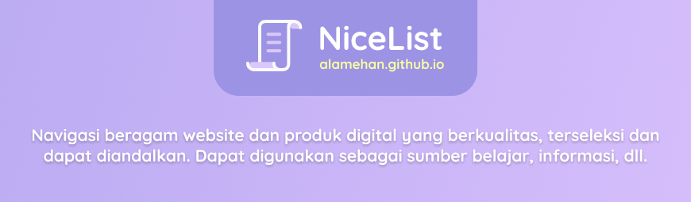

## NiceList
- Navigasi beragam website dan produk digital yang berkualitas dan terseleksi 
- Merupakan salah satu segmen dari [Alamehan Project](https://medium.com/@alamehan/selamat-datang-di-alamehan-35a43da9d87e) | Selebihnya kunjungi : [alamehan.github.io](https://alamehan.github.io/)

## Motivasi 

Dari segala hal yang tersebar secara acak di Internet, terdapat banyak sekali "harta karun" tak ternilai yang tersembunyi. Harta karun ini tidak mudah ditemukan, diperlukan sebuah _keyword_ yang tepat pada mesin pencari untuk mendapatkannya. Harta karun ini berupa website maupun produk-produk digital yang berkualitas dan dapat diandalkan. Dengan harta karun ini, hidup anda akan jauh lebih mudah, anda akan mendapatkan banyak sekali manfaat: informasi yang berbobot, konten yang tidak setengah-setengah hingga produk gratisan yang dapat membantu anda dalam mengerjakan pekerjaan sehari-hari. Tentunya tanpa anda perlu menghabiskan banyak waktu untuk mencarinya kesana-kemari di luasnya Internet, karena kabar baiknya.. saya memberikan semua harta karun yang berhasil saya temukan dalam **NiceList** ini. Jadi bersenang-senanglah..

Dengan **NiceList** yang terinspirasi dari sebuah proyek besar bernama [Awesome](https://github.com/sindresorhus/awesome), saya menghabiskan banyak sekali waktu untuk melakukan "penjelahan" secara mendalam di semesta Internet. Mencari harta karun yang tersembunyi itu, kemudian mengumpulkan lalu mem-_filter_ dan mengkategorikannya sesuai topik. Tidak lain dan tidak bukan untuk memudahkan anda maupun saya pribadi untuk mendapatkan manfaat nyata dari Internet ini. Intinya, **NiceList** dapat anda gunanan sebagai _navigasi_ yang membantu dan menuntun anda ke ragam website maupun produk-produk digital yang berkualitas, terseleksi dan dapat diandalkan.

**Catatan** : Topik yang tersedia di **NiceList** ini memang tidak banyak dan cenderung lebih ke bidang IT (sesuai dengan _background_ pendidikan saya). Namun demikian, **NiceList** ini merupakan proyek yang berkepanjangan, sehingga dari waktu ke waktu saya akan meng-_update_ dan menambahkannya secara berkala, tentunya saat saya menemukan harta karun baru yang layak dimasukkan kedalam daftar.

 

	<a href="#sec01">Find a Job</a>&nbsp;&nbsp;&nbsp;&nbsp;
	<a href="#sec02">Useful Websites</a>&nbsp;&nbsp;&nbsp;&nbsp;
	<a href="#sec03">Self Improvement</a>&nbsp;&nbsp;&nbsp;&nbsp;
	 
	<a href="#sec04">Designer 101</a>&nbsp;&nbsp;&nbsp;&nbsp;
	<a href="#sec05">Developer 101</a>&nbsp;&nbsp;&nbsp;&nbsp;
	<a href="#sec06">Resource 101</a>&nbsp;&nbsp;&nbsp;&nbsp;
	 
	<a href="#sec07">Chrome Extensions</a>&nbsp;&nbsp;&nbsp;&nbsp;
	<a href="#sec08">Figma Plugins</a>&nbsp;&nbsp;&nbsp;&nbsp;
	<a href="#sec09">VS Code Extensions</a>&nbsp;&nbsp;&nbsp;&nbsp;
	 
	<a href="#sec10">Educational Instagram Accounts</a>&nbsp;&nbsp;&nbsp;&nbsp;
	<a href="#sec11">Windows Software Bundles</a>&nbsp;&nbsp;&nbsp;&nbsp;

---

 

💼 
Find a Job
---

<a href="#daftarisi">🡹 Kembali ke daftar isi</a>

* General : [LinkedIn](https://www.linkedin.com/), [Qerja](https://www.qerja.com/), [Glints](https://glints.com/id), [Glassdoor](https://www.glassdoor.com/index.htm), [Urbanhire](https://www.urbanhire.com/), [Careerjet](https://www.careerjet.co.id/), [Indeed](https://id.indeed.com/), [TheMuse](https://www.themuse.com/), [JobStreet](https://www.jobstreet.co.id/), [Jora](https://www.jora.com/), [JobFinder](http://www.jobfinder.co.id/)
  
* Developer : [Tech in Asia](https://www.techinasia.com/jobs/search), [Dicoding](https://www.dicoding.com/jobs/list), [Ekrut](https://careers.ekrut.com/), [SIMONAS (Sistem Informasi Monitoring Alumni Sertifikasi ) Kominfo](https://simonas.kominfo.go.id/)
  
* Startup Career : [Tokopedia](https://www.tokopedia.com/careers/jobs/), [Bukalapak](https://careers.bukalapak.com/browse/Engineering), [Shopee](https://careers.shopee.co.id/jobs/), [Blibli](https://www.blibli.com/page/karir/), [Gojek](https://career.go-jek.com/job/), [Traveloka](https://www.traveloka.com/en/careers), [Pegipegi](https://www.pegipegi.com/team/career.html), [Dana](https://www.dana.id/karir), [KitaBisa](https://kitabisa.urbanhire.com/), [Ruangguru](https://career.ruangguru.com)
  
* Freelancer & Project : [Freelancer](https://www.freelancer.co.id/search/projects/), [Sribu](https://www.sribu.com/id/contests), [Sribulancer](https://www.sribulancer.com/id/bj/loker/v3), [Projects](https://projects.co.id/public/browse_projects/listing), [Fastwork](https://fastwork.id/start-selling), [99designs](https://99designs.com/contests), [DesignCrowd](https://jobs.designcrowd.com/jobs/)
  
 

🌐 
Useful Websites
---

<a href="#daftarisi">🡹 Kembali ke daftar isi</a>

* Digital Product Showcase
  * [Product Hunt](http://www.producthunt.com/) - Discover the latest mobile apps, websites, and technology products.
  * [Stackshare](https://stackshare.io/) - Find the right developer tools and the companies that use them.
  * [YourStack](https://yourstack.com/) - YourStack is for sharing your favorite products with the world.
  * [SimiliarWeb](https://www.similarweb.com/) - SimilarWeb is a website which provides web analytics services for businesses.
  * [Slant](https://www.slant.co/) - Product recommendation community to find the best product, app or game for you.
  * [Capterra](https://www.capterra.com/) - Search, compare, and choose the right software with confidence.
  * [G2](https://www.g2.com/) - Choose the right software and services based on 1,061,900+ authentic.

* Expand Your Knowledge
  * [Wikipedia](https://www.wikipedia.org/) - Encyclopedia. The largest and most popular general reference work on the World Wide Web.
  * [Wikihow](https://www.wikihow.com/) - The world's most helpful how-to instructions to enable everyone to learn how to do anything.
  * [Fandom](https://www.fandom.com/) - The entertainment site where fans come first. Source for all things TV, movies, and games, etc.
  * [Medium](https://medium.com/) - Our sole purpose is to help you find compelling ideas, knowledge, and perspectives.
  * [MakeUseOf](https://www.makeuseof.com/) - Learn how to make use of tech and gadgets around you and discover cool stuff on the Internet.
  * [Vice](https://www.vice.com/) - The Definitive Guide To Enlightening Information from every corner of the planet.
  * [Reddit](https://www.reddit.com/) - An American social news aggregation, web content rating, and discussion website.
  * [Pretty Awesome Lists](https://www.prettyawesomelists.com/) - Pretty Awesome Lists crawls all these lists, collects interesting information.
  
* Expand Your Skills
  * [Kelas](https://kelas.com/) - Belajar dari para mentor terbaik dibidangnya.
  * [Skill Academy](https://skillacademy.com/) - Tingkatkan technical & soft skill di berbagai bidang (by Ruangguru).
  * [IndonesiaX](https://www.indonesiax.co.id/) - Kursus dari universitas peringkat tertinggi di Indonesia dan perusahaan terbaik.
  * [Alison](https://alison.com/) - Free online education platform that mostly focuses on workplace-based skills.
  * [Udemy](https://www.udemy.com/) - Study any topic, anytime. Choose from thousands of expert-led courses now.
  * [Udacity](https://www.udacity.com/) - Advance your career with online courses in programming, data science, and more.
  * [Coursera](https://www.coursera.org/) - Build skills with online courses from world-class universities and companies.
  * [Lynda](https://www.lynda.com/) - Learn software, creative, and business skills to achieve your personal and professional goals.
  * [Skill Share](https://www.skillshare.com/) - Learning platform with online classes taught by the world's best practitioners.
  * [Plural Sight](https://www.pluralsight.com/) - Gives you confidence you have the skills you need to execute your technology strategy.
  * [Treehouse](https://teamtreehouse.com/) - Learn to code, gain a new skill, get a new job. Whatever your goal — we'll get you there.
  * [Codecademy](https://www.codecademy.com/) - Learn the technical skills you need for the job you want.
 
* Discover Documents
  * [Internet Archive](https://archive.org/) - Digital library offering free universal access to books, movies & music.
  * [Libgen](https://libgen.is/) - Search engine for articles and books on various topics which allows free access.
  * [Alleng](https://alleng.org/) - Download textbooks, dictionaries, manuals, audio, video etc. 
  * [PDF Drive](https://www.pdfdrive.com/) - Search engine for PDF files. eBooks for you to download for free.
  * [Sci-Hub](https://sci-hub.tw/) - The first website in the world to provide mass & public access to research papers.
  * [IEEE](https://www.ieee.org/) - The world's largest technical professional organization for the advancement of technology.
  * [DocSity](https://www.docsity.com/) - Access free study contents - study notes, essays, summaries and a lot more.
  * [Scribd](http://www.scribd.com/) - Enjoy an unlimited* number of books, audiobooks, magazines, and more.
   
* Various Resources
  * [Kickass](https://kickass.help/) - You can search for TV shows and TV series, movies, music and games.
  * [1337x](https://www.1337x.tw/) - Brings you the latest games, movies, tv series, music and software for free.
  * [Yify](https://yts.mx/) - YTS was a peer-to-peer release group known for distributing large numbers of movies.
  * [Soap2Day](https://soap2day.ru/) - Watch latest movies and TV series online no ads, we daily update.
  * [Subscene](https://subscene.com/) - Free download and browse more movies, TV Series, tv shows subtitles.
  * [TubeOffline](https://www.tubeoffline.com/) - Free online downloader for any Twitter video. Best tool that actually works.
  * [Use FYI](https://usefyi.com/templates/) - Free resources and templates you need to get work done in one place.
  * [GfxStudy](https://gfxstudy.com/) - Free AE Template, Videohive, Vector, Stock Image , PSD, Photoshop (1).
  * [Graphicex](https://graphicex.com/) - Free AE Template, Videohive, Vector, Stock Image , PSD, Photoshop (2).
  * [Ttorial](http://ttorial.com/) - Obtain & download the best Udemy courses for free.
  * [FreeCourseLab](https://freecourselab.com/) - A great place to learn. Download Udemy Courses for Free.
  * [FreeCourseUdemy](https://freecourseudemy.com/) - Premium Udemy tutorials free download.
  
* Coupon Hunter
  * [OzBargain](https://www.ozbargain.com.au/tag/udemy-course) - Hunting community, coupon codes and freebies.
  * [Freebies Global](https://freebiesglobal.com/) - Latest freebies, courses, coupons & deals.
  * [Disc Udemy](https://www.discudemy.com/language/english) - Free Udemy courses and zero broken link.
  * [Coupo Scorpion](https://couponscorpion.com/) - The ultimate resource for 100% free Udemy coupons.
  * [LearnViral](https://udemycoupon.learnviral.com/) - Free Udemy coupons, get your coupons before they expire.
  * [CouponCause](https://couponcause.com/) - Find promo codes and online discounts by store and category.
  * [Couponos](https://couponos.ooo/) - Get the latest Udemy Coupon and BitDegree Online Courses.
  
* Useful Web Apps
  * [Pdf.io](https://pdf.io/) - Free set of online tools for handling PDF files. Convert and edit your PDF files.
  * [Convert.io](https://convertio.co/) - Convert your files to any format. 300+ formats supported. Fast and easy.
  * [Stackshare.io](https://stackshare.io/) - Find the right developer tools and the companies that use them.
  * [Prototypr.io](https://www.prototypr.io/) - Get the latest daily design news and tools. From UX design to frontend dev.
  * [Libraries.io](https://libraries.io/) - Discover open source packages, modules and frameworks you can use in your code.
  * [Veed.io](https://www.veed.io/) - A simple but powerful online video editor. Music, trim, crop, aff effects, images, filter, etc.
  * [Draw.io](https://www.draw.io/) - A free diagram software for making flowcharts, process diagrams, org charts, UML, ER, etc.
  * [Designer.io](http://designer.io/) - Create graphics, logos and icons, edit images illustrations & presentations, all for free.
  * [Zeplin.io](https://zeplin.io/) - Handoff designs and styleguides with accurate specs, assets, code snippets—automatically.
  * [Codepen.io](http://codepen.io/) - An online code editor. The best place to build, test, and discover front-end code.
  * [Codeshare.io](https://codeshare.io/) - An online code editor for interviews, troubleshooting, teaching and more.
  * [Io-games.io](http://io-games.io/) - The best io games site in the world. A list of all new io games and most played games.
  * [Remove.bg](https://www.remove.bg/) - Remove image background 100% automatically in 5 seconds, without a single click.
  * [Deep-image.ai](https://deep-image.ai/) - Upscale and enhance photo, improve picture quality based on ANN.
  
* Useful Web Tools
  * [Get Emoji](https://getemoji.com/) - ✂️ Copy and 📋 Paste Emoji 👍 No apps required.
  * [LingoJam](https://lingojam.com/) - LingoJam lets you create an online translator (biasanya untuk style text generator).
  * [Text Fixer](https://www.textfixer.com/) - Collection of free online tools for web coding and text conversion
  * [Online Text Tools](https://onlinetexttools.com/) - Online text tools is a collection of useful text utilities (Add line number, etc).
  * [Tools4Noobs](https://www.tools4noobs.com/online_tools/) - Tools you didn't even know you needed. A collection of useful scripts (Count lines, etc).
  * [Sort My List](https://sortmylist.com/) - Online word tool to alphabetize & text sort. Sort numerically or by length and more.
  * [Remove Line Breaks](http://removelinebreaks.net/) - Remove line breaks from blocks of text (solusi untuk copy text dari PDF).
  * [Subtitle Translator](https://www.syedgakbar.com/projects/dst) - Quickly translate subtitles from one language to other language.
  * [ttsMP3](https://ttsmp3.com/) - Easily convert your written text into natural sounding voice in up to 50 different languages.
  * [Pastebin](https://pastebin.com/) - Pastebin is a website where you can store text online for a set period of time.
  * [Bitly](https://bitly.com/) - Shorten, create and share trusted, powerful links for your business.
  * [Small PDF](https://smallpdf.com/) - All-in-one (convert, compress, merge, split and edit) easy-to-use online PDF tools.
  * [Vector Magic](https://vectormagic.com/) - Easily Convert JPG, PNG, GIF Files to PDF, SVG, EPS Vectors.
  * [Google Earth](https://www.google.com/intl/id/earth/) - 3D representation of Earth based primarily on satellite imagery - Allows you to "fly".
  * [IsItDownRightNow?](https://www.isitdownrightnow.com/) - Monitors the status of your favorite web sites and checks whether they are down or not. 
  * [HaveIBeenPwned](https://haveibeenpwned.com/) - Check if you have an account that has been compromised in a data breach.

 

📚 
Self Improvement 
---

<a href="#daftarisi">🡹 Kembali ke daftar isi</a>

* Books and Ideas (ID)
  * [Pimtar](https://pimtar.id/) - Sebentar bacanya, cepat pintarnya. Aplikasi rangkuman buku best seller pertama di Indonesia.
  * [Saputrawhy](https://www.saputrawhy.com/reading-notes/) - Halaman tentang ringkasan buku, berupa poin-poin yang berisi ide atau pelajaran penting.
  * [Darmawan Aji](https://darmawanaji.com/) - Penulis buku mindful life, productivity hack, life by design, hypnoselling, hypnowriting.
  * [Dewa Eka Prayoga](https://dewaekaprayoga.com/) - Dewa Selling, hobi jualan, plus ngajarin orang jago jualan.
  * [Arry Rahmawan](https://arryrahmawan.net/) - Mengikat dan berbagi ilmu untuk generasi Indonesia yang Lebih Baik.
  * [Hitman System](https://hitmansystem.com/produk) - Satu-satunya professional relationship consultancy di Indonesia.

* Books and Ideas (EN)
  * [LifeClub](https://lifeclub.org/book-categories) - Life Club is building a university for life skills. Like a Wikipedia for life skills.
  * [BookAuthority](https://bookauthority.org/) - The most recommended books on business, technology and science.
  * [Blinkist](https://www.blinkist.com/) - Big ideas in small packages. Key takeaways from the world’s best nonfiction books in text and audio.
  * [12min](https://12min.com/) - The best ideas in your pocket. You are only a few seconds away from changing your life.
  * [Four Minutes](https://fourminutebooks.com/) - Over 600 free book summaries. You can read each one in just 4 minutes.
  * [Optimize Me](https://www.optimize.me/) - The best Big Ideas from the best optimal living books. More wisdom in less time.
  * [The Power Moves](https://thepowermoves.com/start-here/) - E-learning platform, social dynamics, power, and life strategies.
  * [Faster to Master](https://fastertomaster.com/) - Faster to Master. Read more, learn faster and wake up productivity.
  * [The Book Summary Club](https://booksummaryclub.com/) - Think big, read small. Short book summaries and reviews for business owners.
  * [Paul Minors](https://paulminors.com/resources/) - I can help you to be more effective with your time and get more done.
  * [Nat Eliason](https://www.nateliason.com/notes/) - Most of the important things I’ve learned have come from books, articles, etc.
  * [Sam Thomas](https://www.samuelthomasdavies.com/book-summaries/) - I take brief but concise notes from the best non-fiction books of all-time.
  * [James Clear](https://jamesclear.com/book-summaries) - Book summaries: popular books summarized in 3 sentences or less.
  * [Marc Reclau](https://www.marcreklau.com/) - Author of the #1 Bestseller "30 days change your habits, change your life".
  * [Gates Notes](https://www.gatesnotes.com/Books) - Where Gates shared about the people he met, the books he read, and what he learned.
  * [Mark Manson](https://markmanson.net/best-books) - Lists of the best books to read based on hundreds of hours of reading and research.
  * [Design Epic Life](https://designepiclife.com/) - Design your greatest life and unleash the best version of you.
  * [Experience Life](https://experiencelife.com/) - Empowering people to become their happiest - deeply satisfying way of life.
  * [Success.com](https://www.success.com/) - Magazine that focuses on people who take full responsibility for their own dev and income.

* Podcast and Ideas (ID & EN)
  * [Podcast Subjective](https://soundcloud.com/iqbalhariadi) - Berbagi kisah, insight, dan tips praktis pengembangan diri.
  * [Satu Persen Audio Insight](https://open.spotify.com/show/1iIFlumWtP4xI1QEzCBcSY) - Berkembang bersama kami, satu persen setiap harinya.
  * [Thirty Days of Lunch](https://open.spotify.com/show/0vFfPAk7zgDLnv3utpZ8ww) - Teman makan siang sekaligus nutrisi untuk pikiran. Ga berat, tapi juga ga receh.
  * [Makna Talks](https://open.spotify.com/show/1PGN4ilb4aoWKkB7FNSLsx) - A weekly podcast with well known subjects every week talking about what's behind the facts.
  * [Hiduplah Indonesia Maya](https://open.spotify.com/show/6yUPhJdvDAMRVwApXBpQWd) - Podcast dari Pandji Pragiwaksono, membahas segala hal yang terjadi di Indonesia.
  * [Finfolk](https://open.spotify.com/show/3coiCSZDmmBSREVpo0PpIB) - Rethinking money. Sunday chill afternoon. New ideas about investment in a fun way.
  * [GaryVee Podcast](https://www.garyvaynerchuk.com/podcast/) - The Garyvee Audio Experience. Keynote speeches on marketing and business.
  * [HBR IdeaCast](https://open.spotify.com/show/4gtSBBxIAE142ApX6LqsvN) - A weekly podcast featuring the leading thinkers in business and management.
  
* Youtube : Motivation & Inspiration (ID & EN)
  * [TEDx Talks](https://www.youtube.com/user/TEDxTalks) - American media organization that posts talks online - "ideas worth spreading". 
  * [OPTIMIZE](https://www.youtube.com/channel/UCRhEwzsFYLGcMa4m2AbTAoA) - The best Big Ideas from the best optimal living books. More wisdom in less time.
  * [FightMediocity](https://www.youtube.com/user/phuckmediocrity/) - The free audiobook or for reading a book, here's FightMediocrity.
  * [GaryVee](https://www.youtube.com/user/GaryVaynerchuk) - Highly sought after public speaker. Keynote speeches on marketing and business.
  * [Evan Carmichael](https://www.youtube.com/user/ModelingTheMasters) - An introvert entrepreneur. Working to solve the world's biggest problem.
  * [SuccessBefore30](https://www.youtube.com/user/successbefore30/) - Wadah untuk Belajar Berbisnis dan Mengerti tentang aspek-aspek dari Kesuksesan.
  * [Pagar Kehidupan](https://www.youtube.com/channel/UCRPWx7xrHni4v31AkXE16Fg) - Butuh Inspirasi dan bantuan dalam hidup? Ini adalah channel yang bisa Kamu tuju.
  * [Chandra Hasyim](https://www.youtube.com/channel/UCFCUdbQNQjbK-7UhKy--chg) - Inspiring and motivational video translations in Indonesia.
  * [Merry Riana](https://www.youtube.com/user/merryrianashow) - Menciptakan dampak positif di dalam kehidupan jutaan orang di Indonesia.
  * [Dewa Eka Prayoga](https://www.youtube.com/channel/UCx-9wWeG3YcqxXKXxOn3wMA) - Sharing seputar bisnis online, digital marketing, copywriting, dll.
  
* Youtube : Animated Book Summaries (EN)
  * [OnePercentBetter](https://www.youtube.com/channel/UCRI6t05DNVlV0XhdI7hx_iw/) - Get the key lessons from self-development books in 10 minutes or less.
  * [Mervan Polat](https://www.youtube.com/channel/UCfr02PiHepExS81u6jRT2Cw) - I tell stories about art, history, technology, philosophy and science.
  * [Practical Psychology](https://www.youtube.com/channel/UCir93b_ftqInEaDpsWYbo_g) - Giving high-quality and informative videos to everyone who wishes to learn.
  * [After Skool](https://www.youtube.com/channel/UC1KmNKYC1l0stjctkGswl6g) - A weekly dose of fun and interesting science, ideas, stories, education and more.
  * [FightMediocrity](https://www.youtube.com/user/phuckmediocrity) - Big Ideas for a better life. The free audiobook or for reading a book.
  
* Youtube : Insight, Feed Your Brain (ID)
  * [Sisi Terang](https://www.youtube.com/channel/UCSg-Y9uI1E-my-I4WKKioEQ) - Penemuan sains, penjelajahan ruang angkasa, misteri, kisah nyata mengejutkan, psikologi, dst.
  * [Kok Bisa?](https://www.youtube.com/channel/UCu0yQD7NFMyLu_-TmKa4Hqg) - Pengalaman belajar sains yang inovatif melalui video-video animasi edukatif.
  * [Hujan Tanda Tanya](https://www.youtube.com/channel/UC5dn6JdeSgWzcNL7NuvMEKQ) - Rangsangan pemikiran seputar sains, teknologi, dan masyarakat.
  * [Sains Bro](https://www.youtube.com/channel/UCCFY2uB8liUM4cnCCkUC6GA) - Channel edukasi Indonesia yang membantu menjelaskan berbagai hal tentang SAINS.
  * [Kamu Harus Tahu](https://www.youtube.com/channel/UCLNrxRWWBw-lYOPaibnvSwA) - Channel edukasi yang menyajikan beragam pengetahuan melalui animasi 2D.
  * [Ayo Mikir](https://www.youtube.com/channel/UCyZa7DYVsdJxnyDw6XmVvCQ) - Channel edukasi yang menyajikan konten tayangan inspiratif dan edukatif untuk Indonesia.
  * [House of Infographics](https://www.youtube.com/channel/UCz-lipPZtRjhgLJpZQHczBg) - Menampilkan data secara sederhana, kreatif dan mudah untuk dipahami.
  * [Nous ID](https://www.youtube.com/channel/UCNgz9dujmF3kTbmR3yJHmlQ) - Nous ID, sebuah channel edukasi alternatif, yang bergerak melalui platform YouTube.
  * [Mau Tau Banget](https://www.youtube.com/channel/UCMCbTLHW5GXsxKMkOelX6-w) - Channel edukasi yang menyajikan berbagai informasi dan pengetahuan melalui Youtube.
  * [DW Indonesia](https://www.youtube.com/user/DWBahasaIndonesia) - Lembaga penyiaran yang memproduksi siaran TV, radio dan informasi melalui internet.
  * [Remotivi](https://www.youtube.com/user/remotivi) - Lembaga studi dan pemantauan media, khususnya televisi di Indonesia.
  * [Satu Persen](https://www.youtube.com/channel/UC_eifcIIjgN8Q_8m34nWo3Q) - Mengajarkan hal-hal penting yang sampai saat ini belum diajarkan di sekolah konvensional.
  * [Creativox](https://www.youtube.com/channel/UC4DogC2xftpKFlF-XgZoRBg) - A multi-platform entertainment media - educational, and motivational experience!
  * [Froyonion](https://www.youtube.com/channel/UCG1E2hR9KDuAWFoRO0yyE4w) - Froyonion mengajak penonton memikirkan kembali berbagai hal dari sudut pandang lain.
  * [Gue Punya Cerita](https://www.youtube.com/channel/UCkRNRz9ifB2A04zTb6Y9LYg) - Berbagai cerita yang diangkat dari kisah nyata, dikemas dalam bentuk animasi.
  
* Youtube : Insight, Feed Your Brain (EN)
  * [TED-Ed](https://www.youtube.com/user/TEDEducation) - Creating lessons worth sharing is an extension of TED’s mission of spreading great ideas.
  * [Crash Course](https://www.youtube.com/user/crashcourse) - Tons of awesome courses - sociology, computer science, film history and mythology.
  * [Kurzgesagt](https://www.youtube.com/user/Kurzgesagt) - We are a small team who want to make science look beautiful. Because it is beautiful.
  * [Epipheo](https://www.youtube.com/user/epipheo/) - We love stories that reveal truth! We work really hard to create valuable stories for our clients.
  * [MinuteEarth](https://www.youtube.com/user/minuteearth) - Science and stories about our awesome planet! Helps understand the world around us.
  * [Minute Physics](https://www.youtube.com/user/minutephysics) - Simply put: cool physics and other sweet science. Helps understand the world around us.
  * [Stated Clearly](https://www.youtube.com/user/sciencestatedclearly) - We produce animations on genetics, evolution, biology, and chemistry.
  * [KnowledgeHub](https://www.youtube.com/channel/UC2_KC8lshtCyiLApy27raYw) - A modern philosopher of our time. Except I talk about pretty pointless things.
  * [AsapSCIENCE](https://www.youtube.com/user/AsapSCIENCE) - The channel produces weekly videos that touch on many different topics of science. 
  * [SciShow](https://www.youtube.com/user/scishow/) - The scientific subjects that defy our expectations and make us even more curious! 
  * [It's Okay To Be Smart](https://www.youtube.com/user/itsokaytobesmart) - Curious group of atoms in a curious universe—tell you how it all works.
  * [SmarterEveryDay](https://www.youtube.com/user/destinws2) - I explore the world using science.  That's pretty much all there is to it. 
  * [Up and Atom](https://www.youtube.com/channel/UCSIvk78tK2TiviLQn4fSHaw) - Making notoriously hard stuff less hard. Math, physics and computer science.
  * [CGP Grey](https://www.youtube.com/user/CGPGrey) - Short explanatory videos, including politics, geography, economics, history, and culture.
  * [Vsauce](https://www.youtube.com/user/Vsauce/) - The channels feature videos on scientific, psychological, mathematical, and philosophical topics, etc.
  
 

🎨 
Designer 101
---

<a href="#daftarisi">🡹 Kembali ke daftar isi</a>

_(Upcoming!)_

 

💻 
Developer 101
---

<a href="#daftarisi">🡹 Kembali ke daftar isi</a>

* Top Udemy Course
  * [The Web Developer Bootcamp](https://www.udemy.com/course/the-web-developer-bootcamp/) - JavaScript Base
  * [The Complete 2020 Web Development Bootcamp](https://www.udemy.com/course/the-complete-web-development-bootcamp/) - JavaScript Base
  * [The Complete Web Developer Course 2.0](https://www.udemy.com/course/the-complete-web-developer-course-2/) - PHP Base
  * [Master Laravel 6 with Vue.js Fullstack Development](https://www.udemy.com/course/master-laravel-6-with-vuejs-fullstack-development/) - PHP Base
  * [Brad Traversy Course](https://www.udemy.com/user/brad-traversy/) - For Better Insight
  
* Online Tutorials
  * [Tutorialspoint](https://www.tutorialspoint.com/index.htm) - Free online tutorials, courses and programming projects #1
  * [Javapoint](https://www.javatpoint.com/) - Free online tutorials, courses and programming projects #2
  * [FreeCodeCamp](https://www.freecodecamp.org/) - Free online tutorials, courses and programming projects #3
  * [GeeksForGeeks](https://www.geeksforgeeks.org/) - Free online tutorials, courses and programming projects #4
  * [Tutorial Kart](https://www.tutorialkart.com/) - Free online tutorials, courses and programming projects #5
  * [SoloLearn](https://www.sololearn.com/) - Free online tutorials, courses and programming projects #6

* Full-Stack Web Dev
  * [Dunia Ilkom](https://www.duniailkom.com/) - Situs yang membahas lengkap materi pembelajaran bahasa pemrograman website.
  * [Web Programming Unpas](https://www.youtube.com/channel/UCkXmLjEr95LVtGuIm3l2dPg) - Membahas mengenai teknologi internet dan pengembangan web.  
  * [Build With Angga](https://buildwithangga.com/) - Pelajari keahlian baru yang dibutuhkan oleh perusahaan IT terbesar di seluruh dunia.
  * [Be Fullstack Developer](https://buku-laravel-vue.com/) - Panduan Hebat untuk Menjadi Fullstack Developer! Laravel & Vue.js.
  * [W3Schools](https://www.w3schools.com/) - The world's largest web developer site. Tutorials and references relating to web dev.
  * [W3Docs](https://www.w3schools.com/) - We are trying to provide useful and concise materials for the programming enthusiasts.
  * [A Smarter Way](https://www.amazon.com/Mark-Myers/e/B00HNW14T4?ref_=dbs_p_ebk_r00_abau_000000) - Coding, I learned, isn't that hard. Easy way to learn web programming.
  
* Front-End Web Dev
  * [HTML](https://github.com/diegocard/awesome-html5) - HTML Resource
  * [CSS](https://github.com/micromata/awesome-css-learning) - CSS Resource #1 (Learn)
  * [CSS](https://github.com/awesome-css-group/awesome-css) - CSS Resource #2 (Collection)
  * [BootStrap](https://github.com/pierceoneill/awesome-bootstrap) - CSS Framework
  * [JavaScript](https://github.com/micromata/awesome-javascript-learning) - JavaScript Resource #1 (Learn)
  * [JavaScript](https://github.com/sorrycc/awesome-javascript) - JavaScript Resource #2 (Collection)
  * [JavaScript](https://github.com/addyosmani/es6-tools) - JavaScript Resource #3 (Tools)
  * [JSON](https://github.com/burningtree/awesome-json) - JSON Resource
  * [JQuery](https://github.com/petk/awesome-jquery) - JavaScript Library
  * [Vue.js](https://github.com/vuejs/awesome-vue) - JavaScript Framework #1
  * [React](https://github.com/enaqx/awesome-react) - JavaScript Framework #2
  * [Angular](https://github.com/PatrickJS/awesome-angular) - JavaScript Framework #3
  
* Back-End Web Dev
  * [PHP](https://github.com/odan/learn-php) - PHP Resource #1 (Learn)
  * [PHP](https://github.com/ziadoz/awesome-php) - PHP Resource #2 (Collection)
  * [REST](https://github.com/marmelab/awesome-rest) - REST Resource
  * [MySQL](https://github.com/shlomi-noach/awesome-mysql) - MySQL Resource
  * [Laravel](https://github.com/shlomi-noach/awesome-mysql) - PHP Framework
  * [NodeJs](https://github.com/sindresorhus/awesome-nodejs) - **Back-End JavaScript Base**

* Miscellaneous
  * [RegexOne](https://regexone.com/) - Learn Regular Expressions with simple, interactive exercises.
  * [Pro Git](https://github.com/progit/progit2-id) - Panduan menggunakan Git lengkap, berbahasa Indonesia.
  * [Oh Shit, Git!?!](https://ohshitgit.com/) - Ragam permasalahan saat bekerja dengan Git beserta solusinya.
  * [Awesome Github](https://github.com/phillipadsmith/awesome-github) - A curated list of GitHub's awesomeness.
  * [Awesome Guideline](https://github.com/Kristories/awesome-guidelines) - A curated list of high quality coding style conventions and standards.
  * [Free for Developer](https://github.com/ripienaar/free-for-dev) - A curated list of Developer resources.
  * [Developer Roadmaps](https://github.com/liuchong/awesome-roadmaps) - A curated list of roadmaps, mostly about software development.
  * [Full-Stack Resources](https://github.com/bmorelli25/Become-A-Full-Stack-Web-Developer) - Free resources for learning Full Stack Web Development.
  * [Front-End Resources](https://github.com/dypsilon/frontend-dev-bookmarks) - Free resources for learning Front End Web Development.
  * [Back-End Resources](https://github.com/backend-br/awesome-backend) - Free resources for learning Back End Web Development.

 

📂 
Resource 101
---

<a href="#daftarisi">🡹 Kembali ke daftar isi</a>

* The Right Way
  * Web Dev : [GitKrakenDocs](https://www.gitkraken.com/resources/devops-report-2020), [W3Docs](https://www.w3docs.com/), [W3Schools](https://www.w3schools.com/), [DevDocs](https://devdocs.io/) (Sebelum ke framework, dll)
  * Know Your Self : _(Upcoming!)_
  * Learn English : _(Upcoming!)_

* Good Resources
  * Psychology : [Positive Psychology](https://positivepsychology.com/), [Psychology Tools](https://www.psychologytools.com/), [Psychology-Tools](https://psychology-tools.com/), [Living Moxie](https://dawnbarclay.com/)
  * Data Visualization : [Visualization Universe](http://visualizationuniverse.com/), [Dataviz Catalogue](https://datavizcatalogue.com/), [Observable HQ](https://observablehq.com/), [Adioma](https://blog.adioma.com/)
  * Explorative Visuals : [By Owen](http://byowen.com/), [One Zoom](https://www.onezoom.org/), [Things Made Thinkable](http://www.thingsmadethinkable.com/), [Knowledge Center](http://www.knowledgecenter.com/ions/NoeticMap.html)
  * Powerful Diagramming : [Creately](https://creately.com/), [Draw.io](https://app.diagrams.net/) (Selebihnya ada di section : Designer 101)

 

⚙️ 
Top Chrome Extensions
---

<a href="#daftarisi">🡹 Kembali ke daftar isi</a>

* Increase Productivity
  * [Extensify](https://chrome.google.com/webstore/detail/extensity/jjmflmamggggndanpgfnpelongoepncg) - Quickly enable/disable Chrome extensions.
  * [Infinity New Tab](https://chrome.google.com/webstore/detail/infinity-new-tab-producti/dbfmnekepjoapopniengjbcpnbljalfg) - Beautiful & usefull homepage.
  * [Muzli 2](https://chrome.google.com/webstore/detail/muzli-2-stay-inspired/glcipcfhmopcgidicgdociohdoicpdfc) - Beautiful inspiration homepage for designer.
  * [Bookmark Sidebar](https://chrome.google.com/webstore/detail/bookmark-sidebar/jdbnofccmhefkmjbkkdkfiicjkgofkdh) - Adds a toggleable sidebar with all your bookmarks at the edge of your browser window.
  * [Tabli](https://chrome.google.com/webstore/detail/tabli/igeehkedfibbnhbfponhjjplpkeomghi) - A simple and powerful tab manager that provides fast switching between windows.
  * [Sticky Notes](https://chrome.google.com/webstore/detail/sticky-notes-just-popped/plpdjbappofmfbgdmhoaabefbobddchk) - Most beautiful, easiest, fastest note taking experience.
  * [Application Launcher for Drive](https://chrome.google.com/webstore/detail/application-launcher-for/lmjegmlicamnimmfhcmpkclmigmmcbeh) - Open Drive files directly from your browser in compatible applications.
  * [Black Menu for Google](https://chrome.google.com/webstore/detail/black-menu-for-google/eignhdfgaldabilaaegmdfbajngjmoke) - The easiest access to the Google universe.
  * [Checker Plus for Gmail](https://chrome.google.com/webstore/detail/checker-plus-for-gmail/oeopbcgkkoapgobdbedcemjljbihmemj) - Get notifications, read, listen, delete emails without opening Gmail.
  * [InstaClean](https://www.instaclean.app/) - **Bukan extension**, Clean Up your Mailbox with Easy Steps.
  * [Awesome Screenshot](https://www.awesomescreenshot.com/) - **Third-party**, share screenshots with your friends or teammates, fast and easily.
  * [Nimbus Screenshot](https://chrome.google.com/webstore/detail/nimbus-screenshot-screen/bpconcjcammlapcogcnnelfmaeghhagj) - Screen capture full web page or any part & record screencasts.
  * [Element Screenshot](https://chrome.google.com/webstore/detail/element-screenshot/mhbapdljigafafoimcnnhagdclejnkcf) - Take screenshot of any HTML element on a webpage.
  * [Carbon](https://carbon.now.sh/) - **Bukan extension**, easiest way to create and share beautiful images of your source code.
  * [Copyfish](https://chrome.google.com/webstore/detail/copyfish-%F0%9F%90%9F-free-ocr-soft/eenjdnjldapjajjofmldgmkjaienebbj) - Copy, paste and translate text from any image, video or PDF.
  * [Image Reader (OCR)](https://chrome.google.com/webstore/detail/image-reader-ocr/cakcfocedphbadddjpalejbkhflfbhmf) - Easily get words out of an image with OCR engine.
  
* Text & Read Tools
  * [Reading List](https://chrome.google.com/webstore/detail/reading-list/lloccabjgblebdmncjndmiibianflabo) - This extension saves a list of links to pages to read later.
  * [Wikiwand](https://chrome.google.com/webstore/detail/wikiwand-wikipedia-modern/emffkefkbkpkgpdeeooapgaicgmcbolj?hl=id) - A new interface that optimizes Wikipedia's amazing content for improved reading experience.
  * [Mercury Reader](https://chrome.google.com/webstore/detail/mercury-reader/oknpjjbmpnndlpmnhmekjpocelpnlfdi) - Clear away the clutter from all of your articles. Instantly. 
  * [Rocket Readability](https://chrome.google.com/webstore/detail/rocket-readability/fhckbdfnalikpmcmcpcpkkdlhabngbod) - Mercury Reader alternative. Parses web pages cutting out ads.
  * [Print Friendly & PDF](https://chrome.google.com/webstore/detail/print-friendly-pdf/ohlencieiipommannpdfcmfdpjjmeolj) - Print Friendly removes ads, navigation and junk before your print.
  * [Kami Extension](https://chrome.google.com/webstore/detail/kami-extension-pdf-and-do/ecnphlgnajanjnkcmbpancdjoidceilk) - Best PDF and Document Annotation and Markup Tool.
  * [Google Docs Offline](https://chrome.google.com/webstore/detail/google-docs-offline/ghbmnnjooekpmoecnnnilnnbdlolhkhi) - Edit, create and view all your documents without Internet access.
  * [One Click Translate](https://chrome.google.com/webstore/detail/one-click-translate/anhjddeakbabimdgmonfbnpbainknbfa?hl=en) - Translate your selected text with Google Translate in one click, in a simplest way.
  * [Mate Translate](https://chrome.google.com/webstore/detail/mate-translate-%E2%80%93-translat/ihmgiclibbndffejedjimfjmfoabpcke) - Your all-in-one translator for web pages, highlighted text & Netflix subtitles.
  * [TransOver](https://chrome.google.com/webstore/detail/transover/aggiiclaiamajehmlfpkjmlbadmkledi?hl=en) - Translate word from any language to the language of your choice by pointing or clicking at it.
  * [Rememberry](https://chrome.google.com/webstore/detail/rememberry-translate-and/dipiagiiohfljcicegpgffpbnjmgjcnf) - Easily replenish your foreign languages dictionary using flashcards.
  * [Copy As Plain Text](https://chrome.google.com/webstore/detail/copy-as-plain-text/eneajgkmdhmjmloiabgkpkiooaejmlpk) - Easily copy the selected text without formatting to the clipboard via right-click menu.
  * [Highlight This](https://chrome.google.com/webstore/detail/highlight-this-finds-and/fgmbnmjmbjenlhbefngfibmjkpbcljaj?hl=en-US) - Automatically finds and highlights words and phrases on the web page according to your list.
  * [Text Tools](https://chrome.google.com/webstore/detail/text-tools/mpcpnbklkemjinipimjcbgjijefholkd) - Handy text tools a click away (including uppercase, lowercase, count words, count lines, etc).
  * [Bitly](https://chrome.google.com/webstore/detail/bitly-unleash-the-power-o/iabeihobmhlgpkcgjiloemdbofjbdcic) - Copy, customize, shorten, measure, optimize and share your links straight from your browser. 
  * [Medium Unlimited](https://manojvivek.github.io/medium-unlimited/) - **Third-party**, addon to access the medium.com premium articles.
  * [Read Aloud](https://chrome.google.com/webstore/detail/read-aloud-a-text-to-spee/hdhinadidafjejdhmfkjgnolgimiaplp) - Read out loud the current web-page article with one click.
  * [Spreed](https://chrome.google.com/webstore/detail/spreed-speed-read-the-web/ipikiaejjblmdopojhpejjmbedhlibno) - Train yourself to double or triple your reading speed, without sacrificing comprehension.
  
* Better Browsing
  * [uBlock Origin](https://chrome.google.com/webstore/detail/ublock-origin/cjpalhdlnbpafiamejdnhcphjbkeiagm) - Finally, an efficient blocker. Easy on CPU and memory.
  * [Adblock for Youtube](https://chrome.google.com/webstore/detail/adblock-for-youtube/cmedhionkhpnakcndndgjdbohmhepckk) - A content filtering and ad blocking which blocks all ads on Youtube.
  * [Open link in same tab](https://chrome.google.com/webstore/detail/open-link-in-same-tab-pop/jmphljmgnagblkombahigniilhnbadca) - Forces Chrome to open new tabs instead of pop-up windows/links in the same tab.
  * [Click to Remove Element](https://chrome.google.com/webstore/detail/click-to-remove-element/jcgpghgjhhahcefnfpbncdmhhddedhnk) - Remove annoying elements with a single click.
  * [Hoxx VPN Proxy](https://chrome.google.com/webstore/detail/hoxx-vpn-proxy/nbcojefnccbanplpoffopkoepjmhgdgh) - Service to unblock blocked websites and encrypt your connection.
  * [Simple Allow Copy](https://chrome.google.com/webstore/detail/simple-allow-copy/aefehdhdciieocakfobpaaolhipkcpgc) - Enable copy and right-click on sites that blocked them.
  
* Downloader
  * [Image Downloader](https://chrome.google.com/webstore/detail/image-downloader/cnpniohnfphhjihaiiggeabnkjhpaldj) - Browse and download images on a web page.
  * [One-Click Video Downloader](https://chrome.google.com/webstore/detail/one-click-video-downloade/bhepgcoaibmmehlmckhlmbdgcemhidcg) - We are the simplest and fastest way to download videos from any website.
  * [Video DownloaderHelper](https://chrome.google.com/webstore/detail/video-downloadhelper/lmjnegcaeklhafolokijcfjliaokphfk) - The most complete Web video downloader. The popular Video Downloader.
  * [SVG Export](https://chrome.google.com/webstore/detail/svg-export/naeaaedieihlkmdajjefioajbbdbdjgp) - Download SVGs from websites as SVGs, PNGs or JPEGs.
  * [SVG-Grabber](https://chrome.google.com/webstore/detail/svg-grabber-get-all-the-s/ndakggdliegnegeclmfgodmgemdokdmg) - A tool to quickly preview and get all the svg assets from a website.
  * [Get Favicon](https://chrome.google.com/webstore/detail/get-favicon/gpipahagclehninhhjkhbkliinfofnhe) - Displays the current page's favicon as well as the favicon's URL and dimensions.
  
* Frontend Developer
  * [Codepen](https://codepen.io/) - **Bukan extension**, an online code editor and community for frontend dev.
  * [JSFiddle](https://codepen.io/) - **Bukan extension**, test your JavaScript, CSS, HTML or CoffeeScript online.
  * [GitZip for Github](https://chrome.google.com/webstore/detail/gitzip-for-github/ffabmkklhbepgcgfonabamgnfafbdlkn) - It can make the sub-directories and files of github repository as zip and download it.
  * [Web Developer](https://chrome.google.com/webstore/detail/web-developer/bfbameneiokkgbdmiekhjnmfkcnldhhm) - Adds a toolbar button with various web developer tools.
  * [Live editor for CSS](https://chrome.google.com/webstore/detail/live-editor-for-css-less/ifhikkcafabcgolfjegfcgloomalapol) - Live preview of CSS/Less/Sass code changes.
  * [Bootstrap Viewport](https://chrome.google.com/webstore/detail/bootstrap-viewport/kflgmkikmbklpikoicfhonemdcemkdia) - Determines browser window width and which bootstrap viewport is in use.
  * [Bootstrap 3 Helper](https://chrome.google.com/webstore/detail/bootstrap-3-helper-resize/bnkadmnhdpkpbfmaehgjeijgopkjinbl) - Show the current Bootstrap 3 breakpoint.
  * [Viewport Resizer](https://chrome.google.com/webstore/detail/viewport-resizer-%E2%80%93-respon/kapnjjcfcncngkadhpmijlkblpibdcgm) -Responsive design testing tool to test any website’s responsiveness.
  * [Responsive Test Tool](http://responsivetesttool.com/) - **Bukan extension**, the best responsive test tools for check your website resolutions.
  * [Pesticide for Chrome](https://chrome.google.com/webstore/detail/pesticide-for-chrome/bblbgcheenepgnnajgfpiicnbbdmmooh) - Outlining each element to better see placement on the page.
  * [Z-Context](https://chrome.google.com/webstore/detail/z-context/jigamimbjojkdgnlldajknogfgncplbh) - Displays stacking contexts and z-index values in the elements panel.
  * [Page Ruler](https://chrome.google.com/webstore/detail/page-ruler/emliamioobfffbgcfdchabfibonehkme) - Draw a ruler to get pixel dimensions, positioning, and measure elements.
  * [Dimensions](https://chrome.google.com/webstore/detail/dimensions/baocaagndhipibgklemoalmkljaimfdj) - A tool for designers to measure screen dimensions.
  * [PerfectPixel](https://chrome.google.com/webstore/detail/perfectpixel-by-welldonec/dkaagdgjmgdmbnecmcefdhjekcoceebi) - This extension helps develop your websites with pixel perfect accuracy.
  * [Visual Inspector](https://chrome.google.com/webstore/detail/visual-inspector/efaejpgmekdkcngpbghnpcmbpbngoclc) - Collaboration tool for website feedback and fixing design bugs.
  * [Stylebot](https://chrome.google.com/webstore/detail/stylebot/oiaejidbmkiecgbjeifoejpgmdaleoha) - Change the appearance of websites instantly.
  * [CSSViewer](https://chrome.google.com/webstore/detail/cssviewer/ggfgijbpiheegefliciemofobhmofgce) - A simple CSS property viewer.
  * [CSS Used](https://chrome.google.com/webstore/detail/css-used/cdopjfddjlonogibjahpnmjpoangjfff) - Get all css rules used by the selected DOM and its children.
  * [WhatFont](https://chrome.google.com/webstore/detail/whatfont/jabopobgcpjmedljpbcaablpmlmfcogm) - The easiest way to identify fonts on web pages.
  * [ColorZilla](https://chrome.google.com/webstore/detail/colorzilla/bhlhnicpbhignbdhedgjhgdocnmhomnp) - Advanced Eyedropper, Color Picker, Gradient Generator and other colorful goodies.
  * [Vue.js Devtools](https://chrome.google.com/webstore/detail/vuejs-devtools/nhdogjmejiglipccpnnnanhbledajbpd) - Chrome and Firefox DevTools extension for debugging Vue.js applications.
  
* Miscellaneous
  * [Loom](https://chrome.google.com/webstore/detail/loom-video-recorder-scree/liecbddmkiiihnedobmlmillhodjkdmb) - Capture, narrate and instantly share videos to communicate faster, clearer and friendlier.
  * [Volume Booster](https://chrome.google.com/webstore/detail/volume-booster/ejkiikneibegknkgimmihdpcbcedgmpo) - Increase your max volume by up to 4 times the loudness.
  * [Clever Mute](https://chrome.google.com/webstore/detail/clever-mute/eadinjjkfelcokdlmoechclnmmmjnpdh) - This extension mutes all sites by default.

 

🔮 
Top Figma Plugins
---

<a href="#daftarisi">🡹 Kembali ke daftar isi</a>

* Project Template
  * [Project Scaffold](https://www.figma.com/community/plugin/747372158567878238/Project-Scaffold) - This plugin Generates a Scaffold for your Product design project in just 1 click.
  * [Wireframe](https://www.figma.com/community/plugin/742764242781786818/Wireframe) - Creating beautiful user flow prototypes and basic structures.
  * [Interplay](https://www.figma.com/community/plugin/736368164448889527/Interplay) - Imports your design system code repository and lets you design with code components
  * [Cover Generator](https://www.figma.com/community/plugin/745146759001708690/Cover-Generator) - Takes a name, description and status and generates a cover for your figma file.

* About Color
  * [Contrast](https://www.figma.com/community/plugin/748533339900865323/Contrast) - Makes it easy to check the contrast ratios of colors as you work.
  * [Color Palettes](https://www.figma.com/community/plugin/740832935938649295/Color-Palettes) - Find the best color palette from the huge list of best color palettes.
  * [uiGradients](https://www.figma.com/community/plugin/744909029427810418/uiGradients) - Adds gradients to groups, text and frames in single click.
  * [Color Designer](https://www.figma.com/community/plugin/739475857305927370/Color-Designer) - Generates shades, tints, and color harmonies based on select layers or local styles.
  * [Chromatic Figma](https://www.figma.com/community/plugin/759433498184507623/Chromatic-Figma) - Lets you use other color spaces than RGB, to create good-looking color.
  * [Color Filters](https://www.figma.com/community/plugin/735658738614175372/Color-filters...) - Simple plugin that allows you to quick convert all the colors in you selected layers or frames.
  * [Image Palette](https://www.figma.com/community/plugin/731841207668879837/Image-Palette) - Extracts a colour palette of 5 different colours from the selected images.
  * [Dominant Color Toolkit](https://www.figma.com/community/plugin/744725347356614754/Dominant-Color-Toolkit-%F0%9F%8E%A8) - Generate a palette from an image to magically populate your designs.
  
* About Text
  * [Better Font Picker](https://www.figma.com/community/plugin/739922281164562258/Better-Font-Picker) - Helps you select fonts with a preview of how it looks. 
  * [Font Scale](https://www.figma.com/community/plugin/741231992144144738/Font-Scale) - Font Scale is a quick tool to generate a harmonious and consistent typography hierarchy.
  * [Font Master](https://www.figma.com/community/plugin/781086314747849337/Font-Master) - Makes it easy to organize your fonts and ensure consistency in your texts.
  * [Find and Replace](https://www.figma.com/community/plugin/735072959812183643/Find-and-Replace) - Search for texts on your page and replace them just like a text editor.
  * [Substrate for Text](https://www.figma.com/community/plugin/739517744595900126/Substrate-for-text) - Highlight text by adding the cool substrate with this simple plugin.
  * [Arc](https://www.figma.com/community/plugin/762070688792833472/arc) - Curve your text upward, downward or into a circle. Adjust the slider and preview the result.

* Shape Manipulation
  * [Pixel Perfect](https://www.figma.com/community/plugin/741300632449121669/Pixel-Perfect) - Move everything back onto the pixel grid, round position and dimentions.
  * [SkewDat](https://www.figma.com/community/plugin/741472919529947576/SkewDat) - You can skew anything & everything in sight within the comfort of everyone's.
  * [Shadow Picker](https://www.figma.com/community/plugin/744987207861965946/Shadow-picker) - Stunt & flex with these drop shadows instead, or tweak them to your liking. 
  * [Aspects](https://www.figma.com/community/plugin/739222456238688882/Aspects) - A little plugin that helps resize selected elements to fit a certain aspect ratio.
  * [Proportional Scale](https://www.figma.com/community/plugin/756895186298946525/Proportional-Scale) - Easily resize your shapes with all other attributes resizing proportionally.
  
* Shape Maker
  * [Chart](https://www.figma.com/community/plugin/734590934750866002/Chart) - Uses real or random data to create the most popular charts.
  * [Make Blob](https://www.figma.com/community/plugin/740172168964577201/Make-blob) - Make random blob and add it on your page. Set your complexity and contrast.
  * [Metaball](https://www.figma.com/community/plugin/743754408199479204/Metaball) - Metaball plugin generates 2D-Metaball shapes from circle objects.
  * [Arrow Auto](https://www.figma.com/community/plugin/751007211632768205/Arrow-Auto) - Automatically draw arrows between interfaces for UI flow diagrams.
  * [Humaaans for Figma](https://www.figma.com/community/plugin/739503328703046360/Humaaans-for-Figma) - Brings the amazing illustations library called Humaaans by Pablo Stanley to Figma.
  * [Hero Patterns for Figma](https://www.figma.com/community/plugin/743134103711120154/Hero-Patterns-for-Figma) - Brings the amazing collection of patterns called Hero patterns by Steve Schoger.

* Shape Exploration
  * [Roto](https://www.figma.com/community/plugin/733184376355671573/Roto) - Roto extrudes and rotates shapes in 3D. 
  * [To Path](https://www.figma.com/community/plugin/751576264585242935/To-Path) - Put any objects or text on a path. Make a curve, select an object, and watch the magic happen.
  * [Sprinkle](https://www.figma.com/community/plugin/734501601239074381/Sprinkle) - Make it rain with confetti. Select your pieces of confetti and watch the magic happen.
  * [Confetti](https://www.figma.com/community/plugin/732876968584257019/Confetti) - Confetti for Figma lets anyone create gorgeous confetti patterns.
  * [Isometric](https://www.figma.com/community/plugin/741184519069077841/Isometric) - Isometric allows you to create isometric layers without manually having to set them up.
  * [Easometric](https://www.figma.com/community/plugin/750743440401413268/Easometric) - With Easometric it is really easy to create isometric layers & groups.

* Layer Manipulation
  * [Layer Names Transfom](https://www.figma.com/community/plugin/734746297902924375/Layer-Names-Transfom) - This plugin will help you to quickly transform the names of your layers.
  * [Reset Text Layer Name](https://www.figma.com/community/plugin/768671547563304036/Reset-Text-Layer-Name) - Ever end up wanting to reset your layer names? This plugin will help you.
  
* Dummy Generator
  * [Photos](https://www.figma.com/community/plugin/745428728979155171/Photos) - Search and insert photos into your Figma files.
  * [Unsplash](https://www.figma.com/community/plugin/738454987945972471/Unsplash) - Insert beautiful images from Unsplash straight into your designs.
  * [Vectary 3D](https://www.figma.com/community/plugin/769588393361258724/Vectary-3D) - Vectary 3D plugin for Figma is adding the missing third dimension to your 2D designs.
  * [Content Reel](https://www.figma.com/community/plugin/731627216655469013/Content-Reel) - Content Reel helps you easily pull text strings, avatars and icons into your designs.
  * [Iconify](https://www.figma.com/community/plugin/735098390272716381/Iconify) - Import Material Design Icons, FontAwesome, Jam Icons, EmojiOne, and many other icons.
  * [Feather Icons](https://www.figma.com/community/plugin/744047966581015514/Feather-Icons) - Collection of simply beautiful open source icons. Quick access to Feather icons in Figma. 
  * [Font Awesome Icons](https://www.figma.com/community/plugin/774202616885508874/Font-Awesome-Icons) - This is the unofficial plugin for the Font Awesome Icon Collection.
  * [Material Design Icons](https://www.figma.com/community/plugin/740272380439725040/Material-Design-Icons) - Provides you instant easy access to the entire Material Design Icons library.
  * [Logo Creator](https://www.figma.com/community/plugin/768094929040207895/Logo-Creator) - Craft a beautiful logo from prebuild collections of 300+ logos.
  * [Avatars Generaotr](https://www.figma.com/community/plugin/746656816456492537/Avatars-generator) - Avatars Generator creates unique, AI-generated photos of a fictional persons.
  * [Map Maker](https://www.figma.com/community/plugin/731312569747199418/Map-Maker) - Map Maker allows you to make a customized map blazing fast.
  * [QR Code Generator](https://www.figma.com/community/plugin/735650288109030027/QR-Code-Generator) - QR Code Generator helps you to quickly create a Vector QR code.
  * [Sigils](https://www.figma.com/community/plugin/755929849994721127/sigils) - Sigils are avatars generated for Urbit IDs, which can be thought of as IP addresses.

* Miscellaneous
  * [Todo](https://www.figma.com/community/plugin/747822968977461925/Todo) - Simple todo list plugin to check off your tasks inside Figma!
  * [Notepad](https://www.figma.com/community/plugin/739527655081183968/Notepad) - Use Notepad to add a place for notes to your Figma documents.
  * [Figma Chat](https://www.figma.com/community/plugin/742073255743594050/Figma-Chat) - This plugin helps you to interact inside your files with other peoples.
  * [Figmotion](https://www.figma.com/community/plugin/733025261168520714/Figmotion) - Figmotion is an animation tool built right in Figma.
  * [Design Inspo](https://www.figma.com/community/plugin/738775292786594626/Design-Inspo) - The best way to quickly look for design inspiration while you work.
  * [Remove BG](https://www.figma.com/community/plugin/738992712906748191/Remove-BG) - Remove the background of images automatically with just a single click.

 

⚔️ 
Top Visual Studio Code Extensions
---

<a href="#daftarisi">🡹 Kembali ke daftar isi</a>

_(Upcoming!)_

 

💎 
Educational Instagram Accounts
---

<a href="#daftarisi">🡹 Kembali ke daftar isi</a>

**Catatan** : Pertama-tama Login terlebih dahulu ke akun Instagram anda. Kemudian copy seluruh akun instagram yang ingin anda _follow_ (dibawah). Lalu gunakan tools/generator [ini](https://chrome.google.com/webstore/detail/helper-tools-for-instagra/clibiflfecckdjnjcgcgjdknmbgceail) untuk mem-_follow_ banyak akun sekaligus dalam satu waktu. Selamat! Anda sudah berhasil mem-_follow_ akun-akun Instagram terseleksi dan pilihan.

**Kategori :**  
[top-40-akun-ig-mixed.txt](../master/edu-instagram/top-40-akun-ig-mixed.txt) - Perkuliahan dan karir, hijrah time, muda-mudi kekinian, olshop dan diskon. 
[top-40-akun-ig-funny.txt](../master/edu-instagram/top-40-akun-ig-funny.txt) - Hewan (kucing) lucu, nonton/streaming kartun, komik dan animasi, hiburan lainnya. 
[top-50-akun-ig-insight.txt](../master/edu-instagram/top-50-akun-ig-insight.txt) - Fakta global & lokal, berita global & lokal, berita spesifik, infografis dan pembelajaran. 
[top-50-akun-ig-interest.txt](../master/edu-instagram/top-50-akun-ig-interest.txt) - Eksplorasi bumi, info untuk developer, info untuk traveler, dan info untuk hobi lainnya. 
[top-50-akun-ig-improve.txt](../master/edu-instagram/top-50-akun-ig-improve.txt) - Buku bisnis, pembelajaran bisnis global & lokal, pembelajaran tentang kehidupan. 
[top-60-akun-ig-influencer.txt](../master/edu-instagram/top-60-akun-ig-influencer.txt) - Para tokoh komedi, milenial, agama, motivator, berbakat, traveler dan selebgram. 
[top-170-akun-ig-skillpackage.txt](../master/edu-instagram/top-170-akun-ig-skillpackage.txt) - Pembelajaran dan inspirasi strategi medsos, developer, ui/ux, desain, art, dan ilustrasi.

 

💽 
Windows Software Bundles
---

<a href="#daftarisi">🡹 Kembali ke daftar isi</a>

**Catatan** : Untuk menjelajah dan membandingkan beragam software anda dapat menggunakan website [Capterra](https://www.capterra.com/) atau [G2](https://www.g2.com/).
  
* Driver Installer
  * [DriverPack Solution](https://driverpack.io/) - Help you to download all the required and competitive drivers to your computer.
  * [Silent Install Builder](http://www.silentinstall.org/) - Tool for quickly install a set of software on a multiple computers.
 
* First-Install
  * [Clover 3](http://en.ejie.me/) - Add multi-tab functionality W.Explorer similar to Google Chrome browser.
  * [Everything](https://www.voidtools.com/) - Locate files and folders by name instantly. Everything.
  * [TeraCopy](https://www.codesector.com/teracopy) - A free utility designed to copy files faster and more secure.
  * [Speecy](https://www.ccleaner.com/speccy) - Fast, lightweight, advanced system information tool for your PC.
  * [SHAREit](https://shareit.one/pc/) - Allows you to share all kind of files from one device to another.
  * [WinRar](https://www.win-rar.com/) - Windows data compression tool that focuses on the RAR and ZIP formats.
  * [Greenshot](https://getgreenshot.org/) - Greenshot is the most awesome tool for making screenshots.
  * [Actual Multiple Monitor](https://www.actualtools.com/multiplemonitors/) - Improves Windows UI when working with several monitors at once.
  
* File & Folder Protector
  * [Encrypto](https://macpaw.com/encrypto) - Drop a file into Encrypto, set a password, and then send it with added security.
  * [Folder Lock](https://www.newsoftwares.net/download/) - Complete Data security software with military grade encryption.
  * [Folder Guard](http://www.folder-guard.com/) - Lock a folder with password & restrict a file or folder.
  * [Gilisoft EXE Lock](https://www.youtube.com/watch?v=1nN77WlQmpU) - Lock software and EXE files with password.
  
* Internet & Browsers
  * [Google Chrome](https://www.google.com/chrome/) - A cross-platform web browser developed by Google.
  * [Mozilla Firefox](https://www.mozilla.org/firefox/) - A free and open-source web browser developed by the Mozilla Foundation.
  * [NetBalancer](https://netbalancer.com/) - Windows application for local network traffic control and monitoring.
  * [K9 Web Protection](https://softfamous.com/k9-web-protection/) - Content-control software to help parents protect their children while using the Internet.
  * [Acrylic Wi-Fi](https://www.acrylicwifi.com/en/wlan-wifi-wireless-network-software-tools/wlan-scanner-acrylic-wifi-free/) - View real-time status of your Wi-Fi. Detects other networks, signal levels, channels.
  * [Internet Download Manager](https://www.internetdownloadmanager.com/) - Tool to increase download speeds by up to 5 times.
  * [4K Video Downloader](https://www.4kdownload.com/) - Allows downloading videos, playlists, channels and subtitles in high quality.
  * [Google2SRT](https://sourceforge.net/projects/google2srt/) - Download, save and convert multiple subtitles from YouTube videos.
  * [uTorrent](https://www.utorrent.com/) - The best torrent downloading app for beginners. Play torrents while you download.
  * [Discord](https://discord.com/) - A new way to chat with your communities and friends. Voice, video, text, and more.

* Security & Optimization
  * [360 Total Security](https://www.360totalsecurity.com/) - Your unified solution for PC security and performance.
  * [Malwarebytes](https://www.malwarebytes.com/) - Protects you against malware, ransomware, malicious websites, and other advanced threats.
  * [Austlogics Boostpeed](https://www.auslogics.com/) - A complete checkup of your system locating junk files and speed-reducing issues.
  * [Wise Care 365](https://www.wisecleaner.com/wise-care-365.html) - All-in-one system tune up tool. Speed up slow computer. Clean registry and junk files.
  * [CCleaner](https://www.ccleaner.com/) - The No.1 Tool For Cleaning Your PC. Automatic cleaning. Reduce PC startup time.
  
* Document & Office Tools
  * [Microsoft Office](https://www.office.com/) - Your place to create, communicate, collaborate, and get great work done.
  * [WPS Office](https://www.wps.com/) - A new generation of office solutions. With powerful PDF, WPS Cloud, OCR, Files Repair, etc.
  * [Foxit Reader](https://www.foxitsoftware.com/pdf-reader/) - Small, fast, and feature-rich PDF viewer that allows you to open, view, and print any PDF file.
  * [Evernote](https://evernote.com/) - Take notes anywhere. Find information faster. Share ideas with anyone.
  * [Adobe Digital Edition](https://www.adobe.com/solutions/ebook/digital-editions.html) - Ebook reader software program from Adobe Systems, built initially using Adobe Flash.
  * [Scribus](https://www.scribus.net/) - Free desktop publishing (DTP) software available for most desktop operating systems.
  * [PUB HTML5](https://www.scribus.net/) - Publish interactive magazines or catalogs Online. Create beautiful flipping book in HTML5.
  * [Edraw Max](https://www.edrawsoft.com/edraw-max/) - Creating flow chart, mind map, org charts, network diagrams and floor plans with templates.
  * [SmartDraw](https://www.smartdraw.com/) - The smartest way to draw any type of chart, diagram, charts, network diagrams, and more.
  * [XMind](https://www.xmind.net/) - The most professional and popular mind mapping tool, to capture ideas, clarify thinking, etc.
  * [Draw.io](https://www.draw.io/) - A free diagram software for making flowcharts, process diagrams, org charts, UML, ER, etc.
  * [PDF Sharper](https://www.pdfshaper.com/) - All-in-one PDF software optimized for better productivity and document security.
  * [eBook Converter Bundle](https://www.ebook-converter.com/) - All in one tools to convert ebook to other format, it support DRM ebook.
  
* Imaging & Multimedia
  * [IrfanView](https://www.irfanview.com/) - One of the most popular viewers worldwide.
  * [PhotoScape](http://www.photoscape.org/) - Fun and easy photo editing software that enables you to fix and enhance photos.
  * [AIMP](https://www.aimp.ru/) - Free audio player with support for large number of formats and playlists.
  * [Spotify](https://www.spotify.com/) - Digital music (and podcast) service that gives you access to millions of songs.
  * [VLC Media Player](https://www.videolan.org/vlc/) - Multimedia player that plays most multimedia files, and various streaming protocols.
  * [Format Factory](http://www.pcfreetime.com/) - Free and multifunctional, multimedia file processing tools by PC Free Time.
  * [HandBrake](https://handbrake.fr/) - Tool for converting video from nearly any format to a selection of modern.
  * [Audacity](https://www.audacityteam.org/) - Audacity is an easy-to-use, multi-track audio editor and recorder.
  * [Subtitle Edit](https://www.nikse.dk/subtitleedit) - A free (open source) editor for video subtitles - a subtitle editor.

* Designer Tools
  * [Adobe Creative Suite](https://www.adobe.com/creativecloud.html) - Collection of 20+ desktop & mobile apps for photography, design, video, UX, etc.
  * [GIMP](https://www.gimp.org/) - GNU Image Manipulation Program. The free, open source and cross-platform Image Editor.
  * [Inkscape](https://inkscape.org/) - A professional vector graphics editor for Linux, Windows and macOS. It's free and open source.
  * [Gravit Designer](https://www.designer.io/) - A free full-featured vector graphic design app that works on ALL platforms.
  * [Autodesk SketchBook](https://sketchbook.com/) - A raster graphics software intended for expressive drawing and concept sketching.
  * [Krita](https://krita.org/) - A pro free painting program. It's made by artists that want to see affordable art tools for everyone.
  * [Birdfont](https://birdfont.org/) - A free font editor which lets you create vector graphics and export TTF, OTF, EOT and SVG fonts.
  * [Darktable](https://www.darktable.org/) - An open source photography workflow application and raw developer.
  * [FastStone Photo Resizer](https://www.faststone.org/FSResizerDetail.htm) - Batch photo editor and converter tool - convert, resize, crop, rotate, etc.
  * [Picosmos Tools](https://www.tigercolor.com/) - Covering all kinds of image functions - editing, composing, segmentation, etc.
  * [ColorImpact](https://www.tigercolor.com/) - An interactive color scheme designer that lets you easily create stunning color schemes.
  * [Cyotek Palette Editor](https://www.cyotek.com/cyotek-palette-editor) - Allows you to create and work with colour palettes, in a variety of formats.
  * [Icons8](https://icons8.com/) - Design stuff for free, for your project - icons, photos, vectors, music, and tools.
  
* Producer Tools
  * [VEGAS](http://www.vegascreativesoftware.com/) - Creative software ll you need for fast, professional and efficient video production.
  * [Wondershare Filmora](https://filmora.wondershare.net/) - A video editor for all creators. Empower your stories and imagination with Filmora.
  * [HitFilm Express](https://fxhome.com/hitfilm-express) - A free video editing software with professional-grade VFX tools and everything you need.
  * [DaVinci Resolve](https://www.blackmagicdesign.com/products/davinciresolve) - A professional editing and color grading system that is suitable for everyone.
  * [OBS Studio](https://obsproject.com/) - Free and open source software for video recording and live streaming.
  * [Photopia](https://photopia.nl/) - Your tool to create video slide shows using your photos, videos and illustrations.
  * [4K Slideshow Maker](https://photopia.nl/) - An extremely easy-to-use app to create slideshows. Save your memories.
  * [Synfig Studio](https://www.synfig.org/) - A free and open-source 2D vector graphics and timeline-based computer animation program.
  * [Aseprite](https://www.aseprite.org/) - Create 2D animations for videogames. From sprites, to pixel-art, retro style graphics, and more.
  
* Developer Tools
  * **for Web Developer**
  * [DevDocs Desktop](https://devdocs.egoist.moe/) - Fast, offline, and free documentation for developers. Search 100+ docs in one place.
  * [Git](https://git-scm.com/) - A free and open source distributed version control system - handle projects with speed and efficiency.
  * [GitKraken](https://www.gitkraken.com/) - Three developer productivity tools: Git GUI client, Kanban Boards & Timelines.
  * [Notepad++](https://notepad-plus-plus.org/) - A free source code editor and Notepad replacement that supports several languages. 
  * [Sublime Text](https://www.sublimetext.com/) - A sophisticated text editor for code, markup and prose. A lightweight text editor.
  * [Atom](https://www.sublimetext.com/) - A free and open-source text and source code editor, developed by GitHub.
  * [Visual Studio Code](https://code.visualstudio.com/) - A code editor redefined and optimized for building and debugging web and
  cloud app.
  * [XAMPP](https://www.apachefriends.org/index.html) - A completely free, easy to install Apache distribution containing MariaDB, PHP, and Perl.
  * [Laragon](https://laragon.org/) - A modern & powerful development environment - easy operation, fast, effective, productive.
  * **for Mobile Developer**
  * [Android Studio](https://developer.android.com/studio) - Android Studio provides the fastest tools for building apps on every type of Android device.
  * [Xcode](https://developer.apple.com/xcode/) - Xcode is an IDE for macOS containing a suite of software development tools developed by Apple.
  * **for Desktop Developer**
  * [IntelliJ IDEA](https://www.jetbrains.com/idea/) - An integrated development environment (IDE) for developing computer software.
  * [Code::Blocks](http://www.codeblocks.org/) - The open source, cross platform, free C, C++ and Fortran IDE. Work with a variety of compilers.
  * **for Data Science Developer**
  * [Google Colab](https://colab.research.google.com/) - Write and execute Python in your browser, with zero config required and free access to GPUs.
  * [Anaconda](https://www.anaconda.com/) - The world's most popular Python/R data science platform, work with packages and env.
  * **for Game Developer**
  * [DAZ 3D](https://www.daz3d.com/) - Free 3D Software Suite for modeling & rendering realistic characters, clothes and scenes.
  * [Blender](https://www.blender.org/) - Open source 3D creation. Free to use for any purpose - modeling, animation, motion, etc.
  * [Unity3D](https://unity3d.com/get-unity/download) - The world’s most popular development platform for creating 2D and 3D multiplatform games.
  * [Godot Engine](https://godotengine.org/) - A 2D/3D free and open-source game engine released under the MIT license.
  * [Construct](https://www.scirra.com/) - An HTML5-based 2D game editor. It's aimed primarily at non-programmers.
  * [RPG Maker MV](https://www.rpgmakerweb.com/) - It is a popular game development engine for the development of RPG games.
  * [Pixel Game Maker MV](https://tkool.jp/act/en/index.html) - Allows you to create thrilling action games with ease - no programming necessary.
  * **for Network Developer**
  * [PuTTY](https://www.putty.org/) - A free SSH and telnet client, developed originally by Simon Tatham for the Windows platform.
  * [NetSpot](https://www.netspotapp.com/) - The only professional app for wireless site surveys, Wi-Fi analysis, and troubleshooting.
  * [Wireshark](https://www.wireshark.org/) - The world’s foremost and widely-used network protocol analyzer - troubleshooting, analysis, etc.
  * [Cisco Packet Tracker](https://www.netacad.com/courses/packet-tracer) - A networking simulation tool used for practice, discovery and troubleshooting.
  
* Miscellaneous
  * **Emulators**
  * [GenyMotion](https://www.genymotion.com/fun-zone/) - Cross-platform Android emulator for developers & QA engineers.
  * [BlueStacks](https://www.bluestacks.com/) - Android emulator for PC. Designed to enable Android applications to run on PCs.
  * [iPadian](https://ipadian.net/) - iPadian is a simulator, not an emulator. It gives you an impression of using the iOS
  * [Emulator Zone](https://www.emulator-zone.com/) - Source for the latest emulators for classic video game consoles and home computers.
  * [Citra](https://citra-emu.org/) - An experimental open-source Nintendo 3DS emulator/debugger written in C++.
  * [Yuzu](https://yuzu-emu.org/) - An experimental open-source emulator for the Nintendo Switch from the creators of Citra.
  * **CD/DVD/Blue-Ray Apps**
  * [DAEMON Tools](https://www.daemon-tools.cc/) - One of the most popular burning tools - mount, copy and create an image.
  * [AVS Disc Creator](https://www.avs4you.com/avs-free-disc-creator.aspx) - Burn audio, video, images, dvd, blu-ray easily. Make ISO images and create boot discs.
  * [WinX DVD Ripper](https://www.winxdvd.com/dvd-ripper/) - DVD ripping software to digitize DVD for easier backup, archiving, editing and sharing.
  * [Unstoppable Copier](https://softfamous.com/unstoppable-copier/) - Scan your CD/DVD/hardware used for storage, then you can choose to restore it.
  * [DVDStyler](https://www.dvdstyler.org/) - Free DVD authoring application for the creation of professional-looking DVDs. 
  * **HDD/SSD Apps**
  * [Hard Disk Sentinel](https://www.hdsentinel.com/) - A SSD/HDD monitoring and analysis software - find, test, diagnose and repair.
  * [HDDlife](https://hddlife.com/) - Allowing you to move your data long before the lifespan of your HDD/SSD comes to an end.
  * [DiskSavvy](https://www.disksavvy.com/) - A free, fast and easy-to-use disk space analyzer utility allowing one to analyze disk.
  * [Wondershare Recoverit](https://recoverit.wondershare.com/) - Rescue your deleted files, photos, videos, audios, emails, and many more.
  * [MiniTool Power Data Recovery](https://www.minitool.com/data-recovery-software/free-for-windows.html) - Powerful for recovering files lost by human errors, system crash.
  * [MiniTool Partition Wizard](https://hddlife.com/) - All-inclusive free partition manager to organize disk partitions.
  * [EaseUS Data Recovery](https://www.easeus.com/datarecoverywizard/free-data-recovery-software.htm) - Your second to none choice for quick but complete file recovery.
  * [EaseUS Todo Backup](https://www.easeus.com/backup-software/) - Backup tasks on schedule, automatically run to make copies, and restore instantly.
  * **Remote Apps**
  * [TeamViewer](https://www.teamviewer.com/) - Remote control, desktop sharing, online meetings and file transfer between computers.
  * [Chrome Remote Desktop](https://remotedesktop.google.com/) - A remote desktop software tool. Access your computers from your Android.
  * [Unified Remote](https://www.unifiedremote.com/) - Turn your smartphone into a universal remote control. The one-and-only.
  * **Tive-Saving Apps**
  * [Autosofted](https://www.autosofted.com/) - Automated keyboard pressers/typers/mouse clickers & useful programs for organizing files.
  * [1Clipboard](http://1clipboard.io/) - A universal clipboard managing app that makes it easy to access your clipboard from anywhere.
  * [GrepWin](https://tools.stefankueng.com/grepWin.html) - A simple search and replace tool which can use regular expressions to do its job.
  * [WinMerge](https://winmerge.org/) - Compare both folders and files, presenting differences in a visual text format. Easy to handle.
  * [Phrase Express](https://www.phraseexpress.com/) - Helps you to speed up your typing tasks in any editor by saving lots of keystrokes.
  * [Free Commander](https://freecommander.com/en/summary/) - An alternative to the standard windows file manager - for your daily work in Windows.
  * [X-Mouse Button Control](https://www.highrez.co.uk/downloads/XMouseButtonControl.htm) - Create window specific profiles of your mouse behaviour.
  * [Pulover's Macro Creator](https://www.macrocreator.com/) - Free automation tool and script generator - multiple automation functions.
  * [Absolute Uninstaller](https://www.glarysoft.com/absolute-uninstaller/) - Best solution to uninstall programs completely with high speed and efficiency.
  * [Advanced Renamer](https://www.advancedrenamer.com/) - Batch rename files and folders in a snap. Perfect for any kind of file renaming.
  * [Attribute Changer](https://www.petges.lu/) - Change file and folder properties with ease. A powerful Windows Explorer add-on.
  * **Education Apps**
  * [Stellarium](https://stellarium.org/) - Planetarium for your computer. It shows a realistic sky in 3D, just like what you see.
  * [WorldWide Telescope](http://www.worldwidetelescope.org/webclient/) - A virtual telescope to astronomers, observatory of the Earth to geo-researchers.
  * [SketchUp](https://www.sketchup.com/) - 3D design software that truly makes 3D modeling, with a simple to learn yet robust toolset.
  * [Sweet Home 3D](http://www.sweethome3d.com/) - Interior design app that helps you draw the plan of your house and arrange furniture on it.
  * **Islamic Apps**
  * [Ayat Qur'an](https://play.google.com/store/apps/details?id=sa.edu.ksu.Ayat&hl=in) - Comprehensive Quranic software with unique features.
  * [Qur'an Tafsiriyah](https://play.google.com/store/apps/details?id=com.annabawy.qtt&hl=in) - Al-Qur'an tarjamah tafsiriyah (QTT) An Nabawi oleh Al Ustadz Muhammad Thalib.
  * [Tafsir Qur'an Ibnu Katsir](https://islamdownload.net/123997-download-tafsir-ibnu-katsir.html) - Ibnu Katsir adalah seorang ahli hadits, ahli fiqih dan ahli tafsir.
  * [HaditsSoft](https://archive.org/details/SetupHaditsSoft) - Aplikasi Hadits yang saat ini berisi kitab-kitab - Bukhari, Muslim, Tirmidzi, dll.
  * [Ensiklopedi Hadits](https://store.lidwa.com/get/) - Aplikasi hadits terlengkap, 62 ribu hadits dari 9 Imam. Belajar dari Nabi jadi lebih mudah.
  * [Hadits Web 7.0](https://ibnumajjah.wordpress.com/2017/10/13/hadits-web-7-0/) - Kumpulan hadits dari kitab-kitab hadits terpercaya, tersusun dengan rapih.
  * [Perpustakaan Islam Digital](https://perpustakaanislamdigital.com/) - Himpunan 800 jilid (3600 judul) kitab kajiam islam klasik dan komtemporer.
  * **Useful Apps**
  * [8GadgetPack](https://8gadgetpack.net/) - Allows you to use gadgets on Windows 10/8.1/7. (Ex gadget : [Days Remaining](http://win7gadgets.com/calendar/days_remaining.html))
  * [KeyTweak](https://softfamous.com/keytweak/) - KeyTweak allows a computer user to remap the keys on the keyboard to a customized layout. 
  * [Event Log Ex](https://eventlogxp.com/) - A software solution for viewing, analyzing and monitoring events recorded in event logs.
  * [HJSplit](http://www.hjsplit.org/) - Tool to split and recombine files as large as 100+ gigabytes - split, join, compare, and checksum.
  * [Cheat Engine](https://www.cheatengine.org/) - Memory scanner/hex editor/debugger. Mostly used for cheating in computer games.
  * [Razer Cortex](https://www.cheatengine.org/) - Brings enhanced gaming performance, and the ability to discover the best gaming deals.
  * [Rainmeter](https://www.rainmeter.net/) - Most popular desktop customization software for Windows - customizable desktop skins.
